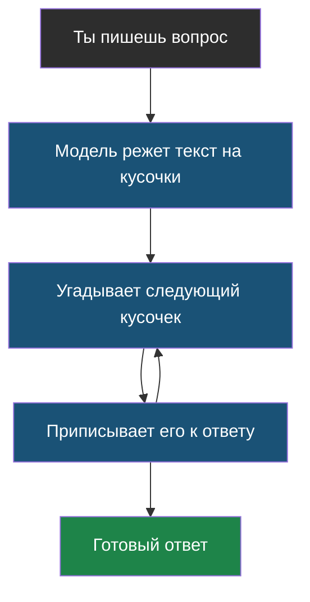

# Тема 1. Как устроена языковая модель

> Ты наверняка уже что-то спрашивал у ChatGPT, Алисы или другого ИИ-помощника. Эта тема — про то, что происходит внутри, когда ты нажимаешь «отправить». Без магии и без сложных формул.

## Что ты узнаешь

К концу темы ты сможешь своими словами ответить на четыре вопроса:

1. Что вообще такое «языковая модель» и как она видит текст (спойлер: не как буквы и не как слова).
2. Почему один и тот же вопрос даёт разные ответы — и как этим управляют.
3. Почему ИИ иногда уверенно говорит неправду, хотя никто его не учил врать.
4. Как ИИ-помощник умудряется что-то *делать* (искать, считать, включать свет), если он умеет только писать текст.

## Главная мысль темы

Языковая модель — это очень хороший **угадыватель следующего кусочка текста**. Всё остальное — и умные ответы, и ошибки, и «агенты», которые сами что-то делают, — вырастает из этой одной способности.

Обрати внимание на стрелку, которая идёт по кругу: модель не придумывает ответ целиком, она добавляет по одному кусочку за раз и каждый раз заново смотрит на всё, что уже написано.

## Уроки темы

- [Урок 1. Как модель читает текст](chapter-01.md) — токены, контекстное окно · лабораторная: [открыть в Colab](https://colab.research.google.com/github/iRoboTron/ai-engineering-school/blob/main/docs/books/labs/tema1-llm-osnovy/01_tokeny.ipynb)
- [Урок 2. Как модель придумывает ответ](chapter-02.md) — вероятности, температура, галлюцинации · лабораторная: [открыть в Colab](https://colab.research.google.com/github/iRoboTron/ai-engineering-school/blob/main/docs/books/labs/tema1-llm-osnovy/02_generaciya.ipynb)
- [Урок 3. Как модель что-то делает](chapter-03.md) — ответ по форме и инструменты · лабораторная: [открыть в Colab](https://colab.research.google.com/github/iRoboTron/ai-engineering-school/blob/main/docs/books/labs/tema1-llm-osnovy/03_instrumenty.ipynb)
- [Словарик темы](glossary.md) — все термины в одном месте

## Что понадобится для практики

Только Python и текстовый редактор. Никаких ключей, регистраций и оплаты — все примеры работают у тебя на компьютере и ничего никуда не отправляют.
