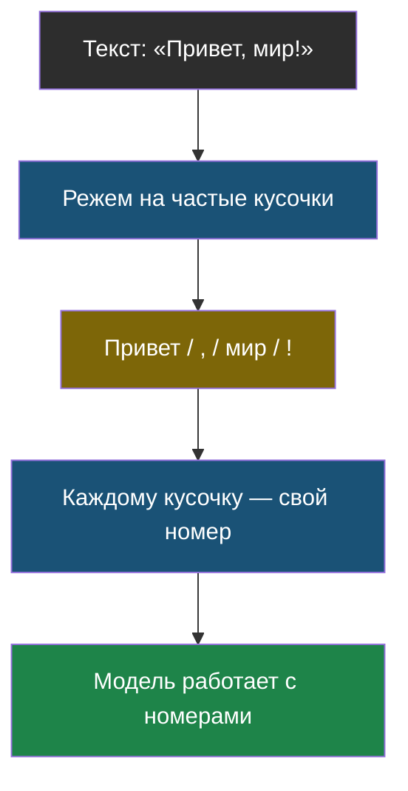
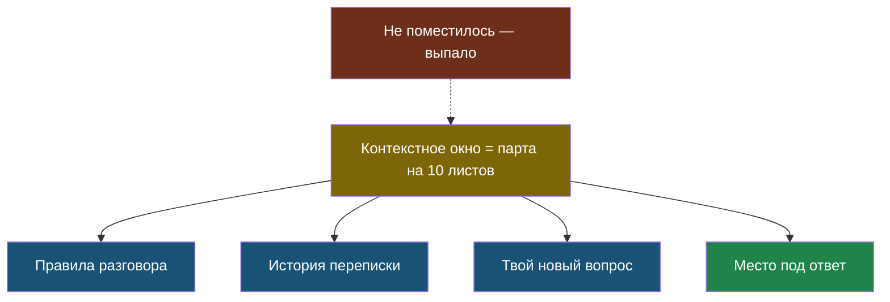

# Урок 1. Как модель читает текст

## С чего начнём: одна знакомая ситуация

Представь, что ты набираешь сообщение в телефоне, и клавиатура подсказывает следующее слово. Ты пишешь «Сегодня очень хорошая…» — и телефон предлагает «погода». Он не понял, что за окном солнце. Он просто много раз видел, что после этих слов чаще всего идёт «погода».

ИИ вроде ChatGPT устроен по той же идее, только эта подсказка стала **очень** умной: она смотрит не на два последних слова, а на десятки страниц текста сразу, и училась не на твоей переписке, а на огромном количестве книг, статей и сайтов.

> **Языковая модель** — программа, которая по уже написанному тексту угадывает, что идёт дальше. Ничего больше она не делает.

Часто пишут «LLM». Это сокращение от английского *large language model* — «большая языковая модель». «Большая» здесь означает не размер файла, а количество настроек внутри: их миллиарды.

## Проблема: компьютер не понимает буквы

Компьютер умеет работать только с числами. Значит, текст нужно как-то превратить в числа. Первая мысль — пронумеровать буквы: а=1, б=2, в=3. Но тогда даже короткое слово станет длинной цепочкой чисел, а модель будет тратить силы на то, чтобы заново собирать из букв слова.

Вторая мысль — пронумеровать слова целиком. Но слов слишком много: только в русском языке сотни тысяч форм («кот», «кота», «котом», «котику»), и всё время появляются новые.

Поэтому придумали середину: резать текст на **куски**, которые встречаются часто. Такой кусок — это иногда целое слово, иногда часть слова, иногда просто пробел со знаком препинания.

> **Токен** — кусочек текста, которым модель меряет всё: и то, что ты написал, и то, что она отвечает. Один токен — это примерно 3–4 буквы, часто это часть слова.

Как это выглядит на практике:

| Текст | Как режется на токены | Сколько токенов |
|---|---|---|
| `кот` | `кот` | 1 |
| `котик` | `кот` + `ик` | 2 |
| `programming` | `program` + `ming` | 2 |
| `программирование` | `програм` + `миро` + `вание` | 3 |



## Почему это важно знать (а не просто запомнить)

### 1. Текст на русском «дороже», чем на английском

Модели учили в основном на английских текстах, поэтому частые английские куски запомнились крупными, а русские — мелкими. Одна и та же фраза на русском разрежется на **в 2–3 раза больше токенов**, чем на английском.

А теперь важное: когда программа обращается к ИИ через интернет, платят именно за токены. Больше токенов — дороже запрос и дольше ответ.

### 2. У модели есть предел, сколько она «видит за раз»

Модель не помнит всю вашу переписку вечно. У неё есть окно, в которое помещается ограниченное число токенов — и вопрос, и вся история диалога, и ответ.

> **Контекстное окно** — сколько токенов модель может держать перед глазами одновременно. Всё, что не поместилось, для неё как будто не существует.

Полезная аналогия: это как парта, на которую влезает ровно 10 листов. Хочешь положить одиннадцатый — придётся убрать первый. Модель не «забыла» начало разговора: этого начала просто больше нет у неё перед глазами.



Есть ещё одна тонкость, которую заметили исследователи: даже если текст поместился, модель лучше замечает то, что в **начале и в конце**, а середину длинного текста «проглядывает». Прямо как человек, который читает конспект по диагонали. Поэтому самое важное лучше писать в начале или в конце запроса, а не закапывать в середину.

## Практика: считаем токены руками

Настоящий разрезатель текста на токены (его называют **токенизатор**) устроен сложно, но главную идею можно повторить самому: берём текст и режем его по частым кускам из заранее заданного списка.

Файл: [labs/tema1-llm-osnovy/01_tokeny.py](labs/tema1-llm-osnovy/01_tokeny.py) — скачай и запусти командой `python3 01_tokeny.py`.

```python
# labs/tema1-llm-osnovy/01_tokeny.py
# Учебная модель токенизатора: режем текст по списку частых кусочков.
# Настоящий токенизатор устроен сложнее, но идея ровно такая же.

# --- НАСТРОЙКИ ---
# Список частых кусочков. Важно: сначала длинные, потом короткие,
# чтобы "программ" отрезалось раньше, чем "про".
CHASTYE_KUSOCHKI = [
    "программ", "компьютер", "привет", "мир", "hello", "world",
    "program", "ming", "comput", "иров", "ание", "ер", "ик",
]

TEKSTY = [
    "привет мир",
    "hello world",
    "программирование",
    "programming",
]


def razrezat(text):
    """Возвращает список токенов для строки text."""
    tokeny = []
    ostatok = text
    while ostatok:
        # Пробел — это тоже токен, не забываем про него.
        if ostatok[0] == " ":
            tokeny.append(" ")
            ostatok = ostatok[1:]
            continue

        # Ищем самый длинный кусочек из списка, с которого начинается остаток.
        naydeno = None
        for kusochek in CHASTYE_KUSOCHKI:
            if ostatok.startswith(kusochek):
                if naydeno is None or len(kusochek) > len(naydeno):
                    naydeno = kusochek

        if naydeno:
            tokeny.append(naydeno)
            ostatok = ostatok[len(naydeno):]
        else:
            # Ничего не подошло — отрезаем одну букву.
            tokeny.append(ostatok[0])
            ostatok = ostatok[1:]

    return tokeny


for text in TEKSTY:
    tokeny = razrezat(text)
    print(f"{text!r}")
    print(f"  токены: {tokeny}")
    print(f"  букв: {len(text)}, токенов: {len(tokeny)}")
    print()
```

**Что посмотреть в выводе:** сравни строки `программирование` и `programming`. У них похожая длина в буквах, но разное число токенов — ровно тот эффект, о котором мы говорили выше.

**Попробуй сам:** добавь в `TEKSTY` свою фразу на русском и её перевод на английский. Какая версия дала больше токенов?

## Найди ошибку

Один ученик решил посчитать, поместится ли его текст в контекстное окно, и написал так:

```python
tekst = "очень длинный текст ученика"
razmer_okna = 8000          # токенов
if len(tekst) < razmer_okna:
    print("Поместится!")
```

В чём ошибка? (Подсказка: что именно считает `len(tekst)` — и в чём измеряется окно?)

<details>
<summary>Ответ</summary>

`len(tekst)` считает **буквы**, а окно измеряется в **токенах**. Это разные единицы. Сравнивать их напрямую нельзя — примерно как сравнивать длину в сантиметрах с весом в граммах. Нужно сначала разрезать текст на токены и посчитать их количество.
</details>

## Что мы узнали

- Языковая модель — это программа, которая угадывает продолжение текста, и больше ничего.
- Текст она видит не как буквы и не как слова, а как **токены** — частые кусочки.
- Русский текст режется на большее число токенов, чем английский, поэтому он «дороже» и дольше обрабатывается.
- **Контекстное окно** — предел того, сколько токенов модель видит одновременно. Что не поместилось — для неё не существует.
- Середину длинного текста модель замечает хуже, чем начало и конец.

## Проверь себя

1. Почему текст режут именно на токены, а не на буквы и не на слова целиком?
2. Пользователь жалуется: «ИИ забыл, о чём мы говорили в начале беседы». Что произошло на самом деле?
3. Ты пишешь длинный запрос с одним очень важным условием. В какое место запроса его лучше поставить и почему?

Дальше — [Урок 2: как модель придумывает ответ](chapter-02.md).
