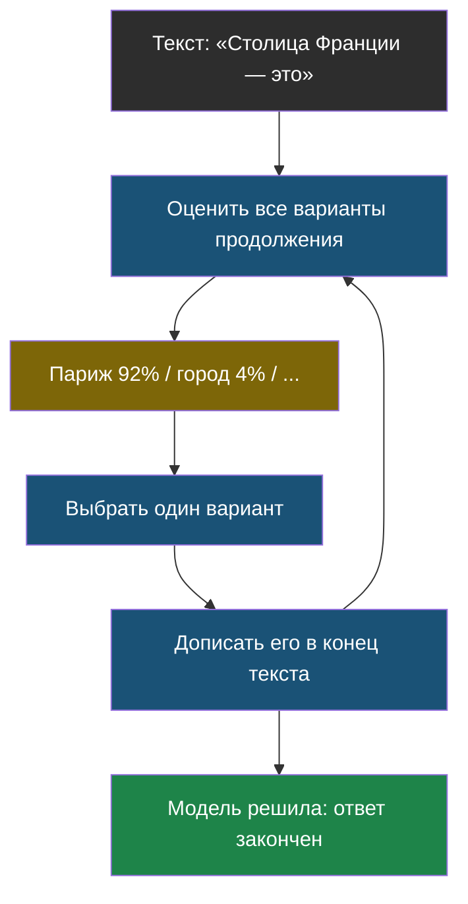
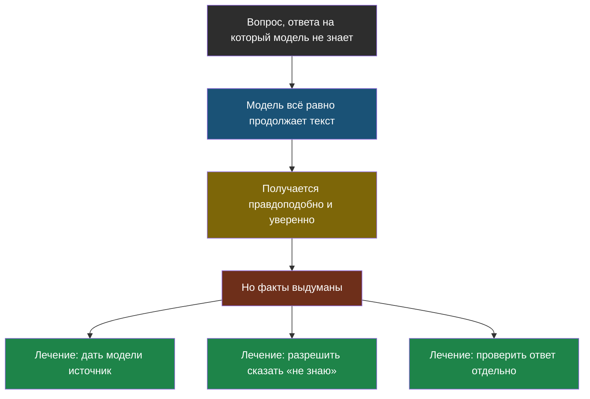

# Урок 2. Как модель придумывает ответ

## Напомним, где мы остановились

В прошлом уроке мы выяснили: модель видит текст как цепочку **токенов** — частых кусочков, и у неё есть **контекстное окно** — ограниченная «парта», на которую эти токены помещаются.

Теперь главный вопрос: что модель делает с этими токенами, чтобы получился осмысленный ответ?

## Один шаг: не «ответ», а «следующий кусочек»

Вот самое важное и самое неожиданное в этом уроке. Модель **не придумывает ответ целиком**. Она делает один маленький шаг: смотрит на весь текст перед собой и прикидывает, каким может быть следующий токен.

Причём она не выбирает один вариант — она оценивает сразу все возможные варианты и присваивает каждому число: насколько он подходит.

Пример. Текст: «Столица Франции — это». Модель прикидывает:

| Следующий токен | Насколько подходит |
|---|---|
| ` Париж` | 92 % |
| ` город` | 4 % |
| ` крупный` | 2 % |
| ` банан` | 0,0001 % |

> **Вероятность** — число от 0 до 100 %, которое показывает, насколько вариант подходит по мнению модели. Чем больше число, тем чаще модель видела такое продолжение при обучении.

Дальше модель выбирает один вариант, дописывает его в конец текста — и **начинает сначала**, уже с новым, чуть более длинным текстом. И так, кусочек за кусочком, пока не решит, что ответ закончен.



Именно поэтому в чате ответ печатается постепенно, слово за словом: это не эффект для красоты, это модель действительно так и работает — по кусочку за раз.

## Почему один и тот же вопрос даёт разные ответы

Если бы модель всегда брала вариант с самой большой вероятностью, ответ на один и тот же вопрос был бы всегда одинаковым — и очень скучным, шаблонным. Поэтому выбор делают немного случайным. А насколько случайным — регулируется одной настройкой.

> **Температура** — настройка, которая управляет разбросом при выборе следующего токена. Ближе к 0 — модель почти всегда берёт самый вероятный вариант. Больше — чаще выбирает менее очевидные.

Аналогия: представь мешок с шариками, где на каждом шарике написан вариант продолжения. При низкой температуре 95 шариков из 100 — это «Париж», вытянешь почти наверняка его. При высокой температуре шарики перемешивают так, что редкие варианты тоже получают реальный шанс.

| Температура | Что получается | Когда пригодится |
|---|---|---|
| близко к 0 | Одинаковые, предсказуемые, «сухие» ответы | Задачи с одним правильным ответом: перевод, извлечение данных, код |
| средняя (около 0,7) | Живой текст, разумное разнообразие | Обычный разговор, объяснения |
| высокая (больше 1) | Неожиданно, творчески, иногда бессмыслица | Придумать идеи, стихи, сюжет |

Важная тонкость, на которой попадаются даже взрослые: даже при температуре 0 ответ не гарантированно одинаковый каждый раз. Компьютер, который считает эти вероятности, складывает миллиарды дробных чисел, и мельчайшие расхождения в порядке сложения иногда меняют результат. Так что «температура 0» означает «почти всегда одно и то же», а не «железно одно и то же».

## Почему ИИ уверенно говорит неправду

Теперь у нас достаточно знаний, чтобы разобрать самую известную проблему ИИ.

Задай модели вопрос о том, чего она не знает — например, про книгу, которой не существует. Что она сделает? Она сделает то единственное, что умеет: **продолжит текст самым правдоподобным образом**. Получится гладкий, уверенный, полностью выдуманный ответ.

> **Галлюцинация** — уверенный ответ модели, который звучит правдоподобно, но не соответствует действительности.

Ключевое, что нужно понять: это **не ложь и не сбой**. Модель не знает, что такое «правда», у неё нет отдельной полочки с фактами, которую она может проверить. Она знает только, какие слова обычно идут вместе. Вопрос без известного ответа для неё ничем не отличается от вопроса с известным — она в обоих случаях делает одно и то же.



Обрати внимание на три «лечения» внизу схемы — это, по сути, содержание всего остального курса:

- дать модели нужные документы прямо в запрос — **тема 2**;
- прямо потребовать отвечать «не знаю», если ответа в документах нет — **тема 2**;
- проверять ответы измеримо, а не на глаз — **тема 5**.

## Практика: генератор текста с температурой

Сделаем крошечную «языковую модель» на чистом Python. Она будет учиться на нескольких фразах: запоминать, какое слово за каким шло, — и потом сама генерировать текст. Ровно та же схема, что у настоящей модели, просто вместо миллиардов настроек — обычный словарь.

Файл: [labs/tema1-llm-osnovy/02_temperatura.py](labs/tema1-llm-osnovy/02_temperatura.py) — запуск: `python3 02_temperatura.py`.

```python
# labs/tema1-llm-osnovy/02_temperatura.py
# Крошечная "языковая модель": учится на нескольких фразах и генерирует текст.
# Показывает, как температура меняет предсказуемость ответа.

import random

# --- НАСТРОЙКИ ---
OBUCHAYUSHCHIY_TEKST = """
кот сидит на окне
кот сидит на диване
кот спит на окне
кот смотрит на птиц
пёс сидит на коврике
пёс спит на коврике
"""

PERVOE_SLOVO = "кот"
DLINA_OTVETA = 5                    # сколько слов сгенерировать
TEMPERATURY = [0.1, 1.0, 2.0]       # какие температуры сравнить
SKOLKO_POPYTOK = 3                  # сколько раз повторить для каждой температуры


def sobrat_statistiku(text):
    """Считает, какое слово сколько раз встречалось после каждого слова."""
    statistika = {}
    for stroka in text.strip().split("\n"):
        slova = stroka.split()
        for i in range(len(slova) - 1):
            tekushchee, sleduyushchee = slova[i], slova[i + 1]
            statistika.setdefault(tekushchee, {})
            statistika[tekushchee][sleduyushchee] = statistika[tekushchee].get(sleduyushchee, 0) + 1
    return statistika


def vybrat_sleduyushchee(varianty, temperatura):
    """Выбирает следующее слово с учётом температуры.

    Низкая температура -> редкие варианты почти не выпадают.
    Высокая температура -> шансы выравниваются, выбор непредсказуемее.
    """
    slova = list(varianty.keys())
    # Возводим частоту в степень 1/температура: это и есть "перемешивание шариков".
    vesa = [varianty[s] ** (1 / temperatura) for s in slova]
    return random.choices(slova, weights=vesa)[0]


def sgenerirovat(statistika, pervoe_slovo, dlina, temperatura):
    otvet = [pervoe_slovo]
    tekushchee = pervoe_slovo
    for _ in range(dlina - 1):
        if tekushchee not in statistika:
            break                       # продолжения не нашлось — заканчиваем
        tekushchee = vybrat_sleduyushchee(statistika[tekushchee], temperatura)
        otvet.append(tekushchee)
    return " ".join(otvet)


statistika = sobrat_statistiku(OBUCHAYUSHCHIY_TEKST)

print("Что модель выучила:")
for slovo, varianty in statistika.items():
    print(f"  после {slovo!r}: {varianty}")
print()

for temperatura in TEMPERATURY:
    print(f"--- температура {temperatura} ---")
    for _ in range(SKOLKO_POPYTOK):
        print("  " + sgenerirovat(statistika, PERVOE_SLOVO, DLINA_OTVETA, temperatura))
    print()
```

**Что посмотреть в выводе:** при температуре 0,1 три попытки почти одинаковые. При температуре 2,0 они заметно разные. Это ровно то, что происходит в настоящем ИИ, когда крутят ту же настройку.

**Попробуй сам:** добавь в `OBUCHAYUSHCHIY_TEKST` пару своих фраз про кота — например, `кот ест сметану`. Как изменились варианты после слова «кот»?

### А теперь — настоящая модель

Мини-генератор повторяет идею, но настоящая модель — это миллиарды настроек и настоящие вероятности. В этой лаборатории ты первый раз пообщаешься с реальной моделью из кода: подключишь официальную библиотеку `openai`, задашь роли `system` и `user`, покрутишь ту же самую температуру и своими глазами увидишь, как модель уверенно выдумывает несуществующее.

Лаборатория (ноутбук): [скачать .ipynb](labs/tema1-llm-osnovy/02_generaciya.ipynb) · [открыть в Google Colab](https://colab.research.google.com/github/iRoboTron/ai-engineering-school/blob/main/docs/books/labs/tema1-llm-osnovy/02_generaciya.ipynb)

Понадобится «код класса» — его выдаёт учитель. Настоящий ключ лежит на школьном сервере, а код класса не секрет: он просто говорит серверу, что запрос от нас. И ещё один сюрприз: на шаге 4 модель уверенно «перескажет» сюжет книги, которой не существует, а на прямой вопрос «существует ли такая книга?» ответит «ДА».

## Найди ошибку

Ученик написал программу, которая просит ИИ достать из письма номер телефона, и поставил температуру 1,8 — «чтобы ИИ лучше старался». Что не так?

<details>
<summary>Ответ</summary>

Высокая температура нужна для творческих задач, где много подходящих ответов. А у номера телефона правильный ответ **ровно один** — он записан в письме, придумывать нечего. Высокая температура здесь только увеличит шанс, что модель выберет менее вероятный (то есть неправильный) вариант и переврёт цифры. Для задач с одним верным ответом температуру ставят близко к нулю.
</details>

## Что мы узнали

- Модель генерирует ответ **по одному токену за раз**, каждый раз заново глядя на весь текст.
- Для каждого следующего токена она оценивает **вероятности** всех вариантов.
- **Температура** управляет тем, насколько случайно выбирается вариант: низкая — предсказуемо, высокая — разнообразно.
- **Галлюцинация** — не ложь и не поломка, а прямое следствие того, как модель работает: она всегда продолжает текст правдоподобно, даже когда не знает фактов.
- Лечится галлюцинация не уговорами, а тремя способами: дать источник, разрешить сказать «не знаю», проверять ответы.

## Проверь себя

1. Почему ответ в чате появляется по словам, а не сразу целиком?
2. Тебе нужно, чтобы ИИ каждый раз одинаково переводил названия товаров. Какую температуру выбрать?
3. Друг говорит: «ИИ мне соврал». Как объяснить ему, что на самом деле произошло?

Дальше — [Урок 3: как модель что-то делает](chapter-03.md).
