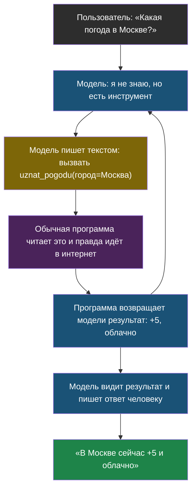

# Урок 3. Как модель что-то делает

> **Лабораторная этого урока:** цикл с инструментом, схема ответа и настоящий вызов инструмента.
> - без интернета: [03_instrumenty.py](labs/tema1-llm-osnovy/03_instrumenty.py) — запуск `python3 03_instrumenty.py`, разобрана в разделе [«Практика: цикл с инструментом без всякого ИИ»](#практика-цикл-с-инструментом-без-всякого-ии)
> - на настоящей модели: [открыть в Google Colab](https://colab.research.google.com/github/iRoboTron/ai-engineering-school/blob/main/docs/books/labs/tema1-llm-osnovy/03_instrumenty.ipynb) · [скачать .ipynb](labs/tema1-llm-osnovy/03_instrumenty.ipynb)

## Странность, которую стоит заметить

Мы выяснили: модель умеет ровно одно — дописывать текст по кусочку. Но ИИ-помощники при этом как-то умеют искать в интернете, считать, ставить напоминания, включать музыку. Как программа, которая умеет только писать текст, это делает?

Ответ красивый: **она этого не делает**. Она пишет текст, а действия выполняет обычная программа рядом. Разберём по шагам — но сначала подготовимся.

## Шаг подготовки: ответ по форме

Обычный ответ модели — это текст для человека: «Конечно! Вот погода в Москве: сейчас там +5 и облачно 🙂». Человеку удобно. А программе — нет: ей нужно вытащить оттуда число, и любое лишнее слово ломает разбор.

Поэтому модель просят отвечать **строго заданной формой** — как заполненный бланк, где у каждого поля своё место.

> **Структурированный ответ** — ответ модели не свободным текстом, а по заранее заданной форме (обычно в формате JSON), которую программа может прочитать без разбора человеческого языка.

Сравни:

| Свободный текст | Структурированный ответ |
|---|---|
| «Конечно! Сейчас в Москве +5 и облачно 🙂» | `{"gorod": "Москва", "temperatura": 5, "pogoda": "облачно"}` |
| Человеку читать приятно | Программе читать надёжно |

Аналогия: свободный текст — это когда одноклассник рассказывает тебе домашку словами. Структурированный ответ — это когда он заполнил бланк с полями «предмет», «страница», «номера задач». Второе скучнее, зато ничего не потеряется.

Просить форму можно тремя способами — от менее к более надёжному:

1. **Просто попросить** в запросе: «ответь в формате JSON». Работает часто, но не всегда: модель может добавить вежливое «вот твой JSON:» перед ответом.
2. **Включить режим JSON**, если он есть у модели: тогда она не сможет выдать ничего, кроме правильного JSON.
3. **Задать точную схему**: перечислить, какие именно поля должны быть и какого они типа. Тогда программа гарантированно получит нужные поля.

## Главное: цикл с инструментами

Теперь соберём всё вместе. Вот как ИИ-помощник «узнаёт погоду», хотя выходить в интернет не умеет.

Программе-помощнику заранее объясняют: «У тебя есть инструмент `uznat_pogodu`, ему нужен один параметр — город». Дальше происходит цикл:



Разберём, кто что делает:

- **Модель** только пишет текст — просто этот текст оформлен как «хочу вызвать такой-то инструмент с такими-то параметрами». Никакого волшебства: это тот же структурированный ответ из первой половины урока.
- **Обычная программа** читает эту просьбу и выполняет действие сама: делает запрос в интернет, считает, включает лампочку.
- Результат кладут обратно в контекстное окно модели — и она делает следующий шаг: либо просит ещё один инструмент, либо пишет финальный ответ.

Обрати внимание на стрелку от «программа вернула результат» обратно наверх. Из-за неё это не одно действие, а **цикл**: модель может ходить по кругу несколько раз, пока не соберёт всё нужное.

> **Инструмент** — обычная функция в программе, которую модели разрешили попросить вызвать: поиск, калькулятор, запрос в базу.

> **Агент** — программа, где модель в цикле сама решает, какой инструмент вызвать следующим, пока не получит ответ.

Запомни этот цикл: в **теме 4** мы разберём его подробно и напишем своего агента. Пока достаточно понимать, что «агент» — это не отдельный мозг и не робот, а вот этот цикл из четырёх шагов.

## Практика: цикл с инструментом без всякого ИИ

Чтобы цикл стал понятным, соберём его целиком — только вместо настоящей модели поставим маленькую функцию-заглушку, которая «решает», что вызвать. Так видно, что вся конструкция работает на обычном коде, а модель — лишь одна из деталей.

Файл: [labs/tema1-llm-osnovy/03_instrumenty.py](labs/tema1-llm-osnovy/03_instrumenty.py) — запуск: `python3 03_instrumenty.py`.

```python
# labs/tema1-llm-osnovy/03_instrumenty.py
# Цикл "модель просит инструмент -> программа выполняет -> модель отвечает".
# Настоящую модель заменяет функция-заглушка, чтобы был виден сам механизм.

# --- НАСТРОЙКИ ---
VOPROSY = [
    "Какая погода в Москве?",
    "Сколько будет 17 умножить на 6?",
    "Привет!",
]
MAX_SHAGOV = 3        # ограничение: сколько раз модель может просить инструмент

# Игрушечная "база погоды" — чтобы не ходить в интернет.
POGODA = {"Москва": "+5, облачно", "Сочи": "+18, солнечно"}


# --- ИНСТРУМЕНТЫ: обычные функции ---
def uznat_pogodu(gorod):
    return POGODA.get(gorod, "нет данных по этому городу")


def poschitat(vyrazhenie):
    a, b = vyrazhenie.split("*")
    return str(int(a) * int(b))


INSTRUMENTY = {"uznat_pogodu": uznat_pogodu, "poschitat": poschitat}


def model(istoriya):
    """Заглушка вместо настоящей модели.

    Возвращает либо просьбу вызвать инструмент, либо готовый ответ.
    Настоящая модель делала бы то же самое, но решала бы сама.
    """
    vopros = istoriya[0]
    uzhe_vyzyvali = [shag for shag in istoriya if shag.startswith("результат")]

    if uzhe_vyzyvali:
        # Инструмент уже отработал — пишем финальный ответ человеку.
        return "ОТВЕТ: " + uzhe_vyzyvali[-1].replace("результат: ", "")

    if "погода" in vopros.lower():
        return "ВЫЗОВ: uznat_pogodu | Москва"
    if "умножить" in vopros.lower():
        return "ВЫЗОВ: poschitat | 17*6"
    return "ОТВЕТ: Привет! Чем помочь?"


def zapustit_agenta(vopros):
    istoriya = [vopros]
    print(f"Вопрос: {vopros}")

    for nomer_shaga in range(1, MAX_SHAGOV + 1):
        reshenie = model(istoriya)

        if reshenie.startswith("ОТВЕТ: "):
            print(f"  шаг {nomer_shaga}: модель отвечает человеку")
            print(f"  {reshenie}\n")
            return

        # Модель попросила инструмент — выполняем его обычным кодом.
        _, telo = reshenie.split("ВЫЗОВ: ")
        imya, parametr = [chast.strip() for chast in telo.split("|")]
        print(f"  шаг {nomer_shaga}: модель просит инструмент {imya}({parametr})")

        rezultat = INSTRUMENTY[imya](parametr)
        print(f"  шаг {nomer_shaga}: программа вернула {rezultat!r}")
        istoriya.append(f"результат: {rezultat}")

    print("  остановились: закончился лимит шагов\n")


for vopros in VOPROSY:
    zapustit_agenta(vopros)
```

**Что посмотреть в выводе:** для вопроса про погоду видно два шага — сначала просьба инструмента, потом ответ. Для «Привет!» инструмент не понадобился, модель ответила сразу.

**Обрати внимание на `MAX_SHAGOV`.** Это защита: без неё модель, которая по кругу просит один и тот же инструмент, крутилась бы вечно. В теме 4 мы поговорим о таких ограничениях подробнее.

**Попробуй сам:** добавь третий инструмент — например, `skolko_bukv`, который считает буквы в слове, — и научи заглушку его вызывать.

### А теперь — настоящая модель с настоящим инструментом

Выше заглушка «решала» по простым правилам, что вызвать. В ноутбуке всё по-настоящему: решает живая модель, а мы смотрим, что она прислала.

Лаборатория (ноутбук): [скачать .ipynb](labs/tema1-llm-osnovy/03_instrumenty.ipynb) · [открыть в Google Colab](https://colab.research.google.com/github/iRoboTron/ai-engineering-school/blob/main/docs/books/labs/tema1-llm-osnovy/03_instrumenty.ipynb)

Там ты увидишь три вещи, которых не покажет никакая имитация. Первое: если попросить JSON словами, модель заворачивает ответ в блок кода с пометкой <code>json</code> и отдаёт номер кабинета строкой `"204"`, а не числом — и программа на этом спотыкается. Со схемой приходит ровно `204` числом. Второе: когда модель просит инструмент, поле с текстом пустое, а причина остановки — `tool_calls`, то есть она ждёт результата. Третье: полный круг «вопрос → заявка на вызов → результат инструмента → ответ человеку» на настоящих данных.

## Что мы узнали

- Программе нужен **структурированный ответ** — по форме, а не свободным текстом, иначе ответ нельзя надёжно разобрать.
- Модель сама ничего не делает: она пишет текст-просьбу «вызови такой-то инструмент».
- **Инструмент** — обычная функция; выполняет её обычная программа, а не модель.
- Результат инструмента кладут обратно в контекст, и модель делает следующий шаг — получается **цикл**.
- **Агент** — это и есть такой цикл. Никакой магии, обычный `for` с проверками.
- Циклу обязательно нужен предел числа шагов, иначе он может не закончиться.

## Проверь себя

1. Почему программе неудобно получать от модели ответ обычным текстом?
2. Кто на самом деле идёт в интернет за погодой — модель или программа?
3. Зачем в цикле агента ограничение на число шагов?

## Итог темы 1

Ты прошёл всю дорогу от «текст режется на токены» до «агент вызывает инструменты в цикле». Все три урока держатся на одной мысли: **модель угадывает продолжение текста**, а всё остальное надстроено сверху обычным кодом.

Открой [словарик темы](glossary.md) и проверь, что можешь объяснить своими словами каждый термин. Если какой-то не даётся — вернись к уроку, где он появился.

Дальше по курсу — тема 2: что делать, если нужный ответ есть только в твоих документах, которых модель никогда не видела.
