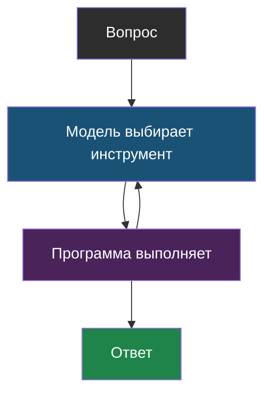
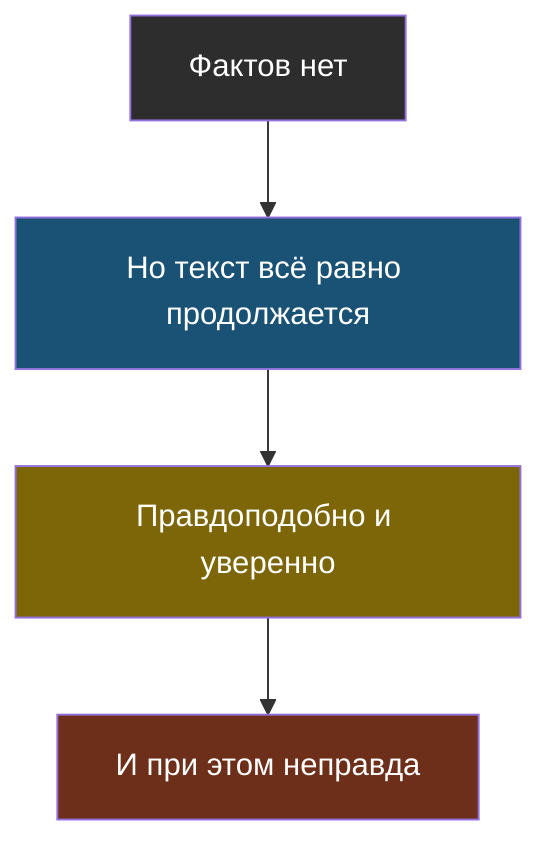
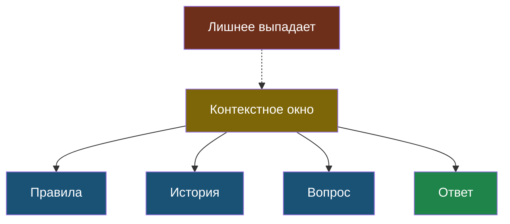
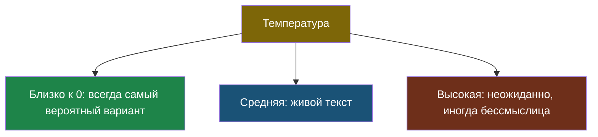
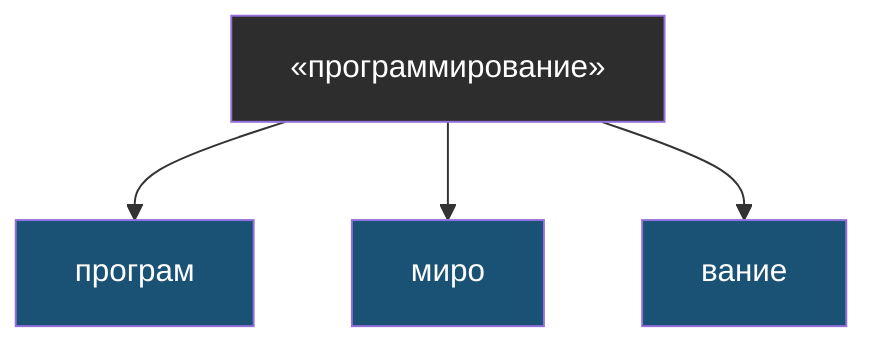

# Словарик темы 1

Термины по алфавиту. Рядом с каждым — где он встретился и короткая схема-подсказка.

## Агент

> **Агент** — программа, где модель в цикле сама решает, какой инструмент вызвать следующим, пока не получит ответ.

Не робот и не отдельный разум — обычный цикл в коде. Появился в [уроке 3](chapter-03.md), подробно разберём в теме 4.

## Вероятность (следующего токена)

> **Вероятность** — число от 0 до 100 %, показывающее, насколько вариант продолжения подходит по мнению модели.

Из [урока 2](chapter-02.md). Модель считает вероятность сразу для всех возможных продолжений, а потом выбирает одно.

## Галлюцинация

> **Галлюцинация** — уверенный ответ модели, который звучит правдоподобно, но не соответствует действительности.

Из [урока 2](chapter-02.md). Не ложь и не поломка: модель продолжает текст правдоподобно даже там, где фактов не знает.

## Инструмент

> **Инструмент** — обычная функция в программе, которую модели разрешили попросить вызвать: поиск, калькулятор, запрос в базу.

Из [урока 3](chapter-03.md). Модель инструмент не выполняет — только просит.

## Контекстное окно

> **Контекстное окно** — сколько токенов модель может держать перед глазами одновременно. Всё, что не поместилось, для неё как будто не существует.

Из [урока 1](chapter-01.md). Как парта, на которую влезает ограниченное число листов.

## Языковая модель (LLM)

> **Языковая модель** — программа, которая по уже написанному тексту угадывает, что идёт дальше.

Из [урока 1](chapter-01.md). LLM — сокращение от *large language model*, «большая языковая модель»; большая — по числу настроек внутри, а не по размеру файла.

## Структурированный ответ

> **Структурированный ответ** — ответ модели не свободным текстом, а по заранее заданной форме (обычно JSON), которую программа может прочитать без разбора человеческого языка.

Из [урока 3](chapter-03.md). Как заполненный бланк вместо устного рассказа.

## Температура

> **Температура** — настройка, которая управляет разбросом при выборе следующего токена. Ближе к 0 — предсказуемо, больше — разнообразнее.

Из [урока 2](chapter-02.md).

## Токен

> **Токен** — кусочек текста, которым модель меряет всё: и вопрос, и ответ. Примерно 3–4 буквы, часто часть слова.

Из [урока 1](chapter-01.md). Русский текст режется на большее число токенов, чем английский.

## Токенизатор

> **Токенизатор** — программа, которая режет текст на токены по заранее собранному списку частых кусочков.

Из [урока 1](chapter-01.md), его упрощённую версию мы написали в лабораторной.
