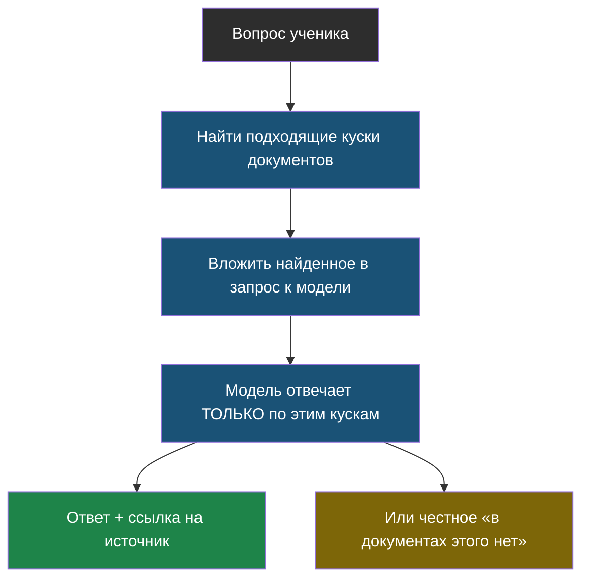

# Тема 2. RAG: ИИ, который ищет ответ в документах

> В теме 1 мы выяснили неприятную вещь: модель уверенно выдумывает, когда не знает ответа. Здесь — самый главный способ это вылечить.

## Задача, с которой начинается тема

Представь, что в школе решили сделать чат-бота, который отвечает на вопросы про расписание, столовую и кружки. Спрашиваешь у обычного ИИ: «Во сколько начинается кружок робототехники?» — и он отвечает уверенно и неправильно, потому что про твою школу он ничего не знает и никогда не узнает.

Что делать? Есть два пути:

1. **Переучить модель** на школьных документах. Дорого, долго, требует специалистов — и всё придётся повторять при каждом изменении расписания.
2. **Подсунуть модели нужный кусок текста прямо в вопрос.** Дёшево, быстро, обновляется мгновенно.

Второй путь придумали назвать сложным словом, которое ты уже слышал, если читал про ИИ: **RAG**. Вся эта тема — про него.

## Главная мысль темы

Модель — это не «знаток», это «умный читатель». Не заставляй её вспоминать — дай ей прочитать нужную страницу прямо сейчас.

Обрати внимание на две стрелки в конце. Хороший ответ бывает двух видов: с источником — или честное «не знаю». Третьего (уверенно выдумать) быть не должно.

## Уроки темы

- [Урок 1. Экзамен с учебником и без](chapter-01.md) — идея RAG, нарезка на куски, честное «не знаю»
- [Урок 2. Как искать нужный кусок](chapter-02.md) — поиск по словам, лаба: свой мини-RAG
- [Словарик темы](glossary.md)

## Что понадобится

Только Python. Никаких баз данных и интернета — весь «поиск» уместится в один файл.
