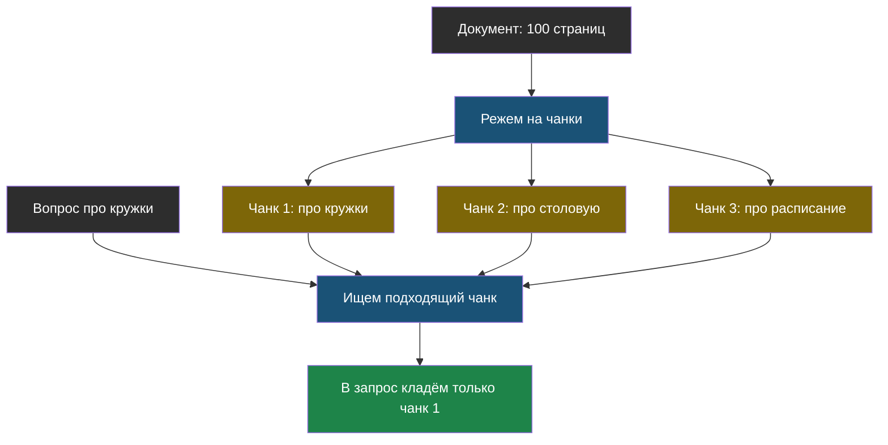

# Урок 1. Экзамен с учебником и без

> **Лабораторной в этом уроке нет.** Практика темы — в [уроке 2](chapter-02.md).

## Знакомая ситуация

Есть два вида контрольных.

**Первый вид: без учебника.** Всё, что ты можешь написать, — это то, что осталось в голове. Если параграф ты не помнишь, вариантов два: честно оставить пустое место или написать что-нибудь похожее на правду и надеяться.

**Второй вид: с учебником.** Помнить наизусть не нужно, нужно уметь быстро найти нужную страницу и аккуратно оттуда ответить.

Обычный ИИ-помощник работает по первому варианту. Он отвечает по тому, что «запомнил», пока учился, — а всё, чего в его обучении не было (твоя школа, твоя переписка, документы твоей компании), он не знает и, как мы выяснили в теме 1, спокойно выдумает.

Идея, которую мы сейчас разберём: **превратить контрольную без учебника в контрольную с учебником**.

> **RAG** — способ работы с ИИ, при котором сначала находят нужные куски документов, а потом кладут их прямо в запрос к модели, чтобы она отвечала по ним, а не по памяти.

Три буквы — это сокращение от английского *retrieval-augmented generation*: «генерация, усиленная поиском». По-русски проще: **сначала найди, потом отвечай**.

## Как это выглядит по шагам

Сравни два запроса к одной и той же модели.

**Без RAG:**

```
Во сколько начинается кружок робототехники?
```

Модель ничего не знает про твою школу → выдумывает.

**С RAG:**

```
Ответь на вопрос, пользуясь ТОЛЬКО текстом ниже.
Если ответа в тексте нет — так и напиши.

ТЕКСТ:
«Кружок робототехники: вторник и четверг, 15:40, кабинет 204.
Руководитель — Иванов П. С.»

ВОПРОС: Во сколько начинается кружок робототехники?
```

Модель отвечает: «В 15:40, по вторникам и четвергам (кабинет 204)». Никакого волшебства — нужный факт просто лежит у неё перед глазами, в контекстном окне из темы 1.

> **Грунтование ответа** (по-английски *grounding*, «опора на источник») — правило, при котором модель обязана отвечать только по данному ей тексту и признаваться, когда ответа там нет.

Это самая важная строчка во всём запросе. Без неё модель, не найдя ответа в тексте, спокойно добавит «из головы» — и получится галлюцинация, только теперь ещё и замаскированная под ответ по документам.

## Проблема: документов слишком много

«Просто положи документы в запрос» — звучит легко, пока документ один. А если это сто страниц школьных правил?

Вспомни про контекстное окно: всё не поместится. И даже если бы поместилось, мы помним из темы 1, что модель хуже замечает середину длинного текста. Класть в запрос всё подряд — плохая идея.

Значит, нужно класть только **нужные куски**. А чтобы можно было выбирать куски, документы заранее режут на части.

> **Чанк** (от английского *chunk*, «кусок») — небольшой фрагмент документа, на которые его заранее разрезали, чтобы искать и подставлять в запрос по отдельности.

Как резать — вопрос не праздный:

| Как режем | Что получается | Проблема |
|---|---|---|
| По 500 символов подряд | Просто и быстро | Фраза может разорваться на середине |
| По абзацам | Мысль остаётся целой | Абзацы бывают очень разной длины |
| По заголовкам («Кружки», «Столовая») | Каждый кусок про одно | Нужны документы с заголовками |

Есть ещё один приём: делать куски **с нахлёстом** — чтобы конец одного куска повторялся в начале следующего. Тогда фраза, разрезанная на границе, всё равно целиком попадёт хотя бы в один кусок.



## Четыре места, где RAG может сломаться

Полезно сразу понимать, что «ИИ ответил неправильно» — слишком общая жалоба. Ошибка могла случиться в одном из четырёх мест, и чинятся они по-разному:

| Где сломалось | Что видно снаружи | Пример |
|---|---|---|
| **Подготовка** — документ плохо порезали | Ответ обрывочный, половина фразы | Расписание разрезали посередине строки |
| **Поиск** — нашли не тот кусок | Ответ уверенный, но не про то | На вопрос про кружок нашли текст про столовую |
| **Ответ** — модель нашла нужное, но переврала | Мелкие искажения фактов | В тексте 15:40, в ответе 15:00 |
| **Проверка** — никто не измеряет качество | Никто не замечает, что стало хуже | Расписание поменяли, а куски остались старые |

Первые три места мы разберём в этой и следующей темах, четвёртое — целиком тема 5.

## Найди ошибку

Ученик сделал школьного бота и написал такой запрос к модели:

```
Ты помощник школы №5. Отвечай на вопросы учеников.

ТЕКСТ ИЗ ПРАВИЛ: «Столовая работает с 9:00 до 15:00.»

ВОПРОС: Во сколько начинается кружок робототехники?
```

Бот ответил: «Кружок робототехники обычно начинается в 15:00, после уроков». В чём ошибка ученика?

<details>
<summary>Ответ</summary>

В запросе нет правила отвечать **только по тексту** и признаваться, когда ответа нет (грунтования). Модель увидела текст про столовую, ответа там не нашла — и, как обычно, продолжила текст правдоподобно, добавив выдуманное время из головы.

Правильный запрос должен содержать строчку вроде: «Отвечай только по тексту выше. Если ответа в нём нет — напиши "в правилах этого нет"».

Обрати внимание: сам поиск тут тоже сработал плохо — на вопрос про кружок подсунули кусок про столовую. Это ошибка **поиска**, ей посвящён следующий урок.
</details>

## Что мы узнали

- Модель не знает твоих документов и никогда не узнает — их нужно давать ей прямо в запросе.
- **RAG** = сначала найти нужные куски, потом ответить по ним.
- **Чанк** — кусок документа; резать на чанки нужно потому, что целиком документы не помещаются в контекстное окно.
- **Грунтование** — обязательное правило «отвечай только по этому тексту, иначе скажи, что не знаешь».
- Сломаться RAG может в четырёх местах: нарезка, поиск, ответ, проверка — и чинятся они по-разному.

## Проверь себя

1. Почему проще подсунуть документ в запрос, чем переучить модель?
2. Зачем резать документы на чанки, если можно отдать модели всё сразу?
3. Какую строчку обязательно нужно добавить в запрос, чтобы модель не выдумывала?

Дальше — [Урок 2: как искать нужный кусок](chapter-02.md).
