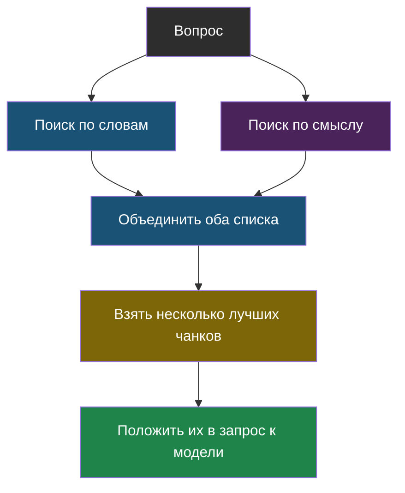

# Урок 2. Как искать нужный кусок

## Напомним, где мы остановились

В прошлом уроке мы разрезали документы на **чанки** и договорились, что в запрос кладём только подходящие. Осталось главное: как понять, какой чанк подходящий?

Это и есть шаг «поиск» — самое хрупкое место всей конструкции. Найдёшь не тот кусок — и дальше уже неважно, насколько умная модель: она честно ответит по неправильному тексту.

## Способ первый: искать по совпадающим словам

Самая простая идея, до которой можно додуматься самому: посчитать, сколько слов из вопроса встретилось в чанке. Больше совпадений — выше место в выдаче.

Вопрос: «во сколько кружок робототехники»

| Чанк | Совпавшие слова | Очки |
|---|---|---|
| «Кружок робототехники: вторник и четверг, 15:40» | кружок, робототехники | 2 |
| «Кружок рисования: среда, 16:00» | кружок | 1 |
| «Столовая работает с 9:00» | — | 0 |

Работает! Но у способа есть слабое место, и его важно увидеть заранее.

Спроси то же самое другими словами: «когда занятия у робототехников». Слово «кружок» не совпало, «робототехники» превратилось в «робототехников» — и поиск по точным словам почти ничего не находит, хотя человек мгновенно понимает, что вопрос про то же самое.

Часть проблемы лечится приведением слов к общей форме — «робототехников» и «робототехники» обрезают до общего начала «робототехник». Но «занятия» и «кружок» так не подружишь: буквы разные, смысл один.

> **Поиск по словам** — способ найти нужный кусок текста по совпадению слов из вопроса. Хорош для точных названий и номеров, плох, когда об одном и том же говорят разными словами.

## Способ второй: искать по смыслу

Второй способ умеет то, чего не умеет первый: находить куски, где нужных слов вообще нет, но смысл тот же. Он опирается на идею «вектора смысла», и она достаточно важная, чтобы посвятить ей отдельную тему — [тему 3](reader.html?b=3&c=book).

Пока запомни главное: у поисков разные сильные стороны, поэтому в настоящих системах их обычно используют **вместе**.

| | Поиск по словам | Поиск по смыслу |
|---|---|---|
| «когда занятия у робототехников» | Промахивается | Находит |
| «где поесть» → столовая | Промахивается | Находит |
| Ответа нет в документах вовсе | Честно возвращает ноль | Уверенно возвращает что попало |
| Надо ли что-то заранее считать | Нет | Да, готовить «векторы» для всех чанков |

Третья строка — самая неочевидная, и в теме 3 ты увидишь её своими глазами. Поиск по словам умеет промолчать: если ни одно слово не совпало, он выдаёт ровный ноль. Поиск по смыслу молчать не умеет — он всегда находит «самое похожее», даже когда похожего нет.



## Сколько кусков брать?

Обычно берут не один, а несколько лучших — три-пять. Почему не один: поиск не идеален, и нужный кусок вполне может оказаться на втором месте. Почему не двадцать: вспомни контекстное окно и «середину, которую модель проглядывает» из темы 1. Чем больше лишнего текста, тем выше шанс, что модель зацепится не за то.

## Практика: собираем свой мини-RAG

Соберём всю цепочку целиком: документ → чанки → поиск → готовый запрос к модели. Настоящую модель звать не будем — вместо этого напечатаем запрос, который ей ушёл бы. Так виднее, что RAG — это на 90 % обычный код, а не магия.

Файл: [labs/tema2-rag/01_mini_rag.py](labs/tema2-rag/01_mini_rag.py) — запуск: `python3 01_mini_rag.py`.

```python
# labs/tema2-rag/01_mini_rag.py
# Мини-RAG целиком: режем документ на чанки, ищем подходящие по словам,
# собираем запрос к модели. Саму модель не зовём — печатаем то, что ей ушло бы.

# --- НАСТРОЙКИ ---
SKOLKO_CHANKOV_BRAT = 2      # сколько лучших кусков класть в запрос

DOKUMENT = """
Кружок робототехники: вторник и четверг, 15:40, кабинет 204. Руководитель Иванов П. С.
Кружок рисования: среда, 16:00, кабинет 112. Приносить свои краски.
Столовая работает с 9:00 до 15:00. Завтрак с 9:00 до 9:30.
Библиотека открыта с 8:30 до 17:00, кроме пятницы.
"""

VOPROSY = [
    "во сколько кружок робототехники",
    "когда работает библиотека",
    "сколько стоит проезд на автобусе",   # ответа в документе нет
]

# Слова, которые встречаются почти везде и мешают искать.
STOP_SLOVA = {"во", "и", "с", "до", "на", "в", "у", "не", "сколько", "когда"}


def narezat_na_chanki(text):
    """Режем документ по строкам: здесь каждая строка — отдельная тема."""
    return [stroka.strip() for stroka in text.strip().split("\n") if stroka.strip()]


def slova(text):
    """Разбиваем текст на слова, убираем знаки и стоп-слова."""
    ochishchennyy = "".join(bukva.lower() if bukva.isalnum() else " " for bukva in text)
    return {s for s in ochishchennyy.split() if s not in STOP_SLOVA}


def obrezat(slovo):
    """Грубое приведение к общей форме: оставляем первые 6 букв.

    Так 'робототехники' и 'робототехников' станут одинаковыми.
    """
    return slovo[:6]


def naiti_chanki(vopros, chanki):
    """Считаем совпадения слов и возвращаем список (очки, чанк), лучшие сверху."""
    slova_voprosa = {obrezat(s) for s in slova(vopros)}
    ocenennye = []
    for chank in chanki:
        slova_chanka = {obrezat(s) for s in slova(chank)}
        ochki = len(slova_voprosa & slova_chanka)
        ocenennye.append((ochki, chank))
    ocenennye.sort(key=lambda para: para[0], reverse=True)
    return ocenennye


def sobrat_zapros(vopros, naydennye_chanki):
    """Собираем текст запроса к модели — с правилом отвечать только по тексту."""
    tekst = "\n".join(f"- {chank}" for chank in naydennye_chanki)
    return (
        "Ответь на вопрос, пользуясь ТОЛЬКО текстом ниже.\n"
        "Если ответа в тексте нет — напиши «в документах этого нет».\n\n"
        f"ТЕКСТ:\n{tekst}\n\n"
        f"ВОПРОС: {vopros}"
    )


chanki = narezat_na_chanki(DOKUMENT)
print(f"Документ разрезан на {len(chanki)} чанков.\n")

for vopros in VOPROSY:
    print("=" * 60)
    print(f"ВОПРОС: {vopros}\n")

    ocenennye = naiti_chanki(vopros, chanki)
    print("Что нашёл поиск (очки — число совпавших слов):")
    for ochki, chank in ocenennye:
        print(f"  {ochki} | {chank[:55]}...")

    luchshie = [chank for ochki, chank in ocenennye[:SKOLKO_CHANKOV_BRAT] if ochki > 0]

    if not luchshie:
        print("\nНичего не нашлось — модель звать незачем, отвечаем «в документах этого нет».\n")
        continue

    print("\nЗапрос, который ушёл бы модели:")
    print("-" * 60)
    print(sobrat_zapros(vopros, luchshie))
    print("-" * 60 + "\n")
```

**Что посмотреть в выводе:**

1. У вопроса про робототехнику нужный чанк получает больше всех очков — поиск сработал.
2. А вот у вопроса «когда работает библиотека» чанк про **столовую** набрал столько же очков, сколько нужный: в нём тоже есть слово «работает». Поиск по словам не понимает, что «работает» — слово-пустышка, а «библиотека» — главное. Хорошо, что мы берём несколько чанков: нужный всё равно попал в запрос. Вот ровно поэтому и не берут только один.
3. У вопроса про автобус **все чанки получили 0 очков**. Обрати внимание, что делает программа: она вообще не зовёт модель и сразу отвечает «в документах этого нет». Это тоже способ бороться с выдумками — самый надёжный, потому что тут модели просто не дают шанса что-то придумать.

**Попробуй сам:**

- Задай вопрос «когда занятия у робототехников» — увидишь ту самую слабость поиска по словам.
- Добавь в `DOKUMENT` строку про свой кружок и проверь, находится ли она.
- Поменяй `SKOLKO_CHANKOV_BRAT` на 4 — как изменился запрос к модели? Стало лучше или появился лишний шум?

### А теперь — настоящий RAG целиком

В мини-версии выше мы только собирали запрос и печатали его. В ноутбуке бот работает по-настоящему: поиск — библиотека `rank_bm25` (тот самый алгоритм, которым десятилетиями пользуются поисковые системы), ответ — живая модель.

Лаборатория (ноутбук): [скачать .ipynb](labs/tema2-rag/01_nastoyashchiy_rag.ipynb) · [открыть в Google Colab](https://colab.research.google.com/github/iRoboTron/ai-engineering-school/blob/main/docs/books/labs/tema2-rag/01_nastoyashchiy_rag.ipynb)

Там бота проверяют на четырёх вопросах, и — внимание — **один он проваливает**. Причём именно так, как это происходит в жизни: ответ в документах есть, но в вопросе слово «рисовани**е**», а в тексте «рисовани**я**», и поиск по словам их не связывает. Ты своими глазами увидишь, как одна буква ломает ответ, и сам проверишь догадку, задав вопрос в другой форме.

А на вопросе про автобус случается обратное: поиск приносит не относящийся к делу кусок, но модель всё равно отвечает «в документах этого нет» — срабатывает грунтование. Отсюда главный вывод лаборатории: **поиск отвечает за то, найдётся ли нужное, грунтование — за то, что модель не выдумает, если найдено не то. Нужны оба.**

## Найди ошибку

Ученик решил, что раз поиск иногда промахивается, надо просто класть в запрос **все** чанки документа. Что плохого в этом решении?

<details>
<summary>Ответ</summary>

Сразу три проблемы, и все — из темы 1:

1. Документ может не поместиться в **контекстное окно**.
2. Даже если поместился, модель хуже замечает **середину** длинного текста — и нужный факт может остаться незамеченным.
3. Каждый лишний чанк — это лишние **токены**, то есть дороже и медленнее.

Если поиск промахивается, чинить надо поиск, а не заваливать модель текстом.
</details>

## Что мы узнали

- **Поиск по словам** прост, ничего не требует заранее и умеет честно промолчать, если совпадений нет. Но он не находит текст, где о том же сказано другими словами.
- **Поиск по смыслу** решает эту проблему — им займёмся в теме 3.
- В настоящих системах оба способа обычно используют вместе.
- В запрос кладут не один чанк, а несколько лучших (обычно 3–5): один — рискованно, двадцать — вредно.
- Если поиск не нашёл ничего, честнее сразу ответить «в документах этого нет», не спрашивая модель.

## Проверь себя

1. Почему поиск по словам не найдёт нужный кусок на вопрос «когда занятия у робототехников»?
2. Почему в запрос кладут несколько чанков, а не только самый лучший?
3. Что стоит сделать, если поиск не нашёл ни одного подходящего куска?

## Итог темы 2

Ты собрал настоящий RAG — пусть маленький, но со всеми частями: нарезка, поиск, сборка запроса, правило не выдумывать. Загляни в [словарик темы](glossary.md) и проверь термины.

Дальше — тема 3: как искать по смыслу, а не по буквам.
