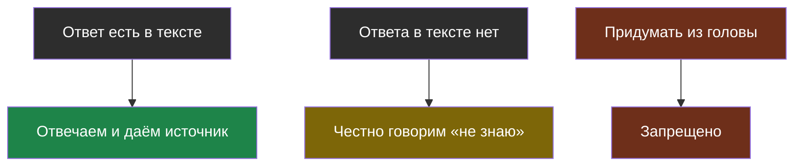
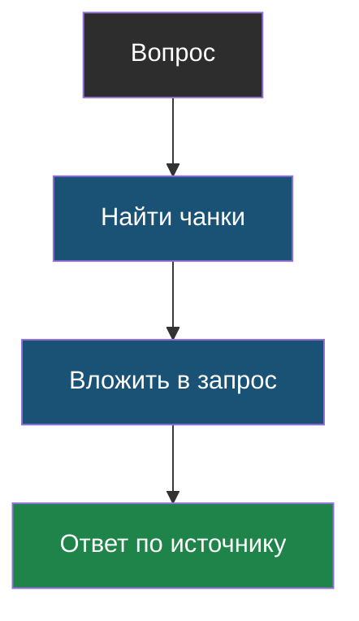
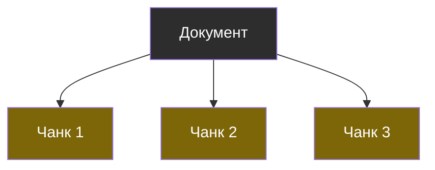

# Словарик темы 2

## Грунтование (grounding)

> **Грунтование ответа** — правило, при котором модель обязана отвечать только по данному ей тексту и признаваться, когда ответа там нет.

Из [урока 1](chapter-01.md). Без этой строчки в запросе RAG превращается обратно в выдумки.

## Нахлёст (overlap)

> **Нахлёст** — приём, при котором конец одного чанка повторяется в начале следующего, чтобы фраза, разрезанная на границе, целиком попала хотя бы в один кусок.

Из [урока 1](chapter-01.md).

## Поиск по словам

> **Поиск по словам** — способ найти нужный кусок текста по совпадению слов из вопроса. Хорош для точных названий и номеров, плох, когда об одном и том же говорят разными словами.

Из [урока 2](chapter-02.md). Именно его мы написали в лабораторной.

## Поиск по смыслу

> **Поиск по смыслу** — способ найти кусок, подходящий по смыслу, даже если в нём нет ни одного слова из вопроса.

Упомянут в [уроке 2](chapter-02.md), разбирается в теме 3.

## RAG

> **RAG** — способ работы с ИИ, при котором сначала находят нужные куски документов, а потом кладут их прямо в запрос к модели, чтобы она отвечала по ним, а не по памяти.

Из [урока 1](chapter-01.md). По-русски: сначала найди, потом отвечай.

## Чанк

> **Чанк** — небольшой фрагмент документа, на которые его заранее разрезали, чтобы искать и подставлять в запрос по отдельности.

Из [урока 1](chapter-01.md). Режут по абзацам, по заголовкам или по числу символов — у каждого способа свои минусы.

