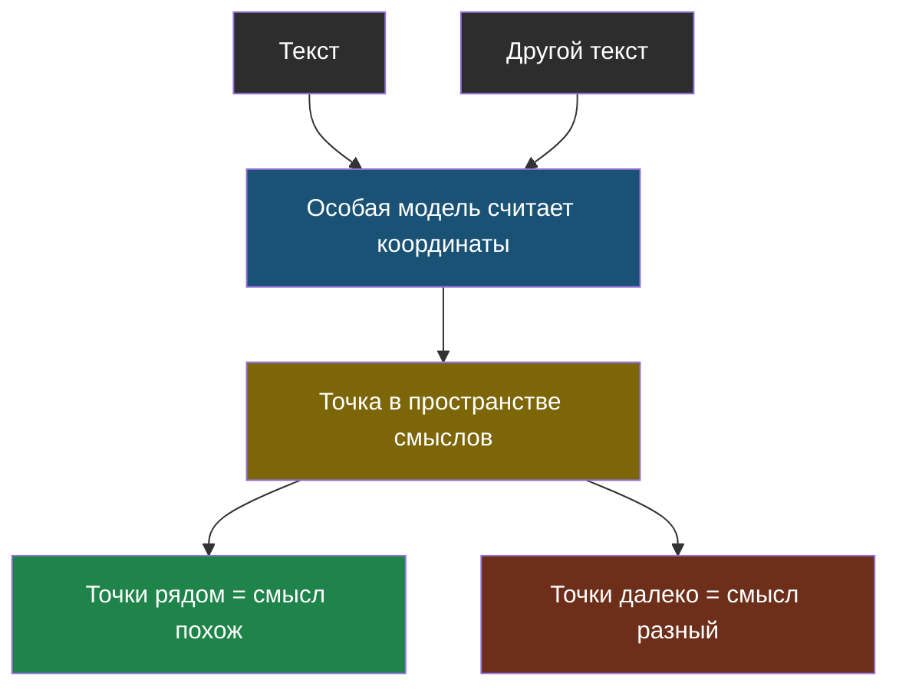

# Тема 3. Векторные базы: как ИИ ищет похожее

> В теме 2 мы упёрлись в стену: поиск по словам не находит текст, где о том же сказано другими словами. Здесь — как эту стену обходят.

## Задача, с которой начинается тема

Вопрос: «когда занятия у робототехников».
В документе: «Кружок робототехники: вторник и четверг, 15:40».

Человек видит, что это про одно и то же, за полсекунды. Компьютер, который сравнивает буквы, не видит почти ничего: «занятия» и «кружок» — разные слова, «робототехников» и «робототехники» — тоже разные строки.

Значит, нужен способ сравнивать не буквы, а **смысл**. Звучит как что-то невозможное для программы — но приём, которым это делают, на удивление простой, и он же используется в рекомендациях музыки, поиске похожих картинок и определении спама.

## Главная мысль темы

Смысл текста можно превратить в **точку в пространстве**. Тогда «похоже по смыслу» станет «близко расположено», а сравнение смыслов — обычной геометрией.

## Уроки темы

- [Урок 1. Смысл как точка на карте](chapter-01.md) — эмбеддинги, похожесть, лаба с поиском по смыслу
- [Урок 2. Когда данных очень много](chapter-02.md) — почему перебор не работает и как ищут быстро
- [Словарик темы](glossary.md)

## Что понадобится

Только Python. Настоящую модель эмбеддингов мы звать не будем — координаты для учебных фраз уже посчитаны и лежат прямо в файле лабораторной.
