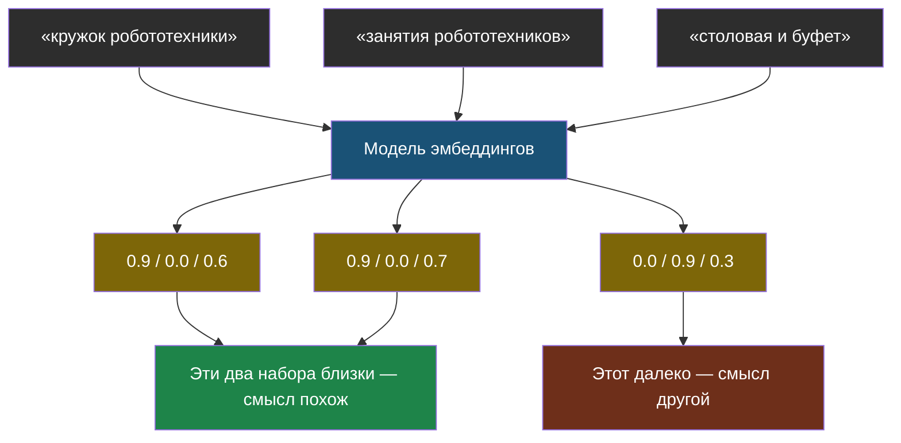

# Урок 1. Смысл как точка на карте

> **Лабораторная этого урока:** ищем по смыслу через векторы и косинусную близость.
> - без интернета: [01_poisk_po_smyslu.py](labs/tema3-vektory/01_poisk_po_smyslu.py) — запуск `python3 01_poisk_po_smyslu.py`, разобрана в разделе [«Практика: поиск по смыслу»](#практика-поиск-по-смыслу)
> - на настоящей модели: [открыть в Google Colab](https://colab.research.google.com/github/iRoboTron/ai-engineering-school/blob/main/docs/books/labs/tema3-vektory/01_smysl_v_chislah.ipynb) · [скачать .ipynb](labs/tema3-vektory/01_smysl_v_chislah.ipynb)

## Начнём с того, что ты уже умеешь

Возьмём задачу попроще: описать числами не смысл, а человека. Например, тремя числами от 0 до 1: «любит спорт», «любит музыку», «любит математику».

| Человек | спорт | музыка | математика |
|---|---|---|---|
| Аня | 0,9 | 0,2 | 0,8 |
| Боря | 0,8 | 0,3 | 0,9 |
| Вика | 0,1 | 0,9 | 0,2 |

Даже не зная этих людей, ты сразу видишь: Аня и Боря похожи, а Вика — другая. Ты это увидел **по числам**, не читая описания. Именно так компьютер и сравнивает то, что сравнивать вроде бы нельзя: сначала превращает в набор чисел, потом смотрит, насколько наборы близки.

Теперь то же самое, только с текстами.

> **Эмбеддинг** — набор чисел, который описывает смысл текста. Тексты с похожим смыслом получают похожие наборы чисел.

Ещё этот набор чисел называют **вектором** — это то же самое, просто слово из математики. Вектор — это координаты точки: как (3, 5) на клетчатой бумаге, только координат не две, а много.

## Откуда берутся эти числа

Не вручную, конечно. Их считает отдельная модель — не та, что пишет ответы, а специально обученная превращать текст в числа. Она видела огромное количество текстов и «поняла», какие слова встречаются в похожих ситуациях.

Важная деталь: у настоящих эмбеддингов **не три числа, а сотни или тысячи**. И что означает каждое конкретное число, никто не знает — там нет подписанной колонки «про еду». Модель сама придумала себе эти оси, пока училась.

Но принцип точно такой же, как в табличке с Аней и Борей: чем ближе наборы чисел, тем ближе смысл. Поэтому дальше мы будем работать с несколькими понятными осями — идея от этого не меняется, зато всё видно глазами.



## Как измерить, насколько близко

Раз тексты стали точками, «похожесть» стала расстоянием. Осталось решить, как именно его мерить.

Самый ходовой способ — смотреть не на расстояние между точками, а на **направление** из начала координат: если две стрелки смотрят в одну сторону, тексты про одно и то же, даже если одна стрелка длиннее (например, потому что один текст просто подробнее).

> **Косинусная близость** — число от −1 до 1, показывающее, насколько два вектора смотрят в одну сторону. 1 — смысл совпадает, 0 — тексты никак не связаны.

Считается она обычной формулой из геометрии, и в лабораторной ты увидишь её целиком в четыре строчки кода. Ничего страшнее умножения и корня там нет.

| Косинусная близость | Что это значит |
|---|---|
| около 1 | Практически об одном и том же |
| 0,5–0,8 | Связанные темы |
| около 0 | Совсем разное |

## Практика: поиск по смыслу

Повторим лабораторную из темы 2, но заменим поиск по словам на поиск по смыслу — и увидим, что теперь находится то, что раньше не находилось.

Чтобы не звать настоящую модель, эмбеддинги для учебных фраз уже посчитаны вручную по четырём осям: **«про учёбу»**, **«про еду»**, **«про время работы»**, **«про технику»**.

Файл: [labs/tema3-vektory/01_poisk_po_smyslu.py](labs/tema3-vektory/01_poisk_po_smyslu.py) — запуск: `python3 01_poisk_po_smyslu.py`.

```python
# labs/tema3-vektory/01_poisk_po_smyslu.py
# Поиск по смыслу: сравниваем не буквы, а наборы чисел (эмбеддинги).
# Настоящую модель не зовём — числа для учебных фраз проставлены вручную
# по четырём осям: [про учёбу, про еду, про время работы, про технику].

import math

# --- НАСТРОЙКИ ---
SKOLKO_POKAZAT = 3        # сколько лучших результатов печатать

CHANKI = {
    "Кружок робототехники: вторник и четверг, 15:40, кабинет 204": [0.9, 0.0, 0.6, 0.9],
    "Кружок рисования: среда, 16:00, кабинет 112":                 [0.85, 0.0, 0.55, 0.0],
    "Столовая работает с 9:00 до 15:00":                           [0.05, 0.95, 0.6, 0.0],
    "В буфете продают пирожки и сок":                              [0.0, 0.9, 0.05, 0.0],
    "Библиотека открыта с 8:30 до 17:00":                          [0.4, 0.0, 0.6, 0.0],
}

VOPROSY = {
    # Ни одного общего слова с нужным чанком — поиск по словам тут бессилен.
    "когда занятия у робототехников":  [0.9, 0.0, 0.65, 0.85],
    "где можно перекусить":            [0.0, 0.92, 0.1, 0.0],
    "во сколько закрывается читальня": [0.35, 0.0, 0.7, 0.0],
}


def kosinusnaya_blizost(a, b):
    """Насколько два вектора смотрят в одну сторону: 1 — одинаково, 0 — не связаны."""
    skalyarnoe = sum(x * y for x, y in zip(a, b))       # перемножили и сложили
    dlina_a = math.sqrt(sum(x * x for x in a))          # длина первой стрелки
    dlina_b = math.sqrt(sum(y * y for y in b))          # длина второй стрелки
    return skalyarnoe / (dlina_a * dlina_b)


for vopros, vektor_voprosa in VOPROSY.items():
    print("=" * 60)
    print(f"ВОПРОС: {vopros}")
    print(f"его эмбеддинг: {vektor_voprosa}\n")

    rezultaty = []
    for chank, vektor_chanka in CHANKI.items():
        blizost = kosinusnaya_blizost(vektor_voprosa, vektor_chanka)
        rezultaty.append((blizost, chank))

    rezultaty.sort(reverse=True)

    for blizost, chank in rezultaty[:SKOLKO_POKAZAT]:
        print(f"  {blizost:.3f} | {chank}")
    print()
```

**Что посмотреть в выводе:**

- Вопрос «когда занятия у робототехников» находит нужный чанк, хотя **ни одного общего слова** с ним нет. Поиск по словам из темы 2 здесь провалился бы.
- «где можно перекусить» находит столовую и буфет — снова без единого совпадения слов.
- А вот «во сколько закрывается читальня» — интересный случай: библиотека действительно на первом месте, но и кружки недалеко, потому что по нашей грубой оси «про учёбу» они похожи. Четыре числа — это очень мало. У настоящих эмбеддингов их сотни, и они различают такие вещи гораздо точнее.

**Попробуй сам:** добавь свой чанк, например `"Спортзал открыт до 19:00": [0.3, 0.0, 0.7, 0.0]`, и вопрос «когда можно поиграть в баскетбол» с эмбеддингом `[0.3, 0.0, 0.7, 0.0]`. Находится ли нужное? А теперь подумай: какой оси нашей игрушечной модели не хватает, чтобы спорт не путался с библиотекой?

### А теперь — настоящая модель эмбеддингов

Выше числа проставлены руками по четырём придуманным осям. В ноутбуке работает настоящая модель `multilingual-e5-small`: она скачивается прямо в ноутбук и считает по 384 числа на фразу — без ключей, без интернета после загрузки.

Лаборатория (ноутбук): [скачать .ipynb](labs/tema3-vektory/01_smysl_v_chislah.ipynb) · [открыть в Google Colab](https://colab.research.google.com/github/iRoboTron/ai-engineering-school/blob/main/docs/books/labs/tema3-vektory/01_smysl_v_chislah.ipynb)

Что там увидишь: пятнадцать фраз о еде, спорте и книгах превращаются в точки на картинке — и сами собираются в группы, хотя никто не говорил модели, какая фраза к какой теме относится. Причём не «на глаз»: расстояние внутри группы измеряется и оказывается в полтора раза меньше, чем между группами.

Дальше поиск по смыслу находит «завтрак» по запросу «во сколько кормят утром» и книги по запросу «хочу почитать книжку» — без единого общего слова.

И самое важное — честная слабость: на вопрос «когда родительское собрание», которого в документах нет вовсе, поиск уверенно возвращает какую-то фразу с близостью 0,83 — почти такой же, как у правильных ответов. По одному числу отличить «нашёл» от «не нашёл» невозможно. Вот почему последнее слово остаётся за грунтованием из темы 2.

## Важное следствие: эмбеддинги нельзя смешивать

Раз оси придумывает сама модель, то у **разных** моделей эмбеддингов оси разные. Числа, посчитанные одной моделью, для другой — бессмыслица, хотя внешне это одинаковые списки чисел.

Отсюда правило, на котором в реальных проектах обжигаются регулярно: если поменял модель эмбеддингов — надо **заново пересчитать все документы**. Иначе поиск не сломается с ошибкой, он просто начнёт тихо выдавать чушь, а это гораздо хуже.

## Найди ошибку

Ученик сделал поиск по смыслу для школьного бота и очень им доволен: на любой вопрос система выдаёт ответ с близостью 0,8 и выше, а это «почти единица, значит, почти идеально». Он решил, что порог 0,7 отсечёт неподходящие ответы, и на этом успокоился.

В чём он ошибается?

<details>
<summary>Ответ</summary>

Сразу в двух вещах.

**Первая: близость 0,8 — это не «почти идеально».** У этой шкалы нет универсального смысла. У одной модели типичные значения лежат около 0,3, у другой — около 0,8, и сравнивать их между собой бессмысленно. Значение имеет только **порядок**: этот кусок подошёл лучше, чем тот.

**Вторая, и она опаснее: порог не сработает.** В лаборатории к этому уроку ты увидишь, что вопрос «когда родительское собрание», ответа на который в документах нет вообще, получает близость 0,83 — выше «порога» и почти столько же, сколько правильный ответ на нормальный вопрос. Поиск по смыслу **не умеет говорить «я не нашёл»**: он всегда возвращает самое похожее из того, что есть.

Что делать на самом деле: не полагаться на порог, а оставлять последнее слово за грунтованием из темы 2 — правилом «отвечай только по тексту, а если ответа там нет, так и скажи». И проверять качество на эталонном наборе, как в теме 5.
</details>

## Что мы узнали

- **Эмбеддинг** — набор чисел, описывающий смысл текста; похожий смысл → похожие числа.
- Оси эмбеддинга придумывает сама модель, и что означает каждое число — неизвестно.
- **Косинусная близость** измеряет, насколько два вектора смотрят в одну сторону: 1 — то же самое, 0 — не связано.
- Поиск по смыслу находит текст без единого общего слова с вопросом — то, чего не умеет поиск по словам.
- Зато он **всегда что-нибудь возвращает**, даже когда ответа нет вовсе, и по числу близости это не отличить. Поиск по словам в такой ситуации честно молчит — поэтому оба способа используют вместе.
- Сменил модель эмбеддингов — пересчитывай все документы заново.

## Проверь себя

1. Почему два текста без общих слов могут оказаться «близкими»?
2. Бот выдал ответ с близостью 0,85. Можно ли по одному этому числу понять, подходит ответ или нет?
3. Почему нельзя взять эмбеддинги от одной модели, а вопрос считать другой?

Дальше — [Урок 2: когда данных очень много](chapter-02.md).
