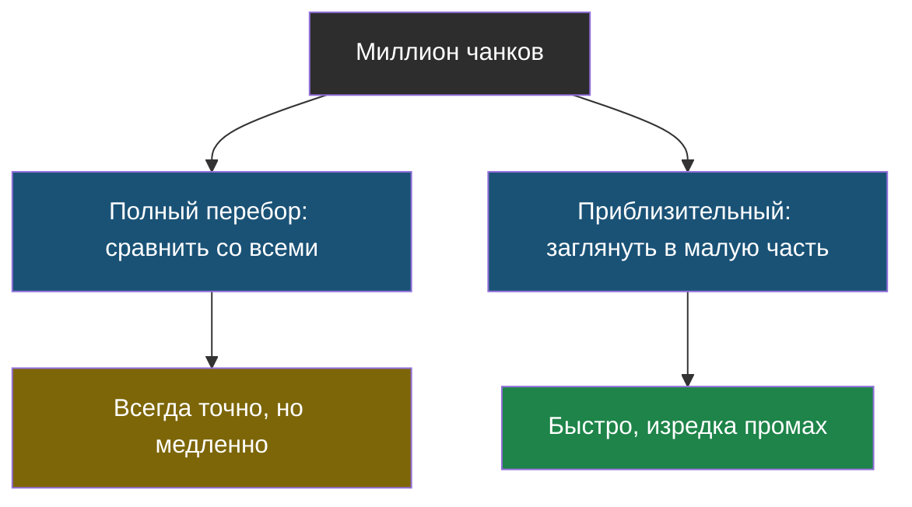
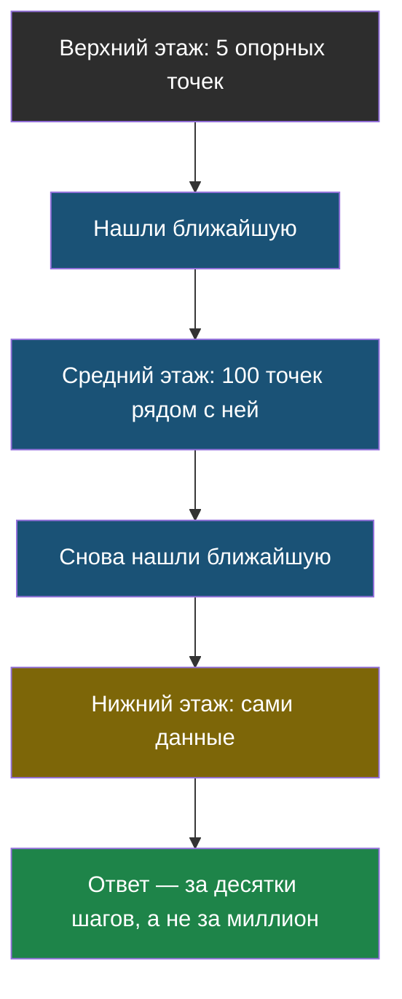

# Урок 2. Когда данных очень много

> **Лабораторной в этом уроке нет.** Практика темы — в [уроке 1](chapter-01.md).

## Напомним, где мы остановились

В прошлом уроке мы научились находить подходящий кусок по смыслу: посчитали косинусную близость **со всеми чанками** и выбрали лучшие.

У нас было пять чанков — пять сравнений, мгновенно. А теперь честный вопрос: что будет, если чанков не пять, а миллион?

## Проблема: перебор растёт вместе с данными

Посчитаем. Пусть одно сравнение занимает крошечное время — миллионную долю секунды.

| Сколько чанков | Сколько сравнений на один вопрос | Сколько ждать |
|---|---|---|
| 5 | 5 | мгновенно |
| 1 000 | 1 000 | тысячная доля секунды |
| 1 000 000 | 1 000 000 | около секунды |
| 100 000 000 | 100 000 000 | около двух минут |

Видишь закономерность? Время растёт **ровно во столько же раз**, во сколько растут данные. Такой поиск называют перебором или полным поиском.

> **Полный перебор** — способ найти нужное, сравнив вопрос по очереди со всеми данными. Всегда даёт точный ответ, но чем больше данных, тем дольше работает.

Две минуты на один вопрос — это уже неприемлемо. А ведь пользователей может быть много, и каждый ждёт ответа за секунду.

Знакомая ситуация, если подумать: искать слово в словаре, листая все страницы подряд, тоже можно — просто никто так не делает.

## Идея: не искать везде

Как ты на самом деле ищешь слово в толстом словаре? Ты не листаешь всё подряд. Ты открываешь примерно посередине, смотришь на букву, понимаешь, в какую сторону идти, — и с каждым шагом отбрасываешь половину книги.

Тот же приём применяют к поиску по смыслу. Общая идея у всех способов одна: **заранее разложить данные так, чтобы при поиске не пришлось смотреть на большую их часть**.

Но есть цена, и её важно понять честно.

> **Приблизительный поиск** — способ найти похожее, просмотрев лишь малую часть данных. Работает во много раз быстрее полного перебора, но изредка может пропустить лучший вариант.

Именно так: не «иногда ошибается», а «может пропустить самый-самый подходящий и вернуть второй по подходящести». Для поиска документов это почти всегда приемлемо: разница между лучшим и вторым куском обычно небольшая, а ускорение — в сотни раз.

## Два способа, которые применяют чаще всего

Разбирать их устройство до последней детали мы не будем — важно понять принцип, потому что оба построены на приёмах из обычной жизни.

### Способ первый: как оглавление в книге

Представь книгу, у которой три уровня: сначала список из 5 разделов, у каждого раздела — список из 20 глав, у каждой главы — 100 страниц. Чтобы найти нужную страницу, ты смотришь в раздел (5 вариантов), потом в главу (20 вариантов), потом уже на страницы. Всего десятки шагов вместо десяти тысяч.

Так же устроен и самый популярный способ быстрого поиска по смыслу: над данными строят несколько «этажей». На верхнем этаже — редкие опорные точки, разбросанные далеко друг от друга. Ты быстро находишь ближайшую из них, спускаешься этажом ниже, где точек больше, находишь ближайшую там — и так до самого низа.

В книжках и вакансиях этот способ называют коротким словом **HNSW**. Расшифровка тебе сейчас ничего не даст, а идея — «многоэтажное оглавление» — даст.

### Способ второй: как почта по районам

На почте письма не перебирают по одному. Их сначала раскладывают по мешкам: этот район, тот район, третий район. Когда приходит письмо, смотрят на адрес, берут один мешок и ищут только в нём.

Точно так же можно поступить с чанками: заранее разбить их на группы похожих (все про еду — в одну кучку, все про кружки — в другую). При поиске смотрят, к какой кучке ближе вопрос, и перебирают только её.

Этот способ называют **IVF**. Здесь особенно хорошо видна цена приблизительности: если нужный чанк лежал на самой границе двух кучек, а мы открыли только одну, — мы его не найдём.

| | «Оглавление» (HNSW) | «Почта по районам» (IVF) |
|---|---|---|
| Скорость поиска | Очень быстро | Быстро |
| Сколько памяти нужно | Много | Меньше |
| Что нужно заранее | Построить этажи | Разложить по кучкам |

## Где всё это хранят

Обычную таблицу с оценками хранят в базе данных. Эмбеддинги — тоже, только база должна уметь искать «похожее», а не «равное».

> **Векторная база данных** — хранилище, которое умеет хранить эмбеддинги и быстро находить среди них похожие, не перебирая всё подряд.

Названия таких хранилищ (pgvector, Qdrant, Chroma и другие) тебе сейчас не нужны — важно знать, что это просто «база данных, которая умеет в похожесть», и внутри у неё один из приёмов, которые мы разобрали.

## Найди ошибку

Ученик сравнил два поиска на своих 200 чанках: полный перебор нашёл ответ за 0,01 секунды, приблизительный — за 0,01 секунды и один раз промахнулся. Ученик сделал вывод: «приблизительный поиск бесполезен, он просто хуже». Где ошибка в рассуждении?

Ответ

Ошибка в размере данных. На 200 чанках полный перебор и так мгновенный — экономить нечего, и приблизительный поиск действительно только вредит.

Весь смысл приблизительного поиска появляется на **больших** объёмах: там перебор занимает секунды и минуты, а приблизительный поиск — по-прежнему миллисекунды. Вывод правильный звучал бы так: «на маленьких данных приблизительный поиск не нужен».

Это, кстати, общее правило в программировании: сложный быстрый способ выигрывает у простого только начиная с какого-то объёма данных.

## Что мы узнали

- **Полный перебор** точен, но его время растёт вместе с объёмом данных — на миллионах чанков это уже слишком долго.
- **Приблизительный поиск** смотрит лишь малую часть данных: в сотни раз быстрее, но изредка может пропустить лучший вариант.
- Способ «многоэтажное оглавление» (**HNSW**) — быстрый, но требует много памяти.
- Способ «почта по районам» (**IVF**) — экономнее, но чаще промахивается на границах кучек.
- **Векторная база данных** — хранилище, которое умеет всё это за тебя.
- На маленьких данных ничего этого не нужно: обычный перебор проще и точнее.

## Проверь себя

1. Почему полный перебор перестаёт годиться, когда данных становится очень много?
2. Что мы отдаём взамен за скорость приблизительного поиска?
3. Чем «многоэтажное оглавление» отличается от «почты по районам»?

## Итог темы 3

Теперь ты знаешь, как ИИ находит нужное **по смыслу**, а не по буквам, и почему для больших данных придумали хитрые способы искать. Проверь себя по [словарику темы](glossary.md).

Дальше — тема 4: ИИ, который не просто отвечает, а сам решает, что делать дальше.
