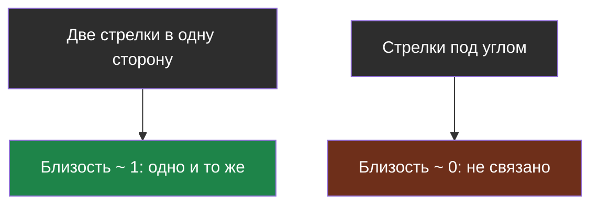
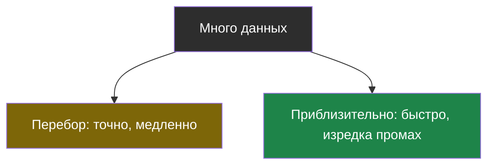
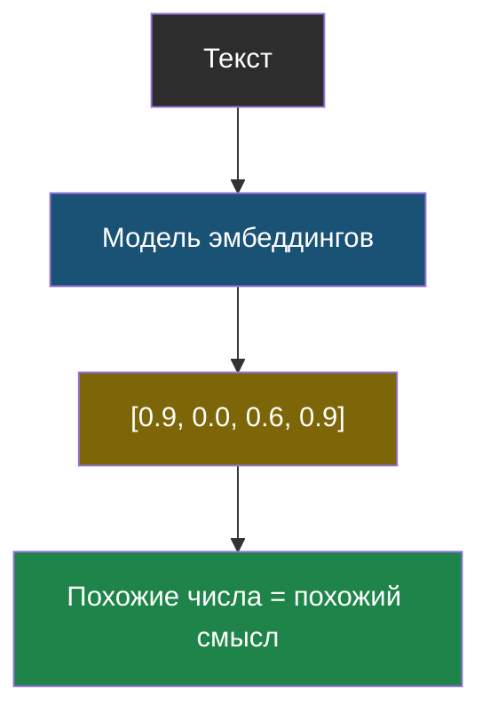

# Словарик темы 3

## Векторная база данных

> **Векторная база данных** — хранилище, которое умеет хранить эмбеддинги и быстро находить среди них похожие, не перебирая всё подряд.

Из [урока 2](chapter-02.md). Обычная база ищет «равное», векторная — «похожее».

## Косинусная близость

> **Косинусная близость** — число от −1 до 1, показывающее, насколько два вектора смотрят в одну сторону. 1 — смысл совпадает, 0 — тексты никак не связаны.

Из [урока 1](chapter-01.md). Считается формулой в четыре строчки кода.

## Полный перебор

> **Полный перебор** — способ найти нужное, сравнив вопрос по очереди со всеми данными. Всегда точен, но чем больше данных, тем дольше работает.

Из [урока 2](chapter-02.md).

## Приблизительный поиск

> **Приблизительный поиск** — способ найти похожее, просмотрев лишь малую часть данных. Во много раз быстрее перебора, но изредка может пропустить лучший вариант.

Из [урока 2](chapter-02.md). Два главных приёма — «многоэтажное оглавление» (HNSW) и «почта по районам» (IVF).

## Эмбеддинг (вектор)

> **Эмбеддинг** — набор чисел, который описывает смысл текста. Тексты с похожим смыслом получают похожие наборы чисел.

Из [урока 1](chapter-01.md). Оси придумывает сама модель; у настоящих эмбеддингов сотни чисел. Сменил модель — пересчитывай все документы заново.

