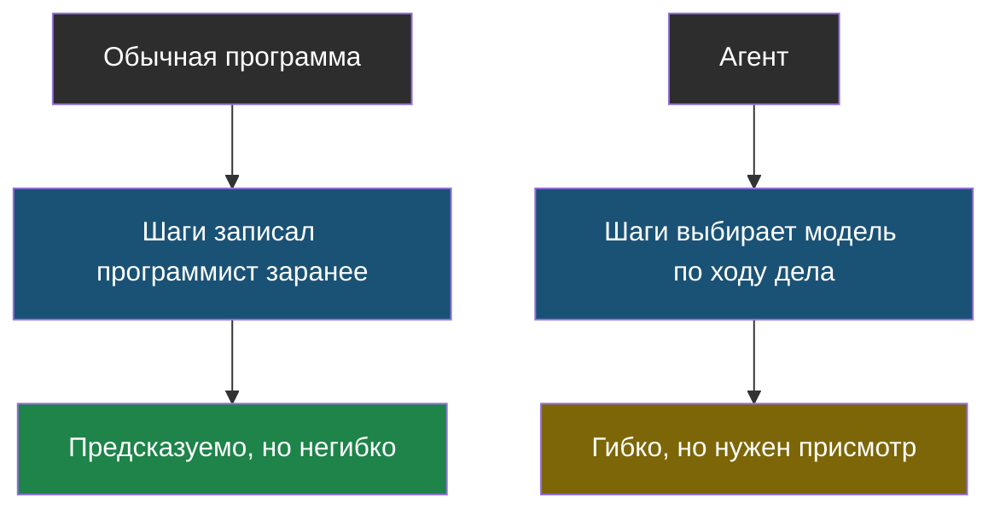

# Тема 4. Агенты: ИИ, который делает шаги сам

> В теме 1 мы мельком увидели цикл «модель просит инструмент — программа выполняет». Здесь разберём его до конца и напишем настоящего агента.

## Задача, с которой начинается тема

Слово «агент» сейчас лепят куда попало, и звучит оно так, будто внутри живёт маленький разум, который «сам думает». Давай честно разберёмся, что там на самом деле — и ты увидишь, что это обычный цикл, который ты сам можешь написать за полчаса.

А заодно поймёшь, почему у агентов есть неприятные свойства, которых нет у обычных программ, и что с этим делают инженеры.

## Главная мысль темы

Обычная программа знает шаги заранее. Агент — не знает: он смотрит на результат каждого шага и **сам решает**, что делать дальше. Отсюда вся его польза и весь его риск.

## Уроки темы

- [Урок 1. Рецепт против повара](chapter-01.md) — чем агент отличается от обычной программы
- [Урок 2. Свой агент и его границы](chapter-02.md) — лаба: агент с двумя инструментами, лимиты и память · лабораторная: [открыть в Colab](https://colab.research.google.com/github/iRoboTron/ai-engineering-school/blob/main/docs/books/labs/tema4-agenty/01_agent_s_granicami.ipynb)
- [Словарик темы](glossary.md)

## Что понадобится

Python. Настоящую модель, как и раньше, заменит простая функция — так виден сам механизм, а не библиотека.
