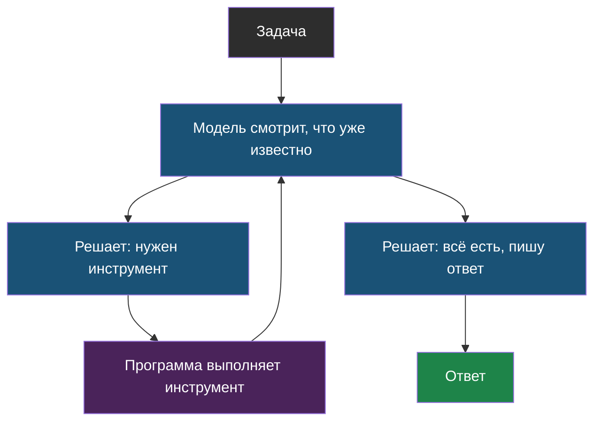

# Урок 1. Рецепт против повара

## Две кухни

**Первая кухня: рецепт.** Написано: «нарезать картошку, обжарить 10 минут, добавить соль, подавать». Ты выполняешь пункты по порядку. Если картошки не оказалось — рецепт не поможет, там про это ничего не сказано.

**Вторая кухня: повар.** Ему сказали: «приготовь ужин». Он открывает холодильник, смотрит, что есть, решает, что готовить, пробует, досаливает, если пресно. Никакого списка шагов заранее не было — он придумывает их по ходу.

Вот и вся разница между обычной программой и агентом.

> **Заранее заданный порядок** (по-английски *workflow*, «рабочий поток») — программа, где все шаги и их порядок придумал программист, а модель вызывается на конкретных шагах.

> **Агент** — программа, в которой модель сама решает, какой шаг сделать следующим, глядя на результат предыдущего, и делает это в цикле, пока не получит ответ.

## Как это выглядит в жизни

Задача: «Найди в школьных правилах, во сколько кружок робототехники, и посчитай, сколько минут он идёт до конца рабочего дня библиотеки».

**Заранее заданный порядок** — программист прописал:

1. Найти в документах чанк про робототехнику.
2. Попросить модель вытащить оттуда время.
3. Найти чанк про библиотеку.
4. Попросить модель вытащить время закрытия.
5. Вычесть одно из другого обычным кодом.

Работает надёжно и стоит дёшево. Но стоит спросить что-то другое — и всё, программа этого не умеет.

**Агент** — программист прописал только инструменты (поиск, калькулятор) и отпустил модель:

1. Модель: «нужно найти про робототехнику» → вызывает поиск.
2. Видит результат: «15:40».
3. Модель: «теперь нужна библиотека» → снова поиск.
4. Видит: «до 17:00».
5. Модель: «надо посчитать разницу» → вызывает калькулятор.
6. Пишет ответ.

Ту же задачу агент решил сам, и он же справится с похожими задачами, которых никто не предусматривал.

Заметил стрелку, идущую обратно вверх? Это тот же самый цикл, что мы видели в теме 1. Только теперь понятно, зачем он: без цикла модель могла бы сделать лишь один шаг.

## Что лучше?

Ловушка новичка — думать, что агент «современнее», а значит лучше. На самом деле выбор простой:

| | Заранее заданный порядок | Агент |
|---|---|---|
| Задача всегда одна и та же | ✅ Берём это | Лишняя сложность |
| Заранее не знаешь, сколько шагов нужно | Не справится | ✅ Берём это |
| Предсказуемость | Высокая | Низкая: сегодня 3 шага, завтра 7 |
| Стоимость | Понятная | Плавает: модель может «задуматься» надолго |
| Отладка, когда что-то сломалось | Просто: шаги известны | Сложно: каждый раз новый путь |

Правило, которым пользуются инженеры: **бери самое простое, что решает задачу**. Если задача решается заранее заданным порядком — не делай агента.

## Три вида памяти

Раз агент делает много шагов, ему нужно что-то помнить. Оказывается, «память» бывает трёх разных видов — и путать их не стоит, потому что устроены они по-разному. Сравни со своей собственной памятью:

| Вид памяти | У человека | У агента | Где живёт |
|---|---|---|---|
| **Короткая** | О чём мы говорим прямо сейчас | Текущий диалог и результаты шагов | В контекстном окне |
| **Долгая** | Что я знаю про друга | Факты о пользователе: имя, класс, что спрашивал раньше | В базе данных, подставляется при надобности |
| **Умения** | Как ездить на велосипеде | Правила «как себя вести», инструкция агента | В системном запросе, задаётся заранее |

Главное следствие: короткая память **не бесконечна**, это то самое контекстное окно из темы 1. Когда диалог длинный, старое приходится либо выбрасывать, либо коротко пересказывать, либо сохранять в долгую память. Само по себе ничего не запомнится.

## Опасность, которой нет у обычных программ

Обычная программа делает ровно то, что написано. Агент — то, что решит модель. Отсюда неприятности, которых у обычных программ просто не бывает:

- **Бесконечный цикл.** Модель повторяет один и тот же вызов снова и снова и никогда не заканчивает.
- **Неожиданные расходы.** Каждый шаг — это запрос к модели. Двадцать шагов вместо двух — в десять раз дороже.
- **Опасное действие.** Если у агента есть инструмент «удалить файл», однажды он его вызовет — просто потому, что решил, что это уместно.

Поэтому агента никогда не отпускают без ограничений. Каким именно — в следующем уроке.

## Найди ошибку

Ученик сделал агента, который отвечает на вопрос «сколько будет 2+2», имея инструменты: поиск в интернете, калькулятор, отправка письма, удаление файлов. Что здесь спроектировано неправильно?

Ответ

Две ошибки.

Первая: для такой задачи агент вообще не нужен. Один шаг, известный заранее — это заранее заданный порядок, а не агент.

Вторая, более важная: агенту дали инструменты, которые для задачи не нужны и при этом **опасны** — отправку письма и удаление файлов. Правило простое: у агента должно быть ровно столько инструментов, сколько нужно для задачи. Каждый лишний инструмент — это то, что однажды может быть вызвано не вовремя.

## Что мы узнали

- **Заранее заданный порядок** — шаги придумал программист; **агент** — шаги выбирает модель по ходу дела.
- Агент — это цикл: посмотреть на результат → решить, что дальше → вызвать инструмент → снова посмотреть.
- Агент нужен, только когда заранее неизвестно, сколько будет шагов. В остальных случаях он лишняя сложность.
- У агента три вида памяти: короткая (контекст), долгая (база), умения (инструкция).
- У агента есть риски, которых нет у обычных программ: бесконечный цикл, неожиданные расходы, опасные действия.
- Лишние инструменты — это лишний риск.

## Проверь себя

1. Чем повар отличается от рецепта — и как это связано с агентами?
2. Приведи задачу, для которой агент не нужен, и задачу, где без него не обойтись.
3. Почему агент не помнит начало длинного разговора, если никто об этом не позаботился?

Дальше — [Урок 2: свой агент и его границы](chapter-02.md).
