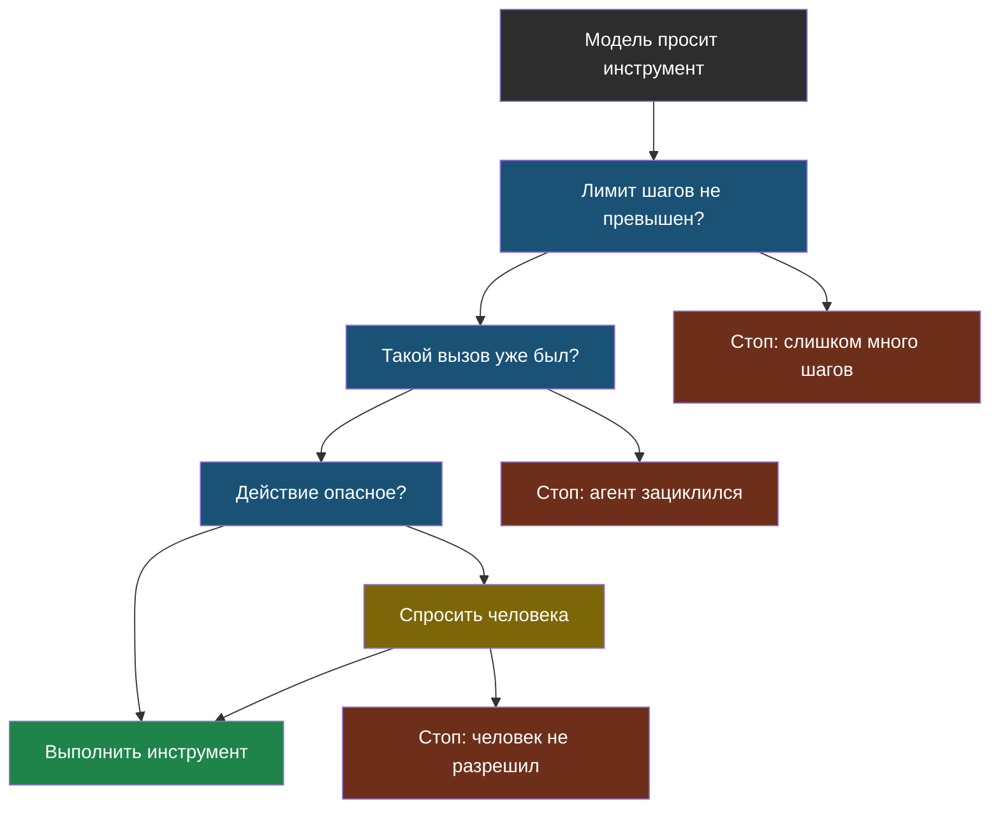

# Урок 2. Свой агент и его границы

## Напомним, где мы остановились

Агент — это цикл, в котором модель сама выбирает следующий шаг. И у этого цикла есть три способа испортить всем жизнь: крутиться вечно, потратить кучу денег и сделать что-то опасное.

Хорошая новость: защита от всего этого — обычный код, который ты сейчас напишешь сам. Никакой особой магии там нет.

## Четыре границы, которые ставят агенту

> **Границы агента** — правила в коде, которые ограничивают, что и сколько раз агент может сделать. Ставит их программист, а не модель.

Последнее важно: границы нельзя «попросить» у модели в запросе («пожалуйста, не делай больше пяти шагов»). Модель может это правило не выполнить — она же не исполняет инструкции, она угадывает продолжение текста. Границы должны быть в коде, который модель обойти не может.

| Граница | От чего защищает | Как выглядит в коде |
|---|---|---|
| **Лимит шагов** | Бесконечный цикл | `for shag in range(MAX_SHAGOV)` |
| **Ловля повторов** | Модель зациклилась на одном вызове | Запоминаем вызовы, повтор — стоп |
| **Спросить разрешение** | Опасное действие | Перед вызовом спрашиваем человека |
| **Только нужные инструменты** | Всё сразу | Не давать инструмент, если он не нужен |

Третью строчку иногда называют красивым английским словом *human-in-the-loop* — «человек в цикле». Смысл простой: перед необратимым действием (удалить, отправить, заплатить) агент останавливается и спрашивает.

И одна тонкость про вторую строчку, на которой легко обжечься. Запоминать нужно **каждую** попытку вызова, а не только удачную. Иначе получается ловушка: вызов, который падает с ошибкой, в список не попадает — и агент повторяет его снова, снова и снова, пока не кончится лимит шагов. Именно так и произошло, когда я готовил лабораторную к этому уроку: модель четыре раза подряд просила один и тот же сломанный вызов, а защита молчала, потому что ни один из них не был «удачным».



Заметь: у трёх стрелок из схемы конец — «Стоп». Это специально. Если агент упёрся в границу, правильное поведение — **остановиться и сказать об этом**, а не «попробовать как-нибудь по-другому». Инженеры называют такой подход «при сомнении — закрыто».

## Практика: агент с двумя инструментами и всеми границами

Собираем всё. Агент умеет искать в школьных правилах и считать. Модель, как обычно, заменена простой функцией — так виден сам цикл.

Файл: [labs/tema4-agenty/01_agent.py](labs/tema4-agenty/01_agent.py) — запуск: `python3 01_agent.py`.

```python
# labs/tema4-agenty/01_agent.py
# Агент с двумя инструментами и четырьмя границами:
# лимит шагов, ловля повторов, разрешение на опасное действие, набор инструментов.
# Вместо настоящей модели — функция model(), которая решает по простым правилам.

# --- НАСТРОЙКИ ---
MAX_SHAGOV = 6              # больше стольких шагов агент сделать не может
OPASNYE = {"udalit_fayl"}   # инструменты, требующие разрешения человека
RAZRESHAT_OPASNOE = False   # что "ответит человек", когда спросят разрешение

PRAVILA_SHKOLY = [
    "Кружок робототехники: вторник и четверг, 15:40, кабинет 204",
    "Библиотека открыта с 8:30 до 17:00",
    "Столовая работает с 9:00 до 15:00",
]


# --- ИНСТРУМЕНТЫ ---
def poisk(zapros):
    """Ищем строку правил, где встречается запрос (упрощённый поиск из темы 2)."""
    for stroka in PRAVILA_SHKOLY:
        if zapros.lower()[:7] in stroka.lower():
            return stroka
    return "ничего не найдено"


def raznica_minut(vyrazhenie):
    """Считает разницу двух времён вида '17:00-15:40' в минутах."""
    konec, nachalo = vyrazhenie.split("-")
    ch1, m1 = (int(x) for x in konec.split(":"))
    ch2, m2 = (int(x) for x in nachalo.split(":"))
    return str((ch1 * 60 + m1) - (ch2 * 60 + m2))


def udalit_fayl(imya):
    return f"файл {imya} удалён"


INSTRUMENTY = {"poisk": poisk, "raznica_minut": raznica_minut, "udalit_fayl": udalit_fayl}


def model(zadacha, istoriya):
    """Заглушка вместо модели: решает следующий шаг по тому, что уже известно.

    Настоящая модель делала бы то же самое, только сама, глядя на текст истории.
    """
    izvestno = " ".join(istoriya)

    if "удали" in zadacha.lower():
        return "ВЫЗОВ udalit_fayl | ocenki.txt"

    if "зациклись" in zadacha.lower():
        return "ВЫЗОВ poisk | столовая"        # намеренно один и тот же вызов

    if "робототехник" not in izvestno:
        return "ВЫЗОВ poisk | робототехника"
    if "Библиотека" not in izvestno:
        return "ВЫЗОВ poisk | библиотека"
    if "raznica_minut" not in izvestno:
        return "ВЫЗОВ raznica_minut | 17:00-15:40"
    return "ОТВЕТ: кружок в 15:40, до закрытия библиотеки остаётся "\
           + istoriya[-1].split(": ")[-1] + " минут"


def zapustit_agenta(zadacha):
    print("=" * 64)
    print(f"ЗАДАЧА: {zadacha}\n")

    istoriya = []
    byvshie_vyzovy = set()          # для ловли повторов

    # ГРАНИЦА 1: лимит шагов — цикл физически не может идти вечно.
    for nomer_shaga in range(1, MAX_SHAGOV + 1):
        reshenie = model(zadacha, istoriya)

        if reshenie.startswith("ОТВЕТ: "):
            print(f"  шаг {nomer_shaga}: модель готова ответить")
            print(f"  {reshenie}\n")
            return

        _, telo = reshenie.split("ВЫЗОВ ")
        imya, parametr = [chast.strip() for chast in telo.split("|")]
        print(f"  шаг {nomer_shaga}: модель просит {imya}({parametr})")

        # ГРАНИЦА 2: ловля повторов.
        if (imya, parametr) in byvshie_vyzovy:
            print("  СТОП: агент зациклился — этот вызов уже был\n")
            return
        byvshie_vyzovy.add((imya, parametr))

        # ГРАНИЦА 3: разрешение человека на опасное действие.
        if imya in OPASNYE:
            print(f"  ! опасное действие, спрашиваем человека: выполнить {imya}?")
            if not RAZRESHAT_OPASNOE:
                print("  СТОП: человек не разрешил\n")
                return
            print("  человек разрешил")

        # ГРАНИЦА 4: вызывать можно только известные инструменты.
        if imya not in INSTRUMENTY:
            print(f"  СТОП: инструмента {imya} не существует\n")
            return

        rezultat = INSTRUMENTY[imya](parametr)
        print(f"  шаг {nomer_shaga}: получен результат — {rezultat}")
        istoriya.append(f"{imya}: {rezultat}")

    print(f"  СТОП: закончился лимит в {MAX_SHAGOV} шагов\n")


zapustit_agenta("Во сколько робототехника и сколько минут до закрытия библиотеки?")
zapustit_agenta("Удали файл с оценками")
zapustit_agenta("Зациклись, пожалуйста")
```

**Что посмотреть в выводе:**

1. **Первая задача** — агент работает как надо: два поиска, потом расчёт, потом ответ. Обрати внимание: никто не прописывал этот порядок, модель выбирала каждый шаг, глядя на то, что уже известно.
2. **Вторая задача** — агент попросил опасный инструмент, и его остановили до выполнения. Файл не тронут.
3. **Третья задача** — модель повторила один и тот же вызов, и защита от повторов её остановила. Без неё агент крутился бы до лимита шагов, впустую тратя запросы.

**Попробуй сам:**

- Поставь `RAZRESHAT_OPASNOE = True` — увидишь, как выглядит разрешённое опасное действие. Как думаешь, в реальной программе кто должен отвечать на этот вопрос?
- Убери проверку повторов (закомментируй границу 2) и запусти третью задачу. Сколько шагов агент потратит впустую?
- Поставь `MAX_SHAGOV = 2` и запусти первую задачу. Что произойдёт и почему это правильное поведение?

### А теперь — настоящий агент

Выше решения принимала заглушка по простым правилам. В ноутбуке решает живая модель: мы даём ей три инструмента и смотрим, как она сама выстраивает порядок шагов.

Лаборатория (ноутбук): [скачать .ipynb](labs/tema4-agenty/01_agent_s_granicami.ipynb) · [открыть в Google Colab](https://colab.research.google.com/github/iRoboTron/ai-engineering-school/blob/main/docs/books/labs/tema4-agenty/01_agent_s_granicami.ipynb)

На составном вопросе («во сколько робототехника и сколько минут до закрытия библиотеки») агент делает три вызова подряд — два поиска и расчёт — и выдаёт верные 80 минут. Порядок ему никто не задавал.

Потом его пробуют сломать: просят удалить расписание — граница не пускает; спрашивают то, чего в правилах нет — агент честно отвечает «нет информации».

Там же видно то, чего не покажет ни одна имитация: модель иногда присылает **испорченные параметры** — оборванный на полуслове JSON. Программа обязана это пережить, а не упасть. В лабораторной такая проверка стоит, и объяснено, зачем: всё, что пришло от модели, — данные, а не гарантия.

## Как агенты подключают чужие инструменты

Ещё одно слово, которое ты наверняка встретишь. Пока инструменты пишет тот же человек, что и агента, всё просто. Но полезных инструментов в мире много, и каждый раз писать переходник под чужую программу — мучение.

Поэтому договорились об общем стандарте: если программа умеет описывать свои инструменты одинаковым способом, любой агент сможет ими пользоваться без переделки.

> **MCP** — общий стандарт подключения инструментов к ИИ-агентам: как USB-разъём, только для программ.

Аналогия с USB тут точная. Раньше у каждого устройства был свой разъём, теперь один стандарт — и мышка от одного производителя работает с ноутбуком другого. Так же и здесь: инструмент, сделанный по стандарту, подойдёт любому агенту.

## Найди ошибку

Ученик защитил агента так: добавил в запрос к модели строчку «Не делай больше 5 шагов и не удаляй файлы без разрешения». Почему это не защита?

<details>
<summary>Ответ</summary>

Потому что это просьба к модели, а не правило в коде. Модель не выполняет инструкции — она продолжает текст наиболее правдоподобным образом. Обычно она эту просьбу учтёт, но однажды не учтёт, и никакой ошибки при этом не возникнет.

Настоящая защита живёт в коде цикла, который модель физически не может обойти: `for` с лимитом шагов, проверка перед вызовом опасного инструмента, набор разрешённых инструментов. В нашей лабораторной все они именно такие.

Правило звучит так: **никогда не полагайся на то, что модель сама себя ограничит**.
</details>

## Что мы узнали

- Границы агента ставят **в коде**, а не просьбой к модели: просьбу модель может не выполнить.
- Четыре главные границы: лимит шагов, ловля повторов, разрешение человека на опасное действие, минимальный набор инструментов.
- Упёрся в границу — остановись и скажи об этом, а не пытайся обойти («при сомнении — закрыто»).
- Перед необратимым действием агент должен спрашивать человека.
- **MCP** — общий стандарт подключения инструментов, как USB для устройств.

## Проверь себя

1. Почему просьба «не делай больше 5 шагов» в запросе не является защитой?
2. Какие действия обязательно должны требовать разрешения человека?
3. Зачем ловить повторяющиеся вызовы, если лимит шагов и так остановит агента?

## Итог темы 4

Ты написал агента со всеми границами, которые ставят в настоящих системах. Загляни в [словарик](glossary.md).

Дальше — тема 5: как понять, что твой агент или RAG работает хорошо, — и почему «вроде отвечает нормально» не годится в качестве ответа.
