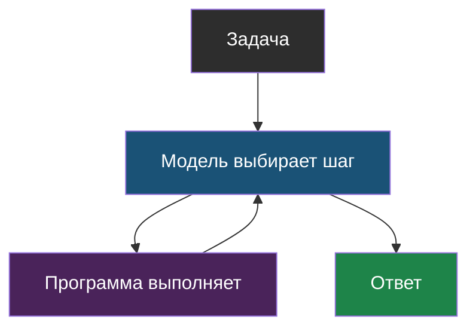
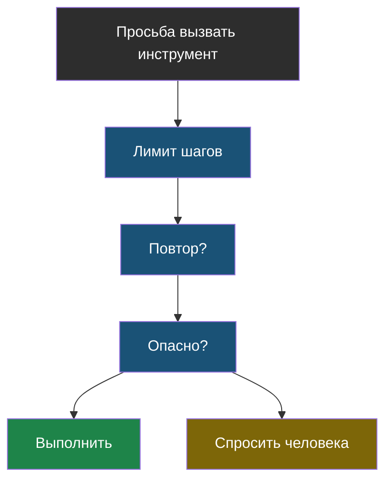
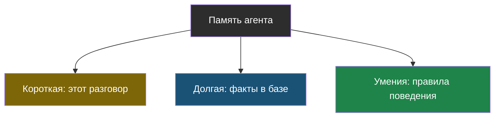

# Словарик темы 4

Термины по алфавиту; названия латиницей — в конце.

## Агент

> **Агент** — программа, в которой модель сама решает, какой шаг сделать следующим, глядя на результат предыдущего, и делает это в цикле, пока не получит ответ.

Из [урока 1](chapter-01.md). Не разум и не робот — обычный цикл в коде.

## Границы агента

> **Границы агента** — правила в коде, которые ограничивают, что и сколько раз агент может сделать. Ставит их программист, а не модель.

Из [урока 2](chapter-02.md). Четыре главные: лимит шагов, ловля повторов, разрешение человека, минимум инструментов.

## Заранее заданный порядок (workflow)

> **Заранее заданный порядок** — программа, где все шаги и их порядок придумал программист, а модель вызывается на конкретных шагах.

Из [урока 1](chapter-01.md). «Рецепт» против «повара»-агента. Если задача всегда одна и та же — бери это, а не агента.

## Память агента

> **Память агента** бывает трёх видов: короткая (текущий диалог, живёт в контекстном окне), долгая (факты о пользователе, живут в базе), умения (правила поведения, заданы заранее).

Из [урока 1](chapter-01.md).

## Человек в цикле (human-in-the-loop)

> **Человек в цикле** — правило, по которому перед необратимым действием (удалить, отправить, заплатить) агент останавливается и спрашивает разрешения у человека.

Из [урока 2](chapter-02.md).

## MCP

> **MCP** — общий стандарт подключения инструментов к ИИ-агентам: как USB-разъём, только для программ.

Из [урока 2](chapter-02.md). Инструмент, сделанный по стандарту, подойдёт любому агенту.
