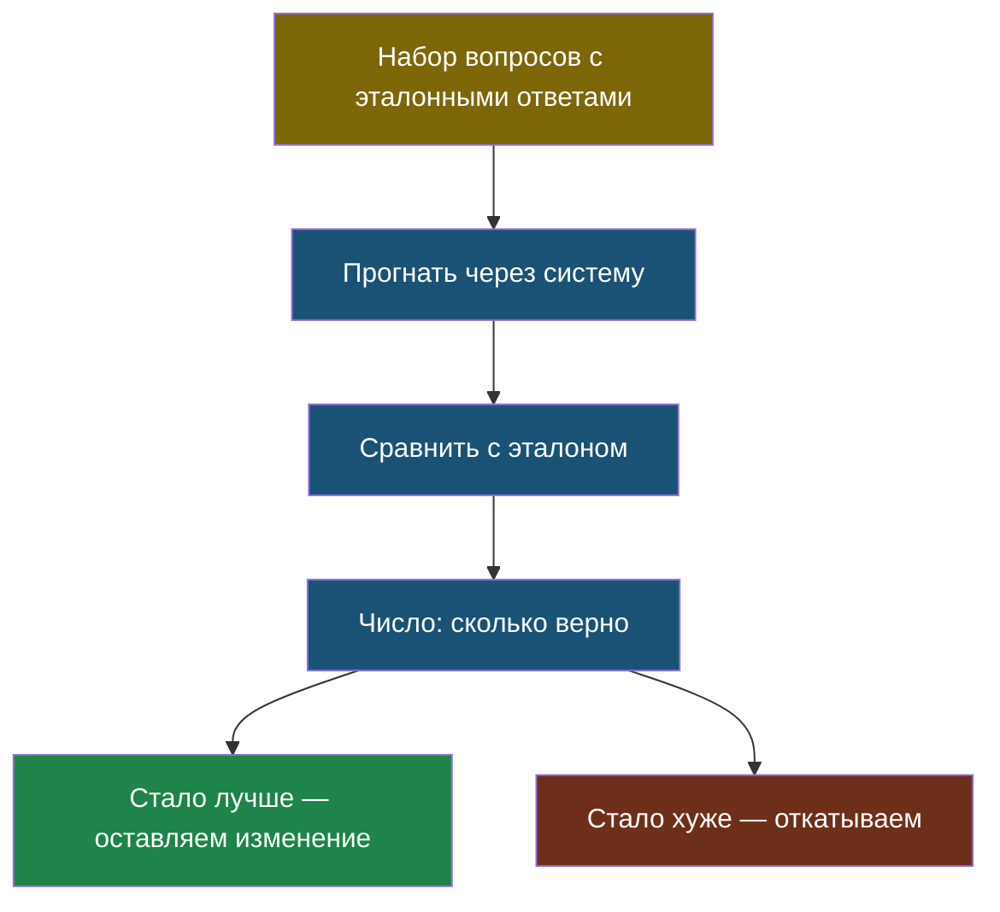

# Тема 5. Как проверить, что ИИ отвечает хорошо

> Мы построили RAG и агента. Осталось ответить на вопрос, который отличает «поигрался» от «сделал»: а откуда мы знаем, что оно работает?

## Задача, с которой начинается тема

Ты сделал школьного бота. Задал ему пять вопросов — отвечает нормально. Показал другу — тоже нормально. Значит, работает?

А теперь неприятное. Ты поменял одну строчку в запросе, чтобы ответы стали короче. Стало лучше или хуже? Задал те же пять вопросов — «вроде нормально». Но пять вопросов ты выбирал сам, а бот отвечает на сотни. Может, где-то стало заметно хуже, а ты просто не проверял.

Так и живут очень многие проекты с ИИ: их качество никто не измеряет, поэтому никто и не замечает, когда оно падает.

## Главная мысль темы

«Вроде нормально» — это не результат. Качество ИИ измеряют так же, как программисты проверяют код: **набором заранее подготовленных вопросов с известными правильными ответами**, которые прогоняют после каждого изменения.

## Уроки темы

- [Урок 1. Пять вопросов другу — не проверка](chapter-01.md) — эталонный набор, что измерять, лаба
- [Урок 2. Когда ИИ проверяет ИИ](chapter-02.md) — ИИ-судья, его ошибки, тихое падение качества
- [Словарик темы](glossary.md)

## Что понадобится

Python. Ничего, кроме стандартной библиотеки.
