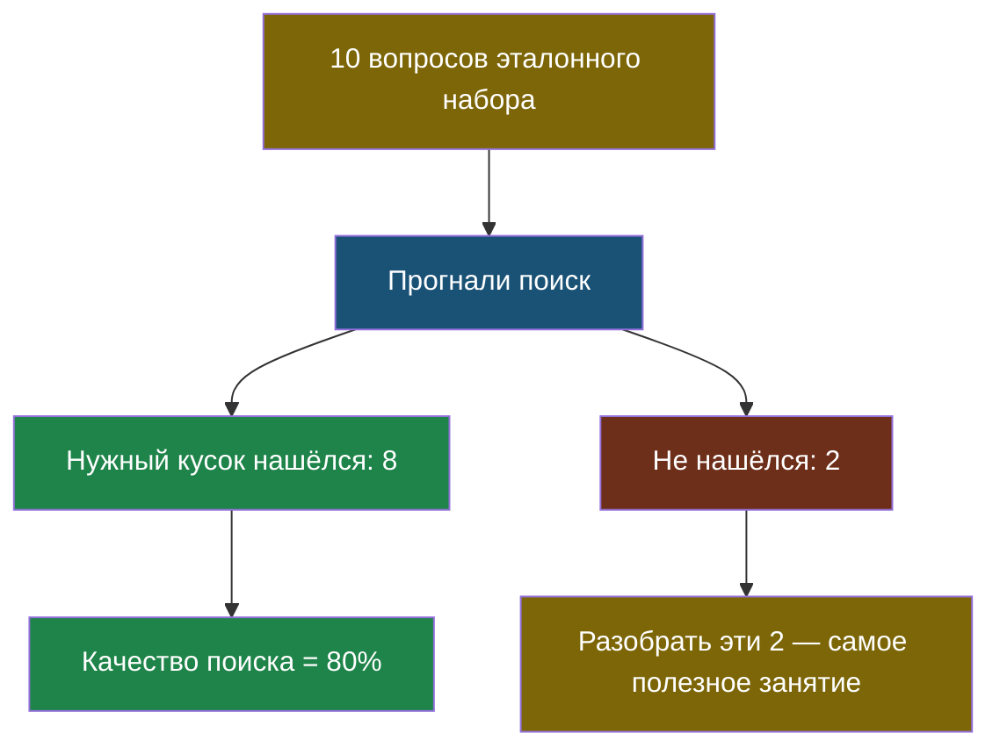

# Урок 1. Пять вопросов другу — не проверка

> **Лабораторная этого урока:** считаем качество RAG на эталонном наборе.
> - без интернета: [01_proverka.py](labs/tema5-provierka/01_proverka.py) — запуск `python3 01_proverka.py`, разобрана в разделе [«Практика: считаем качество своего RAG»](#практика-считаем-качество-своего-rag)
> - на настоящей модели: [открыть в Google Colab](https://colab.research.google.com/github/iRoboTron/ai-engineering-school/blob/main/docs/books/labs/tema5-provierka/01_izmeryaem_kachestvo.ipynb) · [скачать .ipynb](labs/tema5-provierka/01_izmeryaem_kachestvo.ipynb)

## Знакомая ситуация

Ты написал программу и проверил её на одном примере — работает. Учитель добавляет свой пример — падает. Знакомо?

Именно поэтому в программировании придумали **тесты**: набор примеров с заранее известными правильными ответами, который прогоняют автоматически после каждого изменения. Не потому, что программисты не доверяют себе, а потому что проверять руками каждый раз невозможно.

С ИИ ровно та же история, только сложнее: у обычной программы ответ либо правильный, либо нет, а ответ ИИ может быть «в целом верный, но упущена деталь». Но идея та же.

> **Проверка качества** (по-английски *evals*, от *evaluation* — «оценка») — измерение того, насколько хорошо ИИ-система справляется, на заранее подготовленном наборе вопросов, а не на глазок.

## Главный инструмент: эталонный набор

> **Эталонный набор** — список вопросов с правильными ответами, составленный заранее и не меняющийся, на котором проверяют систему после каждого изменения.

Иногда его называют «золотым набором» — от английского *golden set*. Почему «золотой»: потому что его составляют один раз и очень аккуратно, зато потом он служит эталоном годами.

Как выглядит:

| Вопрос | Правильный ответ | Откуда взят |
|---|---|---|
| Во сколько кружок робототехники? | 15:40 | правила, строка 4 |
| До скольки открыта библиотека? | до 17:00 | правила, строка 12 |
| Сколько стоит проезд? | в документах этого нет | — |

Обрати внимание на третью строку. Она такая же важная, как первые две: система обязана уметь честно говорить «не знаю». Если этого вопроса нет в наборе — ты никогда не заметишь, что бот начал выдумывать.

Правила составления набора:

1. **Составляй его до того, как начнёшь улучшать систему.** Иначе подгонишь вопросы под то, что уже работает.
2. **Не меняй его каждый раз.** Смысл в том, чтобы сравнивать вчерашний результат с сегодняшним, а сравнивать можно только одинаковое.
3. **Клади туда трудные случаи**, а не только те, где всё очевидно: вопросы без ответа, вопросы другими словами, вопросы с двумя частями.

## Что именно измерять

Вопрос хитрее, чем кажется. У RAG есть два разных места, где всё может пойти не так — и мерить их надо по отдельности:

| Что меряем | Вопрос, на который отвечаем | Пример проблемы |
|---|---|---|
| **Качество поиска** | Нашёлся ли нужный кусок вообще? | Искали кружок — нашли столовую |
| **Качество ответа** | Правильно ли модель ответила по найденному? | Кусок нашли верный, а в ответе время переврали |

Почему нельзя мерить только итоговый ответ? Потому что когда он неправильный, ты не будешь знать, что чинить — поиск или запрос к модели. Это как чинить велосипед, не понимая, что сломалось: колесо или цепь.

Самая простая мера для поиска звучит так: **в скольких случаях нужный кусок вообще попал в найденное**. Если из 10 вопросов нужный кусок нашёлся в 8 — это 80 %. Улучшил поиск, стало 9 из 10 — 90 %, есть прогресс, и он выражен числом, а не ощущением.



Последний блок — важный совет. Само число «80 %» мало что говорит. Пользу приносит разбор тех самых провалившихся случаев: почти всегда там обнаруживается одна общая причина, починив которую, ты поднимешь качество сразу на несколько процентов.

## Практика: считаем качество своего RAG

Возьмём поиск из темы 2, добавим эталонный набор и посчитаем качество двумя способами — до и после маленького улучшения.

Файл: [labs/tema5-provierka/01_proverka.py](labs/tema5-provierka/01_proverka.py) — запуск: `python3 01_proverka.py`.

```python
# labs/tema5-provierka/01_proverka.py
# Измеряем качество поиска на эталонном наборе — и сравниваем два варианта поиска.

# --- НАСТРОЙКИ ---
SKOLKO_BRAT = 2       # сколько лучших чанков считаем "найденными"

CHANKI = [
    "Кружок робототехники: вторник и четверг, 15:40, кабинет 204",
    "Кружок рисования: среда, 16:00, кабинет 112",
    "Столовая работает с 9:00 до 15:00",
    "Библиотека открыта с 8:30 до 17:00",
]

# Эталонный набор: вопрос -> какой чанк ДОЛЖЕН найтись (None = ответа нет вовсе).
ETALONNYY_NABOR = {
    "во сколько кружок робототехники": 0,
    "когда занятия у робототехников": 0,      # те же слова другими словами
    "где кабинет рисования": 1,
    "когда работает библиотека": 3,
    "до скольки открыта читальня": 3,          # "читальня" вместо "библиотеки"
    "сколько стоит проезд на автобусе": None,  # ответа в документах нет
    "во сколько работает бассейн": None,       # бассейна в правилах тоже нет
}

STOP_SLOVA = {"во", "и", "с", "до", "на", "в", "у", "не", "сколько", "когда", "где", "скольки"}


def slova(text):
    ochishchennyy = "".join(b.lower() if b.isalnum() else " " for b in text)
    return {s for s in ochishchennyy.split() if s not in STOP_SLOVA}


def poisk_prostoy(vopros):
    """Вариант 1: считаем совпадения слов как есть."""
    slova_voprosa = slova(vopros)
    ocenki = [(len(slova_voprosa & slova(chank)), nomer) for nomer, chank in enumerate(CHANKI)]
    ocenki.sort(reverse=True)
    return [nomer for ochki, nomer in ocenki[:SKOLKO_BRAT] if ochki > 0]


def poisk_uluchshennyy(vopros):
    """Вариант 2: то же самое, но слова обрезаем до 6 букв.

    Тогда 'робототехников' и 'робототехники' совпадут.
    """
    slova_voprosa = {s[:6] for s in slova(vopros)}
    ocenki = []
    for nomer, chank in enumerate(CHANKI):
        slova_chanka = {s[:6] for s in slova(chank)}
        ocenki.append((len(slova_voprosa & slova_chanka), nomer))
    ocenki.sort(reverse=True)
    return [nomer for ochki, nomer in ocenki[:SKOLKO_BRAT] if ochki > 0]


def izmerit(poisk, nazvanie):
    """Прогоняем весь эталонный набор и считаем, в скольких случаях всё верно."""
    print(f"--- {nazvanie} ---")
    verno = 0
    provaly = []

    for vopros, nuzhnyy_chank in ETALONNYY_NABOR.items():
        naydeno = poisk(vopros)

        if nuzhnyy_chank is None:
            # Правильное поведение: не найти ничего.
            uspekh = len(naydeno) == 0
        else:
            uspekh = nuzhnyy_chank in naydeno

        if uspekh:
            verno += 1
        else:
            provaly.append((vopros, nuzhnyy_chank, naydeno))

    vsego = len(ETALONNYY_NABOR)
    print(f"верно: {verno} из {vsego} = {round(100 * verno / vsego)}%")

    if provaly:
        print("провалы:")
        for vopros, nuzhnyy, naydeno in provaly:
            print(f"  {vopros!r}: нужен чанк {nuzhnyy}, найдено {naydeno}")
    print()
    return verno


bylo = izmerit(poisk_prostoy, "Вариант 1: поиск по словам как есть")
stalo = izmerit(poisk_uluchshennyy, "Вариант 2: слова обрезаны до 6 букв")

print("=" * 60)
if stalo > bylo:
    print(f"Улучшение помогло: было {bylo}, стало {stalo}. Оставляем.")
elif stalo == bylo:
    print(f"Ничего не изменилось ({bylo}). Смысла в усложнении нет.")
else:
    print(f"Стало хуже: было {bylo}, стало {stalo}. Откатываем.")
```

**Что посмотреть в выводе:**

1. Первый вариант — 5 из 7. Он проваливается на «когда занятия у робототехников»: слово стоит в другой форме, совпадений нет вовсе.
2. Второй вариант — 6 из 7. Обрезание слов починило этот случай, и виден результат **числом**, а не ощущением. Именно так и принимают решение: оставить изменение или откатить.
3. А вот вопрос «во сколько работает бассейн» проваливают **оба** варианта. Бассейна в правилах нет, правильный ответ — «ничего не найдено», но слово «работает» есть в строке про столовую, и поиск радостно её выдаёт. Это самая коварная ошибка: система не молчит, она уверенно выдаёт не то. Без эталонного набора ты бы её просто не заметил.

**Попробуй сам:**

- Добавь в `STOP_SLOVA` слово «работает» и запусти снова. Починился ли вопрос про бассейн? А не сломалось ли при этом что-то другое?
- Добавь в эталонный набор два своих вопроса — обязательно один такой, ответа на который в документах нет.
- Поменяй `SKOLKO_BRAT` на 3 и на 1. Как меняется качество?

Первый пункт особенно важен: почти всегда, чиня одно, ломаешь другое. Увидеть этот размен можно только на эталонном наборе — «на глазок» он незаметен.

### А теперь — измеряем по-настоящему

В мини-версии выше поиск самодельный, а «ответы» никто не проверяет. В ноутбуке измеряется настоящая система из темы 2: поиск BM25 плюс живая модель.

Лаборатория (ноутбук): [скачать .ipynb](labs/tema5-provierka/01_izmeryaem_kachestvo.ipynb) · [открыть в Google Colab](https://colab.research.google.com/github/iRoboTron/ai-engineering-school/blob/main/docs/books/labs/tema5-provierka/01_izmeryaem_kachestvo.ipynb)

Там всё по-настоящему: эталонный набор из девяти вопросов (два — без ответа в документах), отдельный замер поиска и отдельный замер ответов. Поиск даёт 67 %, улучшение поднимает его до 78 % — и тут же видно, что оно **испортило** вопрос без ответа, то есть починив одно, сломали другое. Ответы модели проверяются по ключу: 8 из 9, и провалившийся вопрос провалился не по вине модели, а по вине поиска.

А в конце — ИИ-судья, и с ним самое поучительное: на сверке он ошибается ровно на том случае, ради которого его и заводят, — не засчитывает ответ «без двадцати четыре дня» как 15:40. Отсюда правило: судья такая же модель, и пока ты не сверил его оценки со своими, доверять им нельзя.

## Найди ошибку

Ученик замерил качество, получил 70 %, потом улучшал бота два часа, снова замерил — 85 %. Обрадовался. Но перед вторым замером он добавил в эталонный набор три новых лёгких вопроса, потому что «хотелось проверить побольше». Почему сравнение теперь ничего не значит?

<details>
<summary>Ответ</summary>

Потому что он сравнивал результаты **на разных наборах**. Проценты выросли, но нельзя понять, почему: то ли бот стал лучше, то ли просто добавили лёгких вопросов, которые он и раньше бы прошёл.

Правило: набор фиксируют и не трогают, пока идут сравнения. Хочешь добавить вопросы — добавляй, но тогда замерь заново и старую, и новую версию на **одинаковом** наборе.
</details>

## Что мы узнали

- «Вроде нормально» не является результатом: качество ИИ нужно измерять числом.
- **Эталонный набор** — фиксированный список вопросов с правильными ответами; составляют заранее, потом не меняют.
- В набор обязательно кладут вопросы, ответа на которые нет, — иначе не заметишь, что система начала выдумывать.
- Мерить надо отдельно **поиск** и отдельно **ответ**, иначе непонятно, что чинить.
- Самое полезное — не само число, а разбор провалившихся случаев.
- Улучшая одно, обычно портишь другое; увидеть это можно только на наборе.

## Проверь себя

1. Почему нельзя проверять бота пятью вопросами, которые ты придумал сам на ходу?
2. Зачем в эталонный набор класть вопросы, ответа на которые нет в документах?
3. Итоговый ответ бота неправильный. Как понять, где сломалось — в поиске или в ответе?

Дальше — [Урок 2: когда ИИ проверяет ИИ](chapter-02.md).
