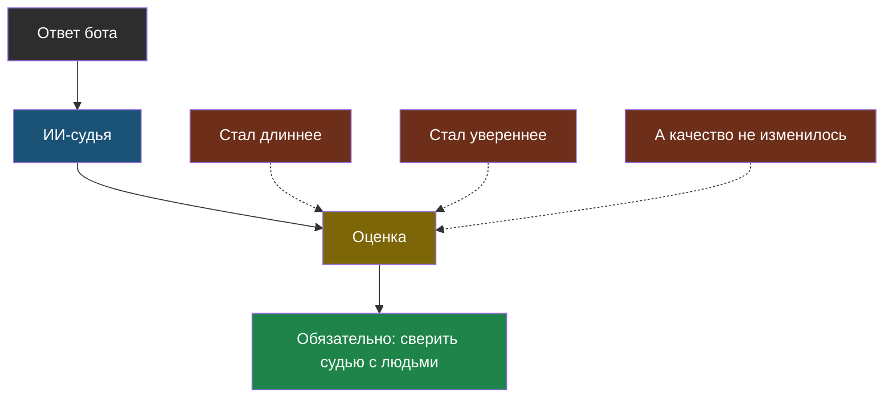
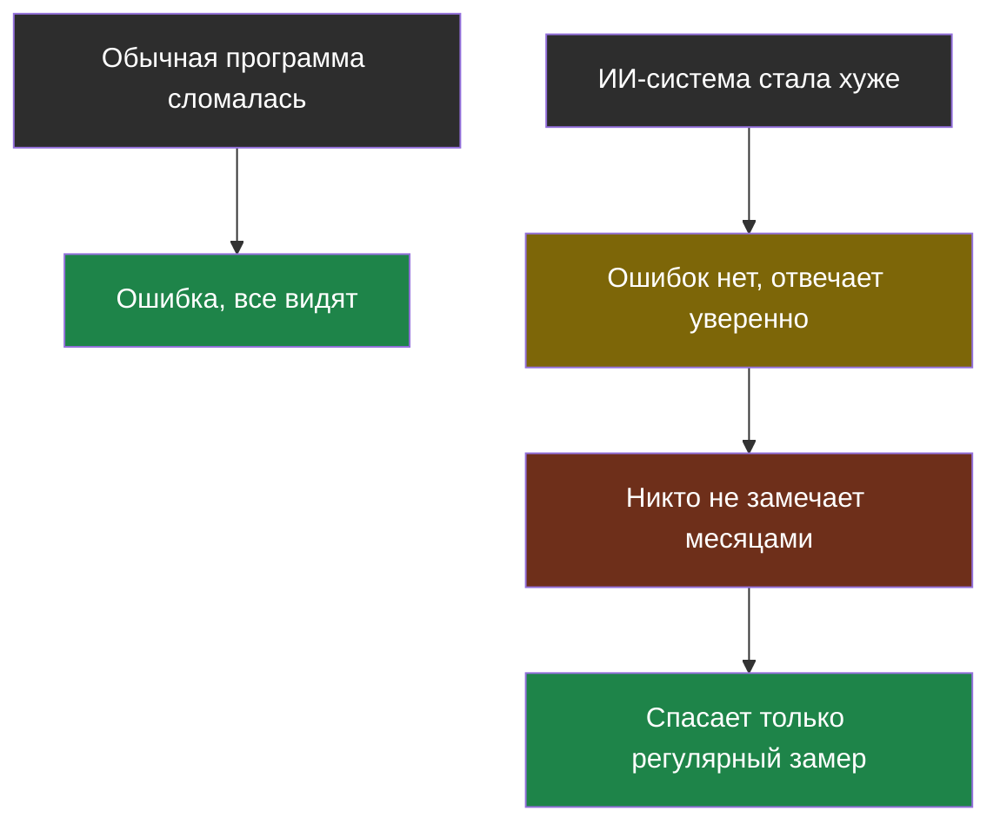

# Урок 2. Когда ИИ проверяет ИИ

> **Лабораторной в этом уроке нет.** Практика темы — в [уроке 1](chapter-01.md).

## Проблема, которая возникает сразу

В прошлом уроке мы сравнивали найденный номер чанка с эталонным — числа сравнивать легко. А как сравнить **тексты ответов**?

Эталон: «Кружок робототехники начинается в 15:40».
Ответ бота: «В 15:40, по вторникам и четвергам».

Побуквенно не совпадает, а по сути ответ правильный, даже лучше эталонного. Обычная проверка `otvet == etalon` тут бесполезна: она забракует хороший ответ.

Проверять руками? Для десяти вопросов можно. Для тысячи и после каждого изменения — нет.

## Идея: пусть проверяет другая модель

Раз модель хорошо понимает текст, можно поручить ей сравнение: показать вопрос, эталонный ответ и ответ бота — и спросить, совпадают ли они по сути.

> **ИИ-судья** — модель, которой поручили оценить ответ другой модели по заданным правилам.

Работает это на удивление неплохо. Но есть важное «но», ради которого и написан этот урок: **у судьи есть свои слабости, и они предсказуемые**.

## Четыре слабости ИИ-судьи

Их выявили исследователи, специально проверявшие судей на подставных ответах. Все четыре легко запомнить, потому что у людей они точно такие же.

| Слабость | В чём проявляется | Человеческий аналог |
|---|---|---|
| **Любит длинное** | Длинный ответ получает оценку выше короткого, даже если содержание то же | Сочинение на 5 страниц «выглядит серьёзнее» |
| **Любит уверенное** | Уверенный тон получает оценку выше, чем осторожный, даже если факты хуже | Тот, кто отвечает уверенно, кажется знающим |
| **Смотрит на порядок** | Из двух ответов чаще выбирает первый (или наоборот, всегда второй) | Первый отвечавший задаёт планку |
| **Хвалит своих** | Ответ, написанный такой же моделью, оценивает выше | «Мне нравится, как он пишет — похоже на меня» |

Отсюда простое и неприятное следствие: если бот научится писать длиннее и увереннее, оценки судьи вырастут, **а качество ответов — нет**. Ты будешь смотреть на растущий график и радоваться, пока пользователи жалуются.

## Как пользоваться судьёй правильно

Три правила, которые снимают большую часть проблем:

1. **Дай судье точные правила, а не «оцени качество».** Плохо: «оцени ответ от 1 до 10». Хорошо: «Совпадает ли факт в ответе с эталоном? Ответь ДА или НЕТ». Чем конкретнее вопрос, тем меньше судья фантазирует.
2. **Проси короткий, строгий ответ** — «да/нет», а не сочинение. Это тот самый структурированный ответ из темы 1.
3. **Проверь самого судью.** Возьми 20–30 ответов, оцени их сам руками, а потом посмотри, насколько совпадают твои оценки с оценками судьи. Если совпадают редко — судье доверять нельзя, и надо менять правила.

Третий пункт называют **сверкой судьи**, и он неочевиден: люди обычно считают, что раз оценивает ИИ, то проверять его не надо. Наоборот — судья тоже модель, и на нём действуют все ограничения из темы 1.

## Что можно проверить вообще без ИИ

Прежде чем звать судью, стоит вспомнить: часть проверок делается обычным кодом, мгновенно и бесплатно.

| Проверка | Как делается |
|---|---|
| Есть ли в ответе нужное число или дата | Обычный поиск подстроки |
| Не выдумал ли бот факт, которого нет в источнике | Проверить, что все числа из ответа есть в найденном чанке |
| Сказал ли «не знаю», когда должен был | Сравнение с ожидаемым текстом |
| Не слишком ли длинный ответ | `len(otvet)` |
| Правильный ли формат (JSON, поля на месте) | Разбор кода |

Правило: **сначала всё, что можно проверить кодом, потом судья на оставшемся**. Код быстрее, дешевле и не имеет слабостей из таблицы выше.

## Главная опасность: качество падает тихо

Последняя мысль темы, и она важнее всех предыдущих.

Обычная программа, когда ломается, выдаёт ошибку. ИИ-система, когда ломается, продолжает уверенно отвечать — просто хуже. Никто не получает уведомление. График не краснеет.

> **Тихая деградация** — постепенное ухудшение качества ИИ-системы, при котором никаких ошибок не возникает и внешне всё работает.

Отчего это происходит:

- Документы обновили, а куски в поиске остались старые — бот отвечает по прошлогоднему расписанию.
- Поставщик обновил модель — она стала другой, и запросы, отлаженные под старую, работают чуть хуже.
- Пользователи начали спрашивать о том, чего в документах никогда не было.

Лечение единственное: **прогонять эталонный набор регулярно**, а не один раз, и смотреть не на одно число, а на то, как оно меняется со временем. Упало с 86 % до 71 % — надо разбираться, даже если жалоб ещё нет.

## Найди ошибку

Ученик поручил ИИ-судье оценивать ответы своего бота по правилу «оцени полезность ответа от 1 до 10». За неделю средняя оценка выросла с 6,2 до 8,4. Ученик решил, что бот стал лучше. Что могло произойти на самом деле?

Ответ

Как минимум три варианта, и все не про качество:

1. Бот стал отвечать **длиннее** — судья любит длинное.
2. Бот стал отвечать **увереннее** (убрал «возможно», «кажется») — судья любит уверенный тон.
3. Правило «оцени от 1 до 10» слишком расплывчатое: сегодня судья понимает его так, завтра иначе. Оценки просто плавают.

Что надо было сделать: задать судье конкретный вопрос («совпадает ли факт с эталоном — ДА/НЕТ»), а потом сверить его оценки со своими на 20–30 примерах.

## Что мы узнали

- Тексты ответов нельзя сравнивать побуквенно — правильный ответ может быть сформулирован иначе.
- **ИИ-судья** решает эту задачу, но у него есть предсказуемые слабости: любит длинное, уверенное, зависит от порядка и хвалит «своих».
- Судье нужно давать конкретные правила и короткий формат ответа, а его самого — сверять с оценками человека.
- Всё, что можно проверить обычным кодом, проверяй кодом — быстрее, дешевле и надёжнее.
- **Тихая деградация** — главная опасность: ИИ-система ломается без ошибок, поэтому замерять качество нужно регулярно и смотреть на изменение во времени.

## Проверь себя

1. Почему нельзя проверять ответ бота сравнением строк «в лоб»?
2. Бот начал писать длиннее, и оценки судьи выросли. Что это доказывает?
3. Чем поломка ИИ-системы отличается от поломки обычной программы?

## Итог темы 5

Теперь у тебя есть то, чего нет у большинства школьных (и, честно говоря, не только школьных) проектов с ИИ: способ доказать числом, что система работает, и заметить, когда она сломалась. Загляни в [словарик](glossary.md).

Дальше — тема 6: где вообще живут эти модели и как ИИ пытаются обмануть.
