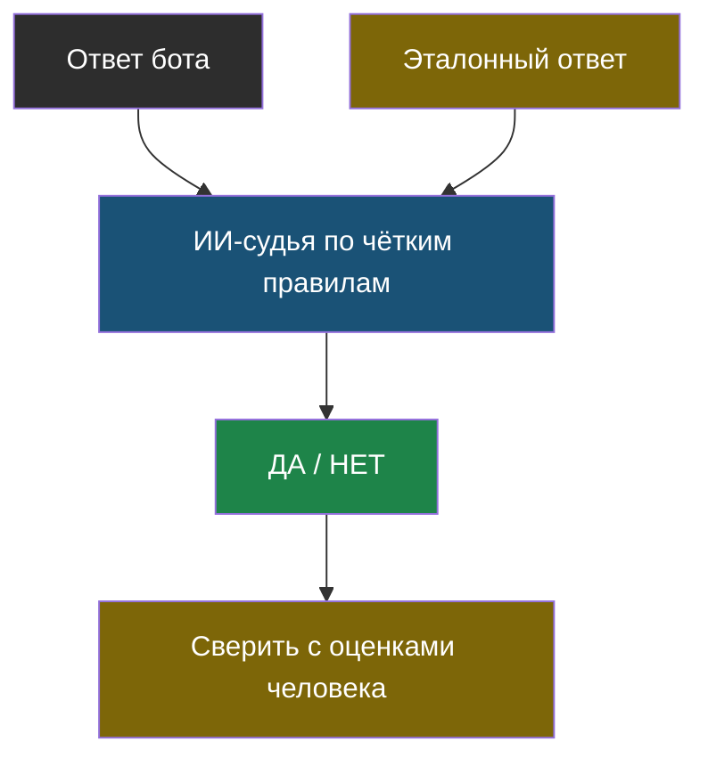
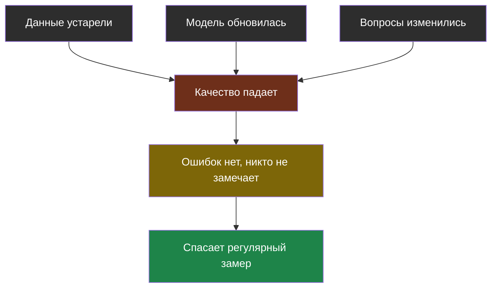
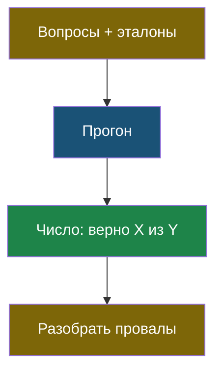

# Словарик темы 5

## ИИ-судья

> **ИИ-судья** — модель, которой поручили оценить ответ другой модели по заданным правилам.

Из [урока 2](chapter-02.md). Слабости: любит длинное, любит уверенное, зависит от порядка, хвалит «своих». Обязательно сверяется с оценками человека.

## Проверка качества (evals)

> **Проверка качества** — измерение того, насколько хорошо ИИ-система справляется, на заранее подготовленном наборе вопросов, а не на глазок.

Из [урока 1](chapter-01.md).

## Тихая деградация

> **Тихая деградация** — постепенное ухудшение качества ИИ-системы, при котором никаких ошибок не возникает и внешне всё работает.

Из [урока 2](chapter-02.md). Главная опасность: обычная программа при поломке кричит, ИИ-система — молчит и уверенно отвечает хуже.

## Эталонный набор (golden set)

> **Эталонный набор** — список вопросов с правильными ответами, составленный заранее и не меняющийся, на котором проверяют систему после каждого изменения.

Из [урока 1](chapter-01.md). Обязательно содержит вопросы, ответа на которые нет, — чтобы поймать выдумки.

