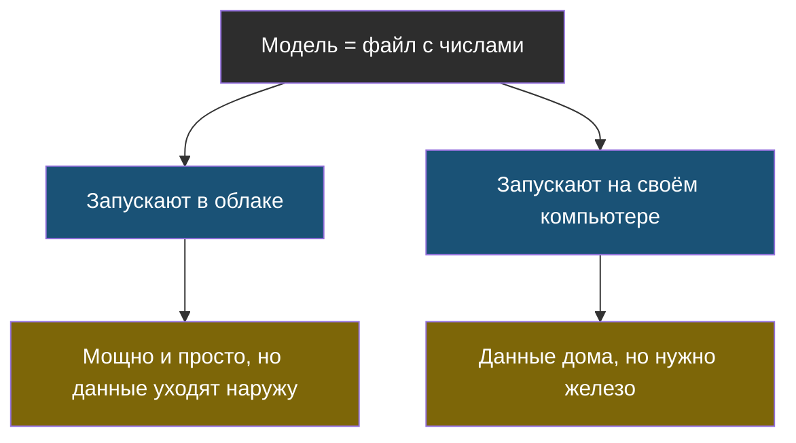

# Тема 6. Модели, безопасность и осторожность

> Мы много говорили про «модель», как будто она одна и живёт где-то в облаке. Пора разобраться, какие они бывают, где работают — и как их обманывают.

## Задача, с которой начинается тема

Два вопроса, которые рано или поздно задаёт каждый, кто делает что-то с ИИ:

1. «А можно, чтобы ИИ работал у меня на компьютере, без интернета?» — можно, и у этого есть цена.
2. «А ИИ можно обмануть?» — можно, причём способом, от которого нельзя защититься уговорами. И это, пожалуй, самое важное, что стоит знать про ИИ в 2020-х.

## Главная мысль темы

Модель — это файл с числами, который где-то запускают. Где именно — твой выбор с понятными плюсами и минусами. А защищать ИИ-систему нужно так же, как любую программу, в которую попадают данные извне: **не доверяя тому, что пришло снаружи**.

## Уроки темы

- [Урок 1. Где живёт модель](chapter-01.md) — облако против своего компьютера, «сначала самое простое»
- [Урок 2. Как ИИ обманывают](chapter-02.md) — подмена инструкций, лаба, правила безопасности
- [Словарик темы](glossary.md)

## Что понадобится

Python — для одной короткой, но очень наглядной лабораторной про обман ИИ.
