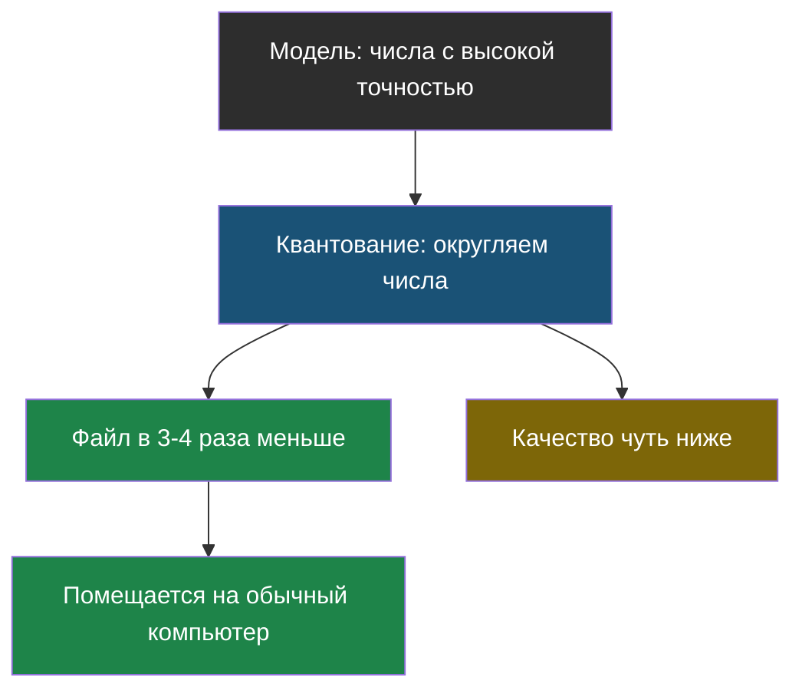
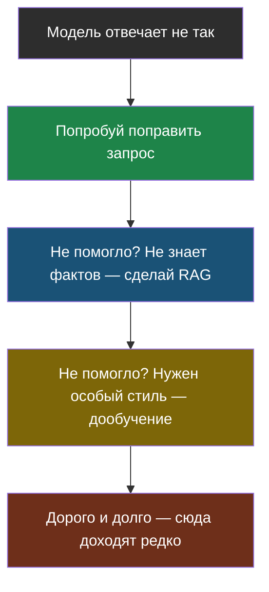

# Урок 1. Где живёт модель

> **Лабораторной в этом уроке нет.** Практика темы — в [уроке 2](chapter-02.md).

## Что такое модель как файл

Мы говорили: у модели «миллиарды настроек». Эти настройки — обычные числа, и они лежат в файле. Большом: от нескольких гигабайт до сотен.

Чтобы модель отвечала, этот файл надо загрузить в память компьютера и прогнать через него твой текст. Значит, вопрос «где живёт модель» — это вопрос «на чьём компьютере лежит файл и чья память работает».

Вариантов ровно два.

> **Модель в облаке** — модель работает на чужих мощных компьютерах, ты отправляешь ей текст по интернету и получаешь ответ.

> **Локальная модель** — файл модели лежит на твоём компьютере и работает на нём же, без интернета.

## Что выбрать

| | В облаке | На своём компьютере |
|---|---|---|
| Насколько умная | Самые большие и сильные модели | Поменьше и попроще |
| Что нужно от тебя | Интернет и оплата за токены | Мощный компьютер, много памяти |
| Куда уходят данные | На чужой сервер | Никуда |
| Работает без интернета | Нет | Да |
| Сколько стоит | Платишь за каждый запрос | Заплатил за компьютер один раз |

Правило выбора простое, и оно почти всегда про данные: **если данные секретные и их нельзя отдавать наружу — модель должна работать локально**. Медкарты, школьные личные дела, переписка — это как раз такие случаи. Если данные обычные, облако проще и умнее.

## Почему локальные модели меньше

Здесь есть красивая инженерная идея, которую полезно понять.

Большая модель не помещается в память обычного компьютера. Но её можно **ужать**: хранить каждое число менее точно. Например, вместо 3,14159265 хранить 3,14.

> **Квантование** — хранение чисел модели с меньшей точностью, чтобы модель занимала меньше памяти. Модель становится немного глупее, но помещается на обычный компьютер.

Аналогия, которая тебе наверняка знакома: фотография в хорошем качестве весит 10 мегабайт, а сжатая — 500 килобайт. Приглядишься — увидишь разницу, а на экране телефона почти всё то же самое.

## Отдельная важная вещь: сначала самое простое

Допустим, модель отвечает не так, как тебе нужно. Есть три способа это чинить, и разница между ними — как между «переставить стул» и «сделать ремонт».

| Способ | Что делаешь | Сколько стоит | Когда применять |
|---|---|---|---|
| **1. Поправить запрос** | Переписать инструкцию, добавить примеры | Минуты, бесплатно | Всегда начинай отсюда |
| **2. Дать документы (RAG)** | Подкладывать нужные тексты в запрос — тема 2 | Часы, недорого | Модель не знает твоих фактов |
| **3. Дообучить модель** | Показать модели тысячи примеров и изменить её настройки | Дни, дорого, нужны специалисты | Нужен особый стиль или формат, которого не добиться первыми двумя |

> **Дообучение** — изменение настроек готовой модели на своих примерах, чтобы она освоила особый стиль или формат ответов.

Ключевая мысль, ради которой этот раздел написан: **дообучение не добавляет модели знаний о фактах**. Оно меняет манеру. Если бот не знает расписания твоей школы, дообучение не поможет — поможет RAG. Это самая частая ошибка новичков: услышав про дообучение, они бросаются «учить модель на своих документах», хотя нужен был поиск.

Это, кстати, общий инженерный принцип, далеко не только про ИИ: **начинай с самого дешёвого решения и усложняй, только когда простое доказано не работает**. Ровно так же ты чинишь не грузящийся сайт: сначала обновить страницу, а не переустанавливать систему.

## Найди ошибку

Школа хочет чат-бота, который отвечает на вопросы по своим правилам. Ученик предложил: «Возьмём модель и дообучим её на школьных документах, тогда она их выучит». Что не так?

Ответ

Дообучение меняет **манеру** ответов, а не добавляет фактов, которые можно надёжно достать. Модель после дообучения может «в целом» отвечать похоже на школьные документы — и при этом уверенно путать время кружка, потому что она по-прежнему угадывает продолжение текста, а не читает документ.

Правильное решение — RAG из темы 2: положить нужный кусок правил прямо в запрос. Плюс: когда расписание поменяется, достаточно заменить документ, а не переучивать модель.

## Что мы узнали

- Модель — это файл с числами; вопрос лишь в том, на чьём компьютере он запускается.
- **Облако**: умнее и проще, но данные уходят наружу и платишь за каждый запрос.
- **Локальная модель**: данные остаются дома и не нужен интернет, но нужен мощный компьютер, а модели поменьше.
- Секретные данные — веский повод выбрать локальную модель.
- **Квантование** — хранение чисел модели менее точно: меньше памяти, немного ниже качество.
- Чинить поведение модели надо по порядку: запрос → RAG → дообучение. Дообучение **не** добавляет знаний о фактах.

## Проверь себя

1. В каком случае облачная модель — плохой выбор?
2. Что теряется при квантовании и что взамен приобретается?
3. Бот не знает расписания твоей школы. Дообучение или RAG? Почему?

Дальше — [Урок 2: как ИИ обманывают](chapter-02.md).
