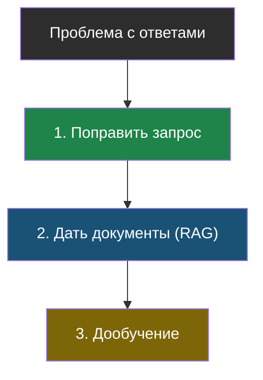
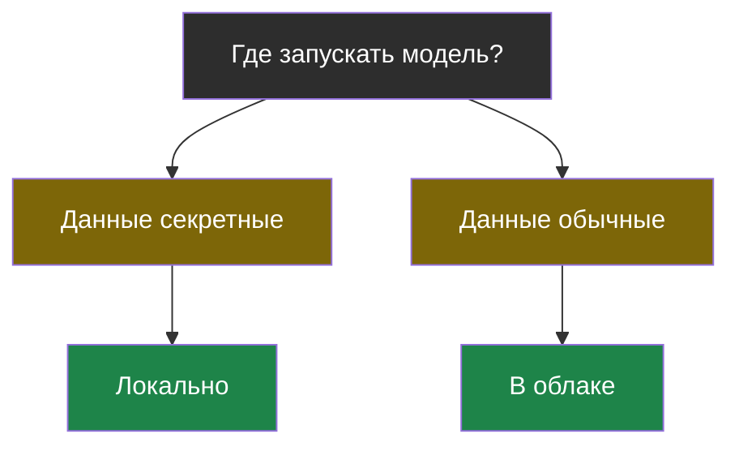
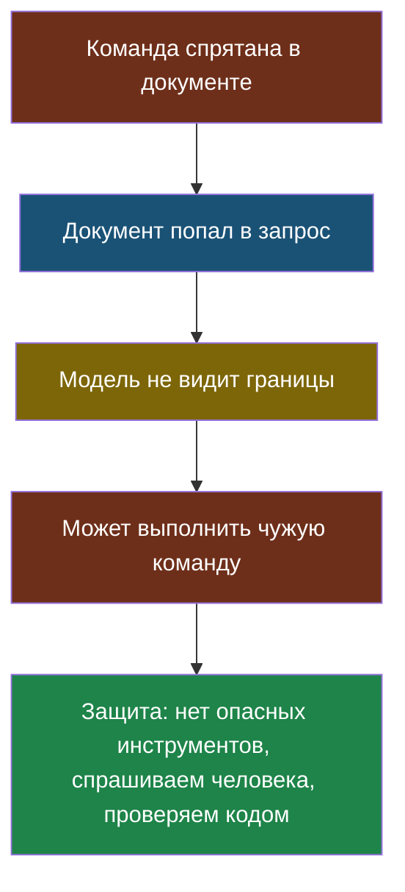

# Словарик темы 6

Термины по алфавиту; названия латиницей — в конце.

## Дообучение

> **Дообучение** — изменение настроек готовой модели на своих примерах, чтобы она освоила особый стиль или формат ответов.

Из [урока 1](chapter-01.md). Меняет манеру, **не** добавляет знаний о фактах — для фактов нужен RAG.

## Квантование

> **Квантование** — хранение чисел модели с меньшей точностью, чтобы модель занимала меньше памяти. Модель становится немного глупее, но помещается на обычный компьютер.

Из [урока 1](chapter-01.md). Как сжатая фотография: весит меньше, отличия почти незаметны.

## Локальная модель

> **Локальная модель** — файл модели лежит на твоём компьютере и работает на нём же, без интернета.

Из [урока 1](chapter-01.md). Данные никуда не уходят, но нужен мощный компьютер.

## Модель в облаке

> **Модель в облаке** — модель работает на чужих мощных компьютерах, ты отправляешь ей текст по интернету и получаешь ответ.

Из [урока 1](chapter-01.md). Умнее и проще, но данные уходят наружу и оплата за каждый запрос.

## Подмена инструкций (prompt injection)

> **Подмена инструкций** — приём, при котором вредная команда прячется в данных, которые попадают в запрос к модели, и модель выполняет её как указание разработчика.

Из [урока 2](chapter-02.md). Не баг, а следствие устройства модели: правила и данные для неё — один текст.

