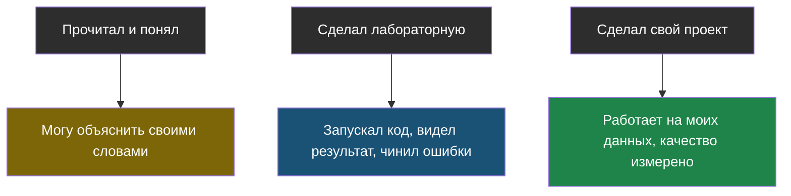

# Тема 7. Портфолио: как показать, что ты умеешь

> Предпоследняя тема. Здесь нет новых терминов про ИИ — здесь про то, как превратить прочитанное в своё и честно об этом рассказать.

## Задача, с которой начинается тема

Ты прошёл шесть тем. Что теперь? Если ничего не делать, через месяц останутся смутные воспоминания: «токены… что-то там про поиск…».

А если собрать один маленький проект — останется навык. Причём, честно говоря, работающий школьный проект с RAG и измеренным качеством — это больше, чем есть у многих взрослых, которые «интересуются ИИ».

## Главная мысль темы

Есть три очень разных уровня знакомства с темой, и путать их — самая частая (и самая заметная со стороны) ошибка:

Все три — нормальные и полезные. Плохо только одно: выдавать первый за третий.

## Уроки темы

- [Урок 1. Собираем свой проект](chapter-01.md) — что делать, из чего собрать, чек-лист готовности · лабораторная: [открыть в Colab](https://colab.research.google.com/github/iRoboTron/ai-engineering-school/blob/main/docs/books/labs/tema7-proyekt/01_moy_proyekt.ipynb)
- [Урок 2. Как о нём рассказать](chapter-02.md) — честность, структура рассказа, ответы на вопросы
- [Словарик темы](glossary.md)

## Что понадобится

Всё, что ты уже написал в лабораторных тем 1–6 — из этих кусочков и собирается проект.
