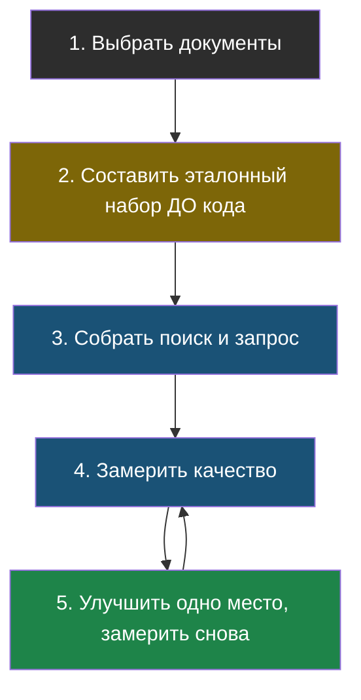

# Урок 1. Собираем свой проект

> **Лабораторная этого урока:** собираем свой проект из готового каркаса: свои документы, свой эталон, замер.
> - разобрана в разделе [«Готовый каркас проекта»](#готовый-каркас-проекта)
> - на настоящей модели: [открыть в Google Colab](https://colab.research.google.com/github/iRoboTron/ai-engineering-school/blob/main/docs/books/labs/tema7-proyekt/01_moy_proyekt.ipynb) · [скачать .ipynb](labs/tema7-proyekt/01_moy_proyekt.ipynb)

## Что вообще собирать

Хорошая новость: все части у тебя уже написаны в лабораторных. Осталось соединить их и подставить свои данные.

Простейший проект, который использует пять тем из шести, звучит так: **бот, который отвечает на вопросы по твоим документам и умеет говорить «не знаю»**.

| Часть проекта | Откуда взять | Тема |
|---|---|---|
| Нарезка документов на чанки | ноутбук «настоящий RAG» | 2 |
| Поиск подходящих чанков | ноутбук «настоящий RAG», а по смыслу — «смысл в числах» | 2, 3 |
| Сборка запроса с правилом не выдумывать | ноутбук «настоящий RAG» | 2 |
| Эталонный набор и замер качества | ноутбук «измеряем качество» | 5 |
| Проверка ответа кодом | ноутбук «подмена инструкций» | 6 |

Собирать это вручную не придётся: всё уже соединено в готовом каркасе — ссылка на него в конце урока.

Что взять в качестве документов — выбирай сам, лишь бы это было тебе интересно и не было чужой личной информацией:

- правила и расписание твоей секции или кружка;
- конспекты по предмету, который тебе нравится;
- описание игры, в которую ты играешь (предметы, правила, персонажи);
- твои собственные заметки.

**Важное правило про данные:** не бери чужую переписку, личные дела, медицинские справки и вообще всё, что касается других людей. Это не про закон даже, а про элементарное уважение — и заодно про тему 6: то, что попало в запрос, может оказаться в ответе.

## План на пять шагов

Обрати внимание на второй шаг: эталонный набор составляется **раньше**, чем пишется код. Причина из темы 5 — иначе ты неосознанно подгонишь вопросы под то, что уже получилось, и замер перестанет что-либо значить.

И на стрелку обратно от пятого шага к четвёртому: улучшение → замер → улучшение → замер. Один круг такого цикла даёт больше, чем неделя «улучшений на глазок».

## Чек-лист готовности

Проект можно считать сделанным, когда выполнено всё:

- [ ] Есть свои документы, разрезанные на чанки.
- [ ] Поиск находит нужный чанк хотя бы на большинстве вопросов.
- [ ] В запросе есть правило отвечать только по тексту и признаваться, когда ответа нет.
- [ ] Есть эталонный набор минимум из 10 вопросов, включая 2 вопроса без ответа в документах.
- [ ] Качество замерено числом, и это число записано.
- [ ] Сделано хотя бы одно улучшение, и есть замер до и после.
- [ ] Разобраны провалившиеся случаи — понятно, **почему** они провалились.
- [ ] В коде нет ничего лишнего, что ты не можешь объяснить.

Последний пункт — самый важный и самый неудобный. Если в проекте есть строчка, которую ты не понимаешь (откуда бы она ни взялась — из интернета, от друга или от ИИ-помощника), у тебя два варианта: разобраться или удалить. Третьего нет, потому что первый же вопрос «а что здесь происходит?» покажет правду.

### Готовый каркас проекта

Чтобы не начинать с чистого листа, весь проект уже собран в ноутбуке. Внутри — всё, что ты проходил: нарезка на чанки, поиск, ответ по документам с запретом выдумывать, замер качества и проверка ответа кодом.

Лаборатория (ноутбук): [скачать .ipynb](labs/tema7-proyekt/01_moy_proyekt.ipynb) · [открыть в Google Colab](https://colab.research.google.com/github/iRoboTron/ai-engineering-school/blob/main/docs/books/labs/tema7-proyekt/01_moy_proyekt.ipynb)

Тебе нужно поменять всего две вещи: свои документы и свой эталонный набор вопросов. Дальше ноутбук сам посчитает качество поиска и ответов, покажет провалы **с указанием виновника** («поиск» или «ответ модели»), переберёт настройки поиска и напечатает заготовку отчёта с твоими числами.

В конце ноутбука — тот же чек-лист готовности, что и в этом уроке, только рядом с кодом.

## Три уровня честности

Теперь главное во всей теме. Про каждую вещь, которую ты изучал, можно сказать три разные вещи — и они означают совершенно разное:

| Что говоришь | Что это значит на самом деле | Как проверяется |
|---|---|---|
| **«Понимаю, как работает»** | Читал, могу объяснить своими словами и ответить на «почему» | Тебя просят объяснить |
| **«Делал в лабораторной»** | Запускал код, видел результат, чинил ошибки | Тебя просят показать код и рассказать, что сломалось |
| **«Сделал свой проект»** | Работает на моих данных, я измерил качество | Тебя просят запустить |

> **Три уровня** — честное разделение того, что ты знаешь: понимаю / делал в лабораторной / сделал сам. Каждый следующий уровень включает предыдущий, но не наоборот.

Зачем это нужно? Не ради скромности. Ради того, чтобы **не попасть в неловкое положение**: человек, сказавший «я делал агентов», получит вопрос «а как ты защищался от бесконечного цикла?». Человек, сказавший «я понимаю, как устроены агенты, и делал учебного», получит тот же вопрос — но уже как интересный разговор, а не как разоблачение.

И ещё: честная формулировка почти всегда производит лучшее впечатление, чем раздутая. Взрослые, которые давно работают, отличают одно от другого за минуту.

## Найди ошибку

Ученик написал в описании проекта: «Разработал систему поиска по документам с использованием векторных баз данных и оценкой качества». А на самом деле он взял лабораторную из темы 3 с готовыми векторами, поменял в ней две фразы и качество не мерил. Что здесь неправильно и как написать честно?

Ответ

Неправильно всё, кроме первых двух слов. «Векторные базы данных» он не использовал — он использовал список чисел в файле. «Оценка качества» не проводилась вообще.

Честный вариант, который звучит совсем не стыдно: «Разобрался, как работает поиск по смыслу: доработал учебный пример с эмбеддингами, добавил свои тексты. Векторную базу данных не использовал — понимаю, зачем она нужна, но не работал с ней».

Второй вариант выглядит слабее только на бумаге. В разговоре он выигрывает: по нему сразу видно, что человек понимает границы того, что он сделал.

## Что мы узнали

- Проект собирается из лабораторных тем 2, 3, 5 и 6 — писать с нуля ничего не нужно.
- Документы бери свои и интересные, но не чужие личные.
- Эталонный набор составляют **до** кода, иначе замер бессмыслен.
- Работа идёт по кругу: улучшил → замерил → улучшил → замерил.
- В проекте не должно остаться строчек, которые ты не можешь объяснить.
- **Три уровня** («понимаю» / «делал в лабораторной» / «сделал сам») нужно различать и не путать.

## Проверь себя

1. Почему эталонный набор составляют до того, как начинают улучшать систему?
2. Чем «делал в лабораторной» отличается от «сделал свой проект»?
3. В проекте есть кусок кода, который ты не понимаешь. Что с ним сделать?

Дальше — [Урок 2: как рассказать о проекте](chapter-02.md).
