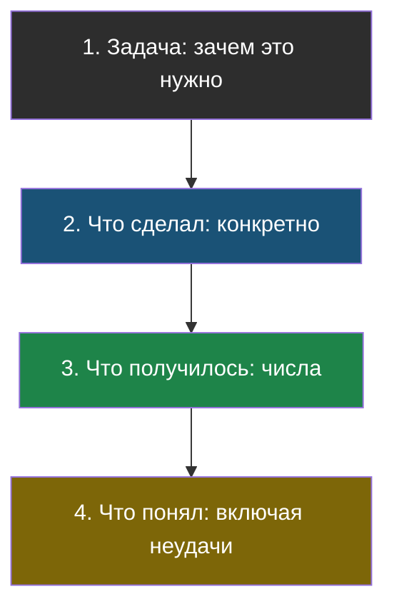

# Урок 2. Как о нём рассказать

## Знакомая ситуация

Ты выходишь к доске с проектом. Первая фраза: «Ну, я сделал бота… он там ищет… ну, короче, работает». Через минуту класс уже смотрит в окно, хотя проект действительно неплохой.

Проблема не в проекте, а в том, что рассказ не собран. А собирается он по простой схеме, которой пользуются и на защите проектов, и на собеседованиях, и вообще везде, где нужно коротко рассказать о сделанном.

## Схема из четырёх шагов

> **Схема рассказа** — четыре части: задача → что я сделал → что получилось → что понял. В таком порядке.

| Шаг | О чём | Пример |
|---|---|---|
| **1. Задача** | Что за проблема и почему она настоящая | «Новички в кружке всё время спрашивают одно и то же: когда занятия, что принести» |
| **2. Что сделал** | Своими словами, конкретно, без общих фраз | «Разрезал правила на 20 кусков, сделал поиск по словам, собираю запрос с правилом не выдумывать» |
| **3. Что получилось** | Числа. Обязательно числа | «Из 12 эталонных вопросов правильно отвечает на 10. Было 7 — помогло обрезание слов до 6 букв» |
| **4. Что понял** | Чему научился, включая то, что не вышло | «Понял, что поиск по словам не находит вопрос другими словами. Решается векторами, но я их не делал» |

Четвёртый шаг обычно пропускают — и зря. Именно он показывает, что ты не просто выполнил инструкцию, а разобрался. Признание «вот это у меня не получилось, и я понимаю, почему» звучит сильнее, чем «всё отлично работает».

## Два правила, которые всё решают

**Правило первое: числа вместо прилагательных.**

| Слабо | Сильно |
|---|---|
| «Бот отвечает довольно хорошо» | «Правильно отвечает на 10 из 12 вопросов» |
| «Я улучшил поиск» | «Было 7 из 12, стало 10 из 12 — помогло вот это изменение» |
| «Работает быстро» | «Отвечает меньше чем за секунду на 20 документах» |

Числа — это не про формальность. Это единственный способ показать, что ты действительно проверял, а не «ощущал».

**Правило второе: говори, чего не делал.**

Не потому, что это скромно, а потому что это тебя защищает. Сказал «векторную базу не использовал» — и никто не спросит про HNSW. Промолчал — спросят, и придётся выкручиваться.

## Вопросы, которые тебе зададут

Хороший рассказ вызывает вопросы — это нормально и даже хорошо. Вот те, которые задают почти всегда:

| Вопрос | Что на самом деле проверяют | Чем отвечать |
|---|---|---|
| «А если спросить то, чего в документах нет?» | Умеет ли система признавать незнание | Покажи такой вопрос в эталонном наборе |
| «Откуда ты знаешь, что стало лучше?» | Мерил или ощущал | Числа до и после |
| «А что не работает?» | Понимаешь ли ты границы своего проекта | Назови конкретный провалившийся случай и причину |
| «Почему так, а не иначе?» | Осознанный выбор или скопировал | Объясни, что рассматривал варианты (например, агент против простого порядка шагов) |
| «Это ты писал?» | Понимаешь ли свой код | Объясни любую строчку. Если не можешь — см. чек-лист из прошлого урока |

Отдельно про последний. Пользоваться ИИ-помощником при написании кода — нормально, этим занимаются все, включая профессионалов. Ненормально другое — не понимать, что получилось. Разница видна с первого уточняющего вопроса.

## Что делать дальше

Курс почти кончился, но это, пожалуй, худший момент останавливаться. Ты уже работал и с живой моделью, и с настоящими библиотеками — значит, дальше идут не «учебные», а обычные инженерные шаги:

1. **Соединить поиск по смыслу с ботом.** В теме 2 бот ищет по словам и спотыкается на синонимах, в теме 3 ты сделал поиск по смыслу отдельно. Соедини их в одном проекте: пусть каждый вопрос ищется обоими способами, а найденные куски объединяются. Это называется гибридным поиском, и именно так устроены серьёзные системы.
2. **Расширить эталонный набор.** Скучно звучит, а пользы больше всего: чем больше вопросов, тем честнее число и тем заметнее любые изменения. Двадцать вопросов вместо восьми — и ты начнёшь замечать то, чего раньше не видел.
3. **Попробовать другую модель.** В ноутбуках модель задана одной строкой. Поменяй её на другую из доступных и прогони свой эталонный набор. Стало лучше или хуже? Теперь у тебя есть способ ответить на это числом, а не мнением.
4. **Завести свой ключ.** Школьный сервер — это удобно, но он чужой. Разберись, как получить собственный доступ к модели и чем платные модели отличаются от бесплатных. Заодно поймёшь, почему в теме 1 мы считали цену запроса.

И главный совет, который переживёт любую конкретную технологию: **всё, что ты услышишь про ИИ в новостях, проверяй тем, что знаешь из темы 1**. Модель угадывает продолжение текста. Не «понимает», не «думает», не «знает» — угадывает. Половина громких заголовков рассыпается от одного этого вопроса: а что тут на самом деле произошло с точки зрения угадывания следующего токена?

## Найди ошибку

Ученик рассказывает: «Я сделал умного ИИ-бота, который понимает вопросы учеников и знает всё про нашу школу. Он работает на нейросети и очень точный». Разбери, что здесь не так — три вещи.

Ответ

1. **«Понимает» и «знает всё»** — неверно по сути. Из темы 1: модель угадывает продолжение текста. Из темы 2: она знает только то, что ей положили в запрос. «Знает всё про школу» — это не про модель, это про качество поиска.
2. **«Очень точный»** — прилагательное вместо числа. Сколько из скольких? Пока цифры нет, это ничем не подтверждено.
3. **Ни слова о том, что не работает.** Значит, либо не проверял, либо скрывает. И то и другое хуже, чем честное «на вопросы другими словами часто промахивается».

Честный вариант: «Сделал бота, который отвечает по правилам нашего кружка. Из 12 эталонных вопросов отвечает правильно на 10, на вопросы без ответа честно говорит "не знаю". Промахивается, когда спрашивают другими словами — это лечится поиском по смыслу, но его я не делал».

## Что мы узнали

- **Схема рассказа**: задача → что сделал → что получилось (числа) → что понял (включая неудачи).
- Числа сильнее прилагательных: «10 из 12» вместо «довольно хорошо».
- Говорить, чего не делал, — не скромность, а защита от неудобных вопросов.
- Пользоваться ИИ при написании кода нормально; не понимать свой код — нет.
- Проверяй громкие заявления про ИИ главной мыслью темы 1: модель угадывает продолжение текста.

## Проверь себя

1. Перескажи схему из четырёх шагов и объясни, зачем нужен четвёртый.
2. Замени фразу «бот работает хорошо» на честную и сильную.
3. Тебя спросили: «а что у тебя не работает?». Почему это хороший вопрос, а не подвох?

## Итог темы 7

Теперь у тебя есть свой работающий проект и понятная схема, как о нём рассказать. Проверь себя по [словарику](glossary.md).

Дальше — итоговая тема: все правила курса «как делать и как не делать» в одном месте, с чек-листом, по которому стоит пройтись и в твоём проекте.
