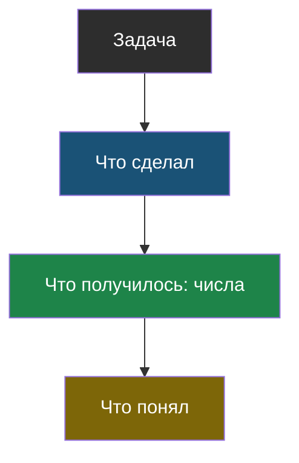
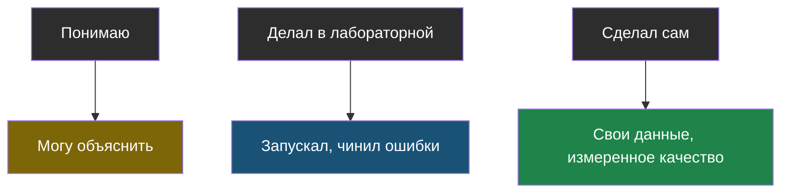

# Словарик темы 7

## Схема рассказа

> **Схема рассказа** — четыре части: задача → что я сделал → что получилось (числа) → что понял (включая неудачи). В таком порядке.

Из [урока 2](chapter-02.md). Четвёртый шаг пропускают чаще всего, а он и показывает, что ты разобрался.

## Три уровня

> **Три уровня** — честное разделение того, что ты знаешь: понимаю / делал в лабораторной / сделал сам. Каждый следующий уровень включает предыдущий, но не наоборот.

Из [урока 1](chapter-01.md). Путать их — самая заметная со стороны ошибка.

## Чек-лист готовности

> **Чек-лист готовности** — список пунктов, которые должны быть выполнены, чтобы считать проект сделанным, а не «почти сделанным».

Из [урока 1](chapter-01.md). Главный пункт: в проекте не осталось строчек, которые ты не можешь объяснить.
