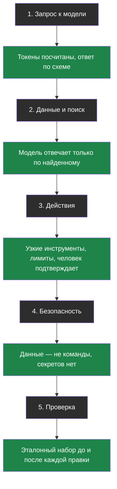

# Тема 8. Хорошие привычки: как делать и как не делать

> Итоговая тема. Новой теории здесь почти нет — здесь всё пройденное собрано в правила «так делай, а так не делай», и кое-где мы копнём чуть глубже, чем раньше.

## Задача, с которой начинается тема

Представь, что ты знаешь правила дорожного движения наизусть. Это ещё не значит, что ты хорошо водишь: хороший водитель не вспоминает правила, у него **привычки** — посмотреть в зеркало, включить поворотник, притормозить у школы. Он делает это, даже когда торопится.

С ИИ-проектами то же самое. Почти все провалы, которые мы разбирали за семь тем, случались не потому, что человек не знал теорию. Он знал, что модель выдумывает, — но не добавил проверку. Знал, что качество надо мерить, — но «на глаз вроде работает». Знал про подмену инструкций — но «кто будет взламывать школьного бота».

Эта тема — про привычки. Каждое правило здесь ты уже встречал, теперь они лежат в одном месте.

## Главная мысль темы

Хорошая привычка — это проверка, встроенная в каждый этап работы с ИИ. Этапов пять, и на каждом есть своё «не забудь»:

Сквозное правило курса никуда не делось и здесь главное: **просьба к модели — не защита**. Всё, что действительно важно, проверяется кодом или человеком.

## Уроки темы

- [Урок 1. Разговор с моделью и работа с данными](chapter-01.md) — хорошие привычки из тем 1–3
- [Урок 2. Агенты, безопасность и проверка](chapter-02.md) — хорошие привычки из тем 4–6
- [Урок 3. Итоговый чек-лист и ревизия бота](chapter-03.md) — разбор плохого проекта · лабораторная: [открыть в Colab](https://colab.research.google.com/github/iRoboTron/ai-engineering-school/blob/main/docs/books/labs/tema8-praktiki/01_ispravlyaem_bota.ipynb)
- [Словарик темы](glossary.md)

## Что понадобится

Словарики предыдущих тем под рукой: в этой теме мы постоянно на них ссылаемся. И проект из темы 7, если ты его сделал, — в конце мы проверим его по чек-листу.
