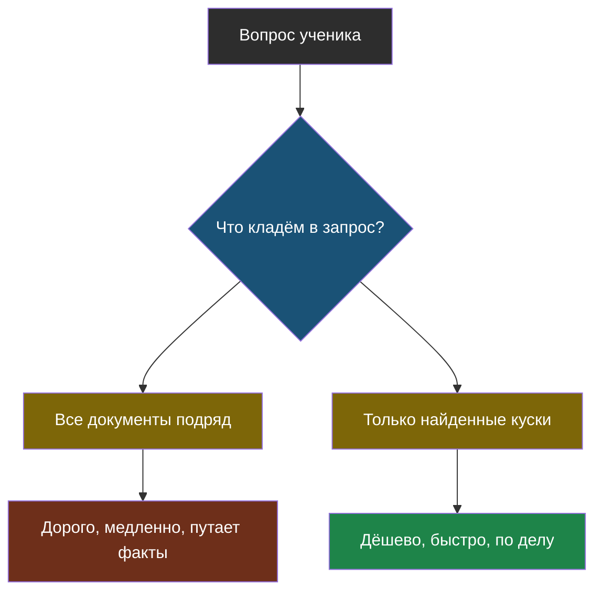
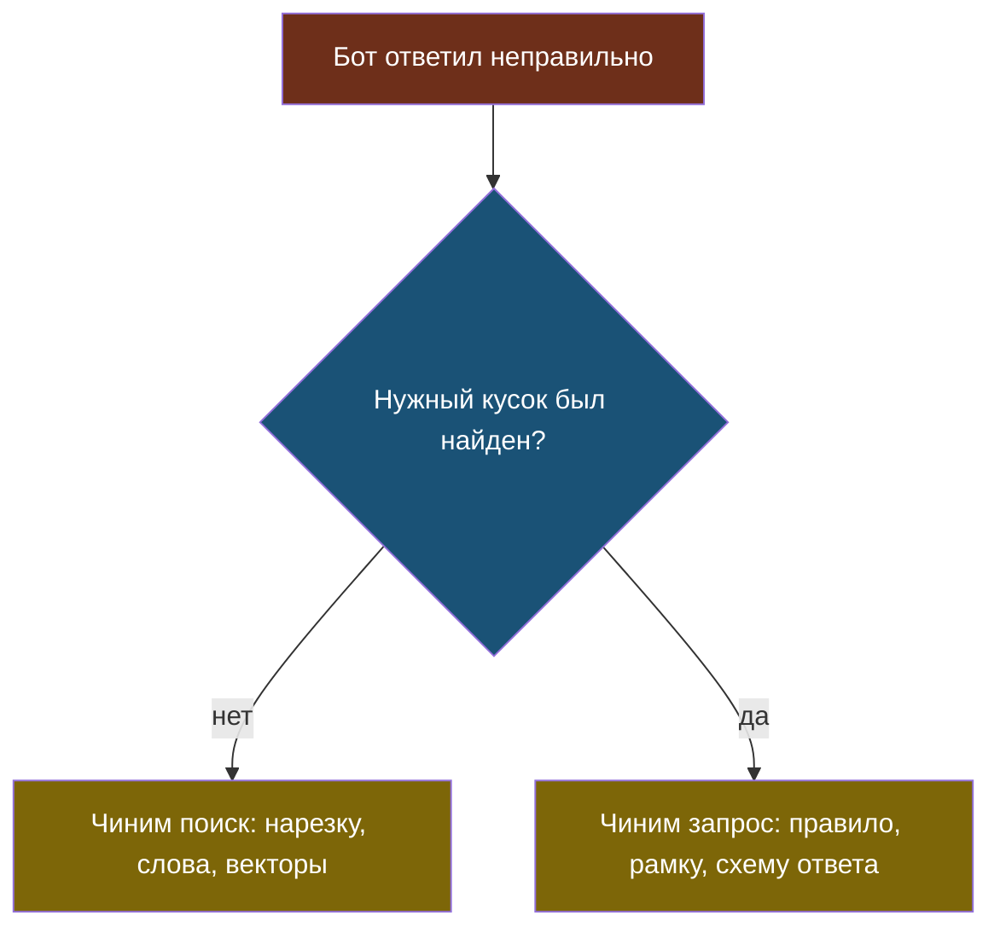

# Урок 1. Разговор с моделью и работа с данными

## С чего начнём

У пилотов перед каждым взлётом есть список проверок: топливо, закрылки, приборы. Пилот с двадцатилетним опытом всё равно проходит его пункт за пунктом. Не потому, что забыл, как летать, — а потому, что память подводит именно тогда, когда всё привычно и кажется, что «и так понятно».

Мы соберём такие списки для ИИ. В этом уроке — всё, что касается самого запроса к модели и документов, по которым она отвечает. Это темы 1, 2 и 3.

> **Хорошая практика** — способ делать работу, который раз за разом приводит к меньшему числу ошибок; обычно это привычка что-то проверить или от чего-то отказаться.

Каждый раздел ниже устроен одинаково: короткое напоминание, таблица «так / не так» и то, что стоит понять чуть глубже.

## Привычка 1. Помни, что модель угадывает продолжение

**Напоминание из темы 1.** Модель не ищет ответ в памяти и не «думает». Она раз за разом выбирает следующий **токен** — кусочек текста — из тех, что правдоподобно продолжают написанное.

Из этого одного факта следуют почти все остальные привычки курса.

| Так | Не так |
|---|---|
| «Модель выдала правдоподобный текст, надо проверить» | «ИИ сказал — значит, так и есть» |
| Давать модели нужные факты прямо в запросе | Надеяться, что она «знает» про твою школу |
| Писать, что проверил и сколько раз | Верить одному удачному ответу |

**Чуть глубже.** Один удачный ответ ничего не доказывает, потому что ответ модели — это выбор среди вероятностей. Если спросить то же самое пять раз и получить пять одинаковых правильных ответов — это уже что-то. Если ответы разные — ты узнал о системе больше, чем из любого одного из них.

## Привычка 2. Считай токены и не заваливай запрос

**Напоминание из темы 1.** У модели есть **контекстное окно** — сколько токенов она может учесть за один раз. Каждый токен стоит денег и времени. Русский текст дробится на токены сильнее английского: «школа» — это 4 токена, а «school» — один.

Самая частая ошибка новичка — «положу в запрос все документы сразу, модель сама разберётся».

| Так | Не так |
|---|---|
| Найти 2–3 нужных куска и положить только их | Вставить все правила школы целиком |
| Прикинуть длину запроса до отправки | Узнать про лимит, когда запрос упал |
| Короткое ясное правило в начале | Три абзаца уговоров «пожалуйста, будь точным» |

**Чуть глубже.** Лишний текст вредит не только цене. Чем больше в запросе посторонних кусков, тем больше шанс, что модель возьмёт факт не из того документа: «кабинет 204» из объявления про кружок попадёт в ответ про библиотеку. Короткий запрос с одним нужным куском — это одновременно дешевле, быстрее **и** точнее.



На схеме видно, что выбор делается **до** модели, в твоём коде. Модель не может «отфильтровать лишнее» за тебя бесплатно: всё, что ты ей дал, она прочитает и оплатит.

## Привычка 3. Настраивай, а не уговаривай

**Напоминание из темы 1.** У запроса есть **температура**: низкая — модель выбирает самые вероятные токены, высокая — рискует. Есть **схема ответа**: можно потребовать от модели ответ строго в заданном виде, например с полями «ответ» и «источник».

| Так | Не так |
|---|---|
| Температура 0 для фактов, повыше — для сочинений | Одна и та же температура на всё |
| Схема ответа, если ответ дальше читает программа | Искать нужное в свободном тексте ответа кусками кода |
| Роли: правила — в системном сообщении, вопрос — в пользовательском | Всё одной строкой, вперемешку |

**Чуть глубже.** Когда ответ модели дальше обрабатывает программа, свободный текст — это бомба замедленного действия. Сегодня модель пишет «Ответ: 15:40», завтра «Занятие начинается в 15:40», послезавтра «15.40». Код, который ищет «Ответ:», однажды тихо сломается. Схема ответа убирает саму возможность такой поломки.

## Привычка 4. Разреши говорить «не знаю» — и проверь, что это работает

**Напоминание из тем 1 и 2.** **Галлюцинация** — уверенный правдоподобный ответ, не основанный на фактах. Лучшее лекарство — **грунтование**: модель отвечает только по найденным документам. Но в теме 1 лаборатория показала неприятное: просто написать «если не знаешь, скажи "не знаю"» — ненадёжно.

| Так | Не так |
|---|---|
| Положить в запрос документы и правило «только по ним» | Спросить модель «из головы» |
| Если поиск ничего не нашёл — ответить «не знаю» кодом, без модели | Всё равно звать модель: «вдруг знает» |
| Держать в эталонном наборе вопросы, на которые ответа нет | Проверять только вопросы с ответом |

**Чуть глубже.** Посмотри на вторую строчку таблицы. Если поиск вернул пустоту, у модели нет фактов — значит, всё, что она скажет, будет выдумкой по определению. Самое надёжное «не знаю» — то, которое произносит **программа**, а не модель. Это то самое правило: просьба к модели — не защита.

## Привычка 5. Сначала почини поиск, потом ответ

**Напоминание из тем 2 и 3.** В RAG два шага: найти куски и ответить по ним. **Поиск по словам** находит совпадения слов, **поиск по смыслу** — через векторы — находит похожее по смыслу, даже другими словами. В теме 3 мы увидели его слабость: он **всегда** что-то возвращает, даже когда ответа нет.

| Так | Не так |
|---|---|
| Проверять поиск отдельно: нашёлся ли нужный кусок | Смотреть только на итоговый ответ |
| Резать документы на куски по смыслу: абзац — один факт | Резать ровно по 500 символов посреди предложения |
| Хранить рядом с куском, откуда он взят | Не знать, из какого файла пришёл факт |
| Начинать с поиска по словам, векторы — когда доказано, что не хватает | Сразу строить векторную базу для 20 абзацев |

**Чуть глубже.** Если бот ответил неправильно, виноват один из двух шагов — и чинить их нужно по-разному. Нужный кусок не нашёлся — бесполезно переписывать запрос к модели, чини поиск. Кусок нашёлся, а ответ всё равно плохой — бесполезно менять поиск, чини запрос. Ученик, который этого не разделяет, неделю улучшает не ту половину.



Смотри на ромб: один вопрос экономит часы. Ответ на него даёт только замер поиска отдельно от ответа — тот, что мы делали в теме 5.

## Найди ошибку

Ученик делает бота по правилам школы. Код запроса такой:

```python
vse_pravila = open("pravila.txt").read()          # 40 страниц
zapros = (
    "Ты очень умный помощник. Пожалуйста, будь точным и не выдумывай!\n"
    + vse_pravila
    + "\nВопрос: " + vopros
)
otvet = sprosit_model(zapros, temperature=1.0)
```

Бот иногда отвечает правильно, иногда путает кабинеты, а на вопрос про школьную форму сочинил цену. Найди как минимум три ошибки.

<details>
<summary>Ответ</summary>

1. **Все 40 страниц в запросе** (привычка 2). Дорого, медленно, и модель путает факты из разных частей. Нужно найти 2–3 подходящих куска (тема 2).
2. **«Пожалуйста, не выдумывай»** вместо проверки (привычка 4). Просьба к модели — не защита. Если поиск ничего не нашёл — «не знаю» должен говорить код.
3. **Температура 1.0 для фактов** (привычка 3). Для ответов по правилам нужна низкая температура, иначе модель чаще выбирает менее вероятные токены — и «кабинет 204» превращается в «кабинет 402».
4. Бонус: правила и вопрос склеены одной строкой без ролей и без рамки — модель не видит, где правила разработчика, а где данные (тема 6).
</details>

## Что мы узнали

- Модель угадывает продолжение текста; один удачный ответ ничего не доказывает.
- В запрос кладут только нужные куски: это дешевле, быстрее и точнее одновременно.
- Модель настраивают параметрами (температура, схема ответа, роли), а не уговорами.
- Самое надёжное «не знаю» произносит программа, когда поиск ничего не нашёл.
- Ошибку RAG сначала относят к поиску или к ответу — и только потом чинят нужную половину.

## Проверь себя

1. Почему «положить все документы в запрос» вредит не только цене?
2. Поиск ничего не нашёл. Почему правильнее ответить «не знаю» кодом, а не звать модель?
3. Бот ответил неверно. Какой первый вопрос нужно себе задать, прежде чем что-то менять?
