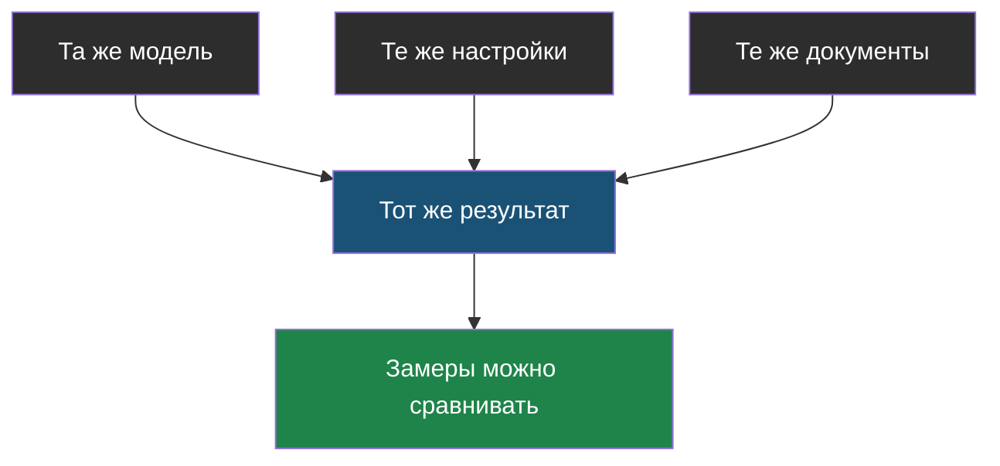
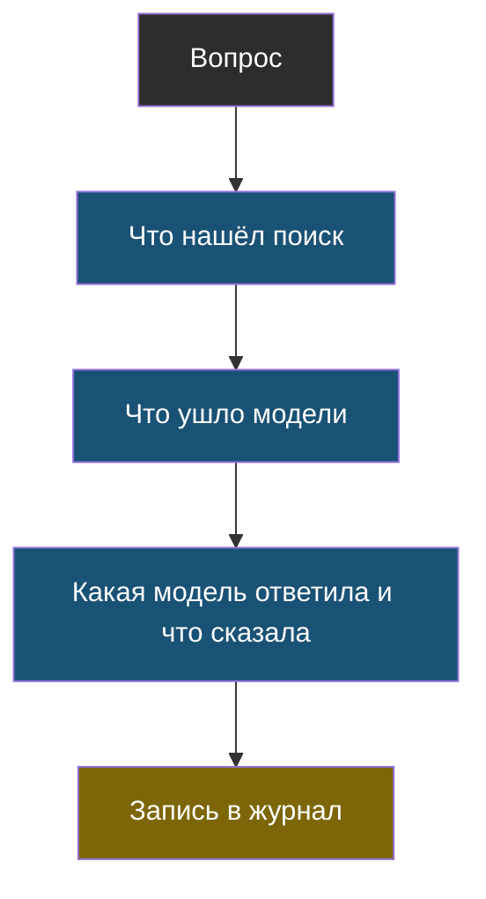
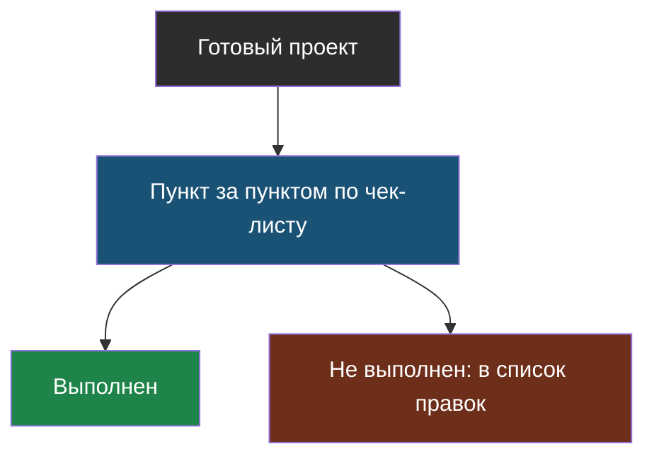
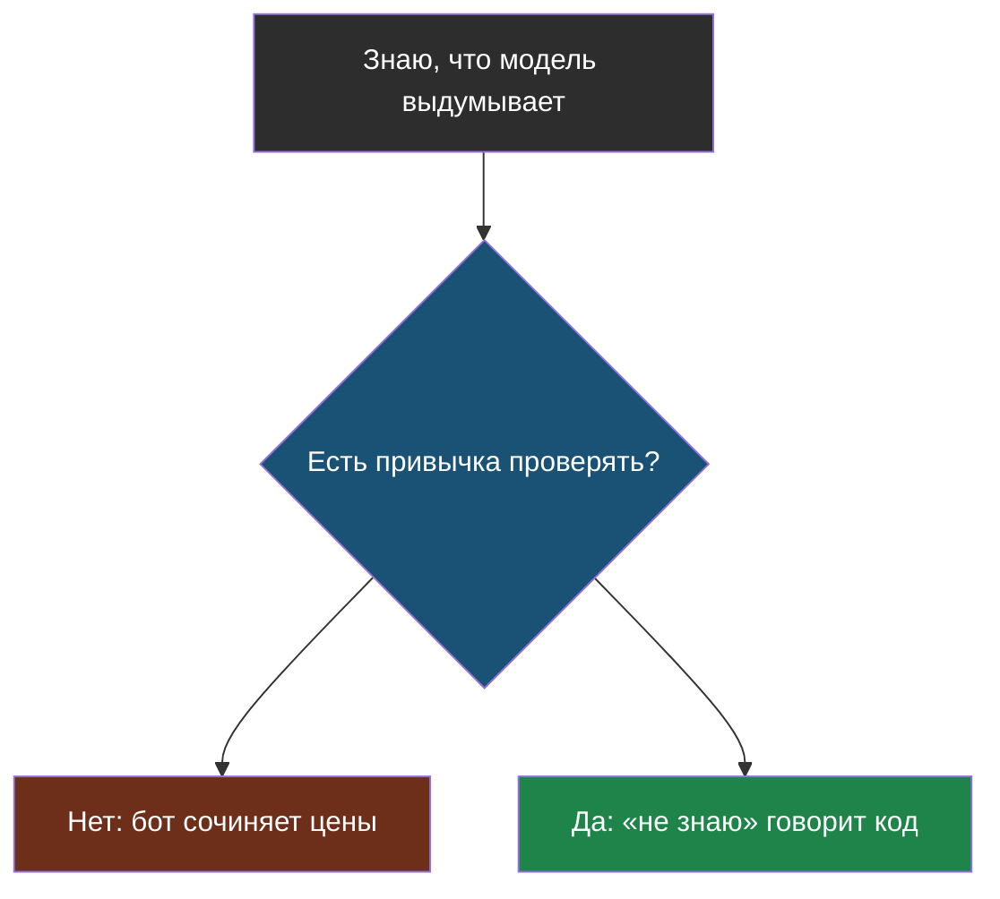
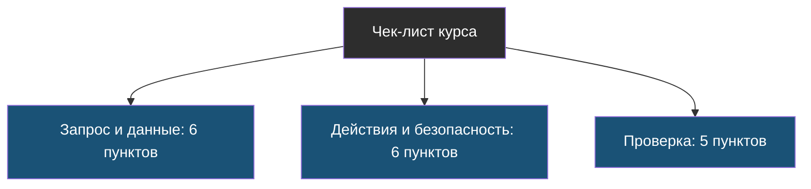

# Словарик темы 8

Термины по алфавиту. Новых терминов в теме мало: она собирает старые. Остальные слова, которые здесь встречаются, ищи в словариках тем 1–7.

## Воспроизводимость

> **Воспроизводимость** — свойство системы давать тот же результат при тех же условиях: та же модель, те же настройки, те же документы.

Из [урока 2](chapter-02.md). Без неё два замера нельзя честно сравнить: непонятно, изменилось качество из-за твоей правки или из-за чего-то ещё.

## Журнал

> **Журнал** — запись о каждом обращении к модели: какой был вопрос, что нашёл поиск, что ушло в запрос и что вернулось. По-английски это называют логированием (*logging*).

Из [урока 2](chapter-02.md). Секреты и личные данные в журнал не пишут.

## Ревизия

> **Ревизия** — проверка готового проекта по списку пунктов: каждый пункт либо выполнен, либо нет, без «в целом нормально».

Из [урока 3](chapter-03.md). Найденные проблемы чинят по одной, с замером после каждой.

## Хорошая практика

> **Хорошая практика** — способ делать работу, который раз за разом приводит к меньшему числу ошибок; обычно это привычка что-то проверить или от чего-то отказаться.

Из [урока 1](chapter-01.md). Знать теорию и иметь привычку — разные вещи: провалы случаются от пропущенной проверки, а не от незнания.

## Чек-лист

> **Чек-лист** — короткий список проверок, который проходят каждый раз целиком, даже когда кажется, что всё и так понятно.

Из [урока 3](chapter-03.md). Итоговый чек-лист курса — 17 пунктов в трёх группах: запрос и данные, действия и безопасность, проверка. Не путай с чек-листом готовности из темы 7: тот про то, доделан ли проект, этот — про то, сделан ли он правильно.

