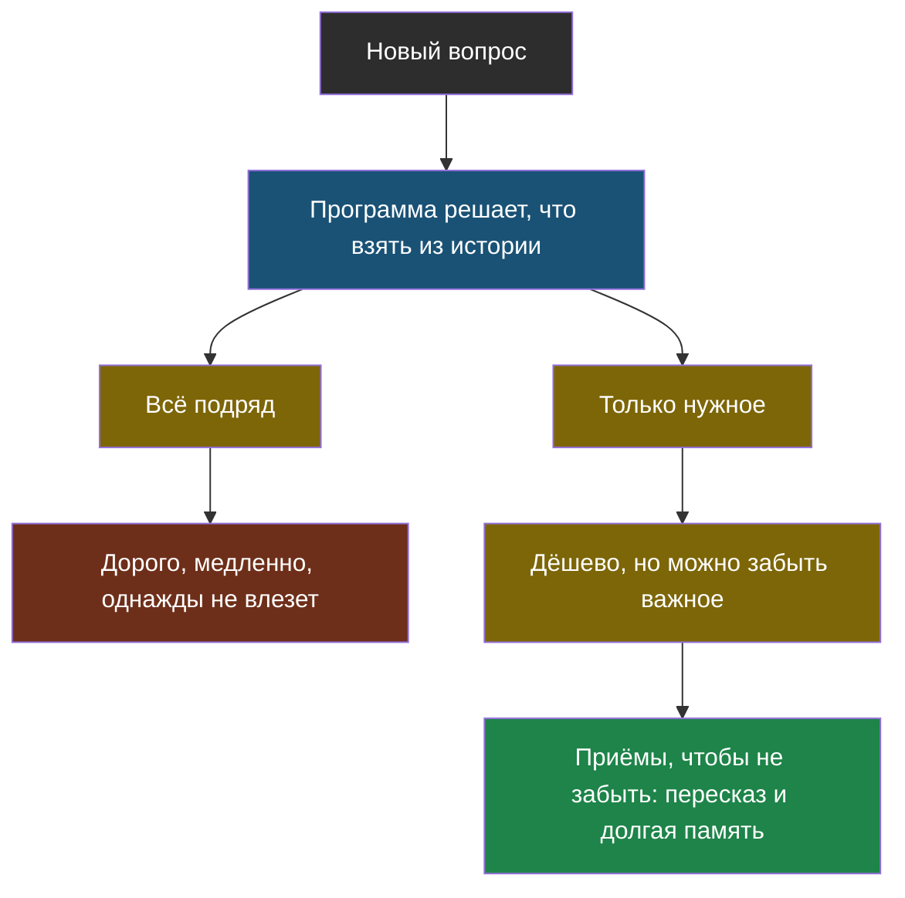

# Тема 9. История и память: почему диалог дорожает

> Первая тема продолжения курса. Основной курс научил делать ИИ-проект правильно. Продолжение — про то, как сделать его дешёвым, быстрым и надёжным, когда им пользуются по-настоящему.

## Задача, с которой начинается тема

В теме 4 ты написал агента и видел, как устроен разговор: каждый новый шаг добавляется в список `istoriya`, и весь этот список уходит модели. Снова и снова, целиком.

Пока шагов три, это незаметно. Но школьный бот, с которым ученик переписывается полчаса, на тридцатом вопросе отправляет модели всё, что было сказано за эти полчаса. И платит за это. И ждёт, пока модель это прочитает. А однажды история просто перестанет влезать в контекстное окно.

## Главная мысль темы

Модель ничего не помнит между запросами — помнит программа. Значит, **программа и решает, что из прошлого стоит отправить**, и от этого решения зависят цена, скорость и то, не забудет ли бот что-то важное.

## Уроки темы

- [Урок 1. Модель ничего не помнит](chapter-01.md) — почему история уходит целиком и почему цена растёт быстрее числа вопросов
- [Урок 2. Как экономить, не теряя смысл](chapter-02.md) — окно, обрезка, пересказ, долгая память, кэш начала запроса · лабораторная: [открыть в Colab](https://colab.research.google.com/github/iRoboTron/ai-engineering-school/blob/main/docs/books/labs/tema9-istoriya/01_ekonomim_na_istorii.ipynb)
- [Словарик темы](glossary.md)

## Что понадобится

Тема 1 (токены и контекстное окно) и тема 4 (агент, память агента). Если помнишь, как в лабораторной темы 4 история росла на каждом шаге, — ты готов.
