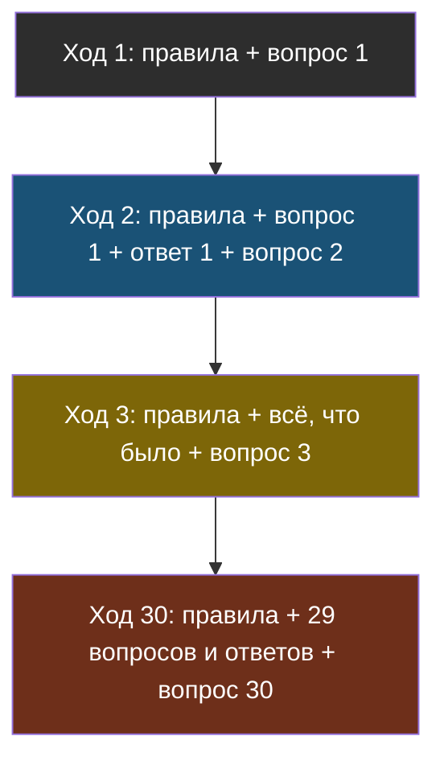
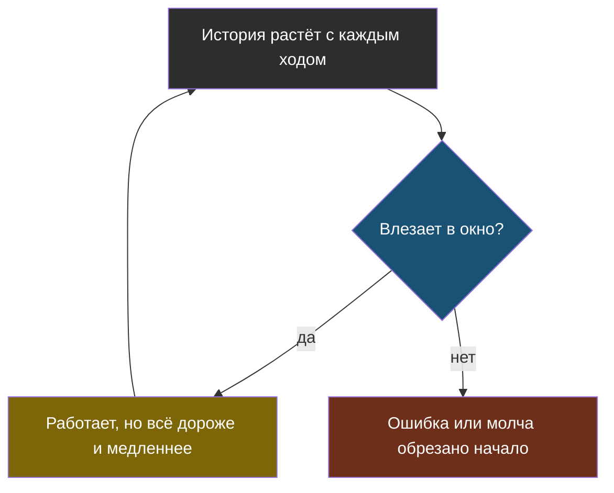

# Урок 1. Модель ничего не помнит

> **Лабораторной в этом уроке нет.** Практика темы — в [уроке 2](chapter-02.md).

## Знакомая ситуация

Представь друга, который после каждого твоего сообщения полностью забывает переписку. Чтобы он ответил по делу, тебе приходится каждый раз пересылать ему **весь разговор с самого начала** плюс новый вопрос.

На третьем сообщении это терпимо. На тридцатом ты отправляешь простыню текста, друг читает её минуту, а если за каждое прочитанное слово надо платить — разговор становится очень дорогим.

Так и работает любой чат с ИИ. Просто пересылает переписку не человек, а программа, и ты этого не видишь.

## Модель действительно ничего не помнит

Вспомни тему 1: модель — это функция, которая по тексту угадывает продолжение. Между двумя запросами у неё не остаётся ничего: ни твоего имени, ни прошлого вопроса.

> **Модель без состояния** — модель, которая не хранит ничего между запросами: каждый запрос для неё первый, и всё, что она должна «помнить», нужно положить в сам запрос.

Когда в чате кажется, что ИИ помнит начало разговора, на самом деле программа чата хранит историю у себя и на каждом ходе отправляет её заново. Ровно так было в агенте из темы 4:

```python
istoriya = [{"role": "system", "content": PRAVILA}]

while True:
    vopros = input("Ты: ")
    istoriya.append({"role": "user", "content": vopros})
    otvet = sprosit_model(istoriya)          # уходит ВСЯ история
    istoriya.append({"role": "assistant", "content": otvet})
```

Обрати внимание на строку с `sprosit_model`: туда передаётся не `vopros`, а вся `istoriya`. Уберёшь историю — бот на втором же вопросе забудет, о чём шла речь.



Смотри, как от хода к ходу растёт блок: каждый следующий запрос содержит все предыдущие целиком.

## Почему цена растёт быстрее, чем число вопросов

Посчитаем на простых числах. Пусть один вопрос с ответом — это 200 токенов. На каждом ходе мы отправляем всю историю.

| Ход | Отправляем токенов | Заплачено всего | Если бы платили только за новое |
|---|---|---|---|
| 1 | 200 | 200 | 200 |
| 2 | 400 | 600 | 400 |
| 5 | 1 000 | 3 000 | 1 000 |
| 10 | 2 000 | 11 000 | 2 000 |
| 20 | 4 000 | 42 000 | 4 000 |
| 30 | 6 000 | 93 000 | 6 000 |

Правая колонка растёт ровно вместе с числом ходов: в два раза больше ходов — в два раза больше денег. А колонка «заплачено всего» растёт гораздо быстрее: 20 ходов стоят не в два раза дороже десяти, а почти в **четыре**. Каждый ход заново оплачивает все предыдущие.

> **Стоимость истории** — сколько токенов уходит на повторную пересылку прошлых сообщений. В длинном диалоге она быстро становится основной частью цены, хотя новой информации в ней нет.

И это без учёта правил в начале запроса, которые тоже едут на каждом ходе, и без ответов инструментов.

## Где в истории самое тяжёлое

Не все сообщения весят одинаково. Если посмотреть на историю реального бота, в ней обычно три тяжёлых вида текста:

| Что | Почему тяжёлое | Нужно ли оно целиком потом |
|---|---|---|
| **Результаты инструментов** (тема 4) | Инструмент вернул страницу расписания или найденный документ целиком | Почти никогда: нужен был ответ, а не сырой текст |
| **Найденные куски документов** (тема 2) | RAG кладёт 2–3 куска на каждый вопрос, и они оседают в истории | Нет: к новому вопросу найдутся новые куски |
| **Правила в начале** | Длинная инструкция боту | Да, на каждом ходе — но они одинаковые, и на этом можно сэкономить (урок 2) |

Выходит, что ученик задаёт короткие вопросы, бот отвечает коротко, а история всё равно раздувается — за счёт того, что осталось от инструментов и поиска.

## А потом история перестаёт влезать

Контекстное окно не бесконечно (тема 1). Если ничего не делать, наступает момент, когда история длиннее окна. Дальше бывает одно из двух, и оба плохие:

- запрос падает с ошибкой, и бот перестаёт отвечать посреди разговора;
- сервис молча отрезает начало, и бот забывает самое первое — часто как раз то, как тебя зовут и что ты просил.



Стрелка из жёлтого узла возвращается наверх: пока диалог идёт, запрос только растёт. Вопрос не в том, случится ли проблема, а в том, на каком ходе.

Большие окна на миллион токенов отодвигают этот момент, но не отменяют главного: **платишь ты за каждый отправленный токен**, а не за то, сколько влезает.

## Найди ошибку

Ученик сделал бота с поиском по правилам школы (тема 2) и памятью разговора:

```python
istoriya = [{"role": "system", "content": PRAVILA}]

def otvetit(vopros):
    kuski = nayti(vopros)                       # 3 куска по 500 символов
    tekst = "ДОКУМЕНТЫ:\n" + "\n".join(kuski) + "\n\nВОПРОС: " + vopros
    istoriya.append({"role": "user", "content": tekst})
    otvet = sprosit_model(istoriya)
    istoriya.append({"role": "assistant", "content": otvet})
    return otvet
```

Через 15 вопросов бот начал отвечать медленно, а счёт за месяц вырос в разы. Что не так?

<details>
<summary>Ответ</summary>

В историю попадают **найденные куски документов**. На каждом вопросе к ней добавляется 1500 символов текста, который нужен был только для этого вопроса. К 15-му ходу модель получает 15 наборов старых документов, большинство не про текущий вопрос, — и за каждый символ платится снова.

Исправление: в историю класть только сам вопрос и ответ, а документы подставлять лишь в **текущий** запрос:

```python
zapros = istoriya + [{"role": "user", "content": tekst}]   # документы — только сейчас
otvet = sprosit_model(zapros)
istoriya.append({"role": "user", "content": vopros})       # в историю — без документов
istoriya.append({"role": "assistant", "content": otvet})
```

Бонус: так модель ещё и меньше путается — старые документы про кружки не мешают вопросу про столовую (привычка 2 из темы 8).
</details>

## Что мы узнали

- **Модель без состояния**: между запросами она ничего не помнит, «память» чата — это история, которую программа пересылает заново.
- На каждом ходе уходит вся история, поэтому общая цена диалога растёт гораздо быстрее, чем число вопросов.
- Самое тяжёлое в истории — результаты инструментов и найденные документы, а не сами вопросы.
- Рано или поздно история не влезет в окно: будет ошибка или бот молча забудет начало.
- Решать, что из прошлого отправить, — работа программы, а не модели.

## Проверь себя

1. Почему в чате кажется, что ИИ помнит разговор, если модель ничего не хранит?
2. Диалог из 10 ходов стоит 11 000 токенов. Почему диалог из 20 таких же ходов стоит не 22 000, а около 42 000?
3. Что из истории агента обычно выгоднее всего не пересылать целиком и почему?
