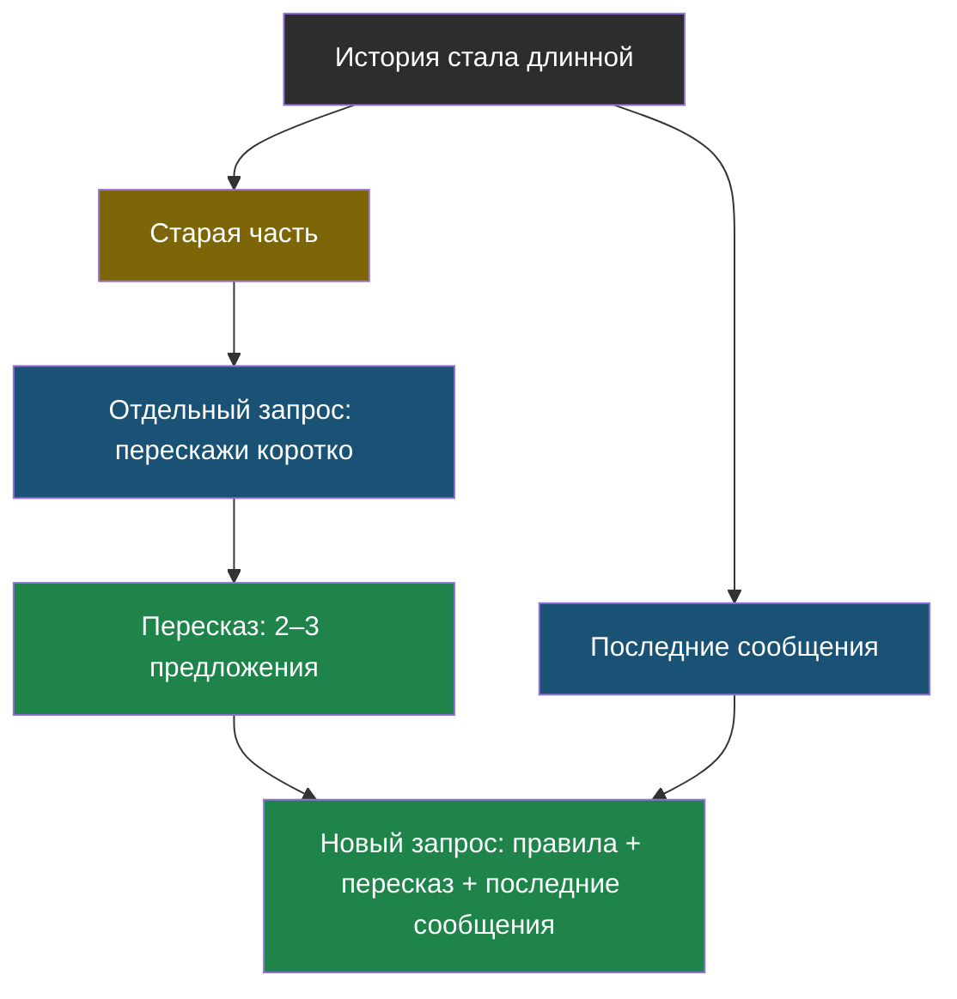
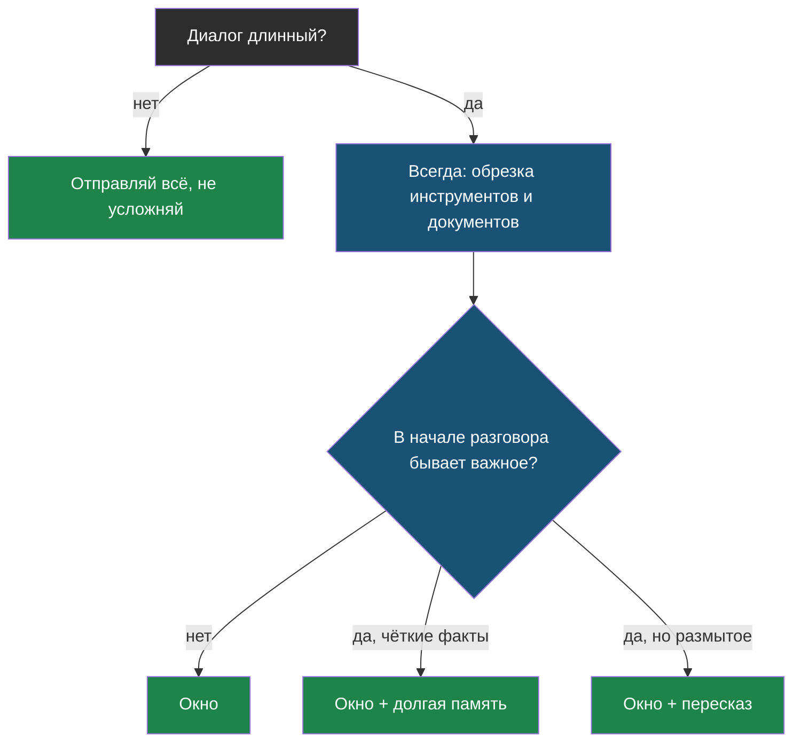

# Урок 2. Как экономить, не теряя смысл

> **Лабораторная этого урока:** пять способов отправлять историю — считаем токены и проверяем, не забыл ли бот имя.
> - без интернета: [01_dlina_dialoga.py](labs/tema9-istoriya/01_dlina_dialoga.py) — запуск `python3 01_dlina_dialoga.py`, разобрана в разделе [«Практика: пять стратегий на одном диалоге»](#практика-пять-стратегий-на-одном-диалоге)
> - на настоящей модели: [открыть в Google Colab](https://colab.research.google.com/github/iRoboTron/ai-engineering-school/blob/main/docs/books/labs/tema9-istoriya/01_ekonomim_na_istorii.ipynb) · [скачать .ipynb](labs/tema9-istoriya/01_ekonomim_na_istorii.ipynb)

## Напомним, где мы остановились

Модель ничего не помнит, поэтому программа на каждом ходе пересылает ей историю. Цена диалога от этого растёт быстрее числа вопросов, а тяжелее всего в истории — результаты инструментов и найденные документы. Теперь разберём, как отправлять меньше и при этом не забывать важное.

## С чего начнём

Когда ты рассказываешь другу длинную историю, ты не пересказываешь её дословно с первой минуты. Ты говоришь: «Короче, помнишь, мы поехали на дачу, там сломалась машина. Так вот, сегодня…» Старое — коротко, свежее — подробно, а важные факты («машина сломалась») не теряются.

Все приёмы этого урока — варианты этой бытовой привычки.

## Приём 1. Скользящее окно

Самое простое: отправлять не всю историю, а только **последние N сообщений** плюс правила.

> **Скользящее окно** — приём, при котором модели отправляются только несколько последних сообщений диалога; более старые не отправляются вовсе.

```python
OKNO = 6
zapros = [pravila] + istoriya[-OKNO:]
```

Цена запроса перестаёт расти: на 30-м ходе он такой же, как на 6-м. Но у окна есть очевидная беда — всё, что выпало за его край, **забыто полностью**. Если ученик в первом сообщении представился, на десятом бот уже не знает, как его зовут.

| Хорошо | Плохо |
|---|---|
| Одна строчка кода | Забывает всё, что было раньше окна |
| Цена запроса больше не растёт | Важное из начала пропадает без предупреждения |
| Подходит для коротких, не связанных вопросов | Не подходит, если в начале были договорённости |

## Приём 2. Обрезка результатов инструментов

Вспомни урок 1: самое тяжёлое в истории агента — ответы инструментов. Инструмент вернул страницу расписания на 3000 символов, модель нашла в ней нужное время и ответила. **На следующих ходах эта страница уже не нужна** — нужен был только вывод.

```python
def obrezat(soobshchenie):
    if soobshchenie["role"] == "tool":
        return {**soobshchenie, "content": soobshchenie["content"][:120] + "…"}
    return soobshchenie
```

Этот приём почти ничего не стоит и почти ничего не ломает, поэтому его ставят первым. Если результат инструмента вдруг понадобится снова — агент просто вызовет инструмент ещё раз.

## Приём 3. Пересказ старого

Окно забывает. Чтобы не забывать, можно **сжимать** старую часть разговора: попросить модель пересказать её в двух-трёх предложениях и отправлять пересказ вместо оригинала.

> **Пересказ истории** — приём, при котором старая часть диалога заменяется коротким изложением, которое пишет сама модель; свежие сообщения отправляются как есть.



На схеме видно, что пересказ — это **ещё один запрос к модели**. Он тоже стоит денег, поэтому его делают не на каждом ходе, а когда история перевалила за порог, например за 2000 токенов.

И у пересказа есть подвох из темы 1: пересказ пишет модель, а модель может что-то упустить или исказить. Если в начале разговора было «у меня аллергия на орехи», а в пересказ это не попало — бот об этом больше не узнает. Поэтому для по-настоящему важных фактов есть следующий приём.

## Приём 4. Факты — в долгую память

В теме 4 мы разбирали три вида памяти агента. Короткая память — это история, и она дорогая. **Долгая** — отдельное хранилище фактов, которые подставляются в запрос по надобности.

Идея: важные факты (имя, класс, «аллергия на орехи», «отвечай на английском») выписываются из разговора в отдельный список — и этот короткий список добавляется в каждый запрос. А сама история может жить в скромном окне.

```python
fakty = ["Зовут Аня", "Учится в 9Б"]
zapros = [pravila, {"role": "system", "content": "Известно о собеседнике: " + "; ".join(fakty)}] + istoriya[-6:]
```

| Приём | Экономия | Что может забыть | Сложность |
|---|---|---|---|
| Окно | большая | всё старше окна | одна строчка |
| Обрезка инструментов | средняя | сырой вывод инструментов | несколько строк |
| Пересказ | большая | детали, которые модель не сочла важными | отдельный запрос к модели |
| Долгая память | большая | ничего из выписанного | нужно решить, что считать фактом |

Обычно их **сочетают**: обрезка инструментов — всегда, окно — всегда, а сверху пересказ или долгая память — смотря что важнее в твоём боте.

## Отдельный приём: кэш начала запроса

Есть часть запроса, которую сократить нельзя, — правила бота. Они длинные и одинаковые на каждом ходе. На этом экономят по-другому.

Многие поставщики моделей запоминают **начало запроса**, которое уже видели недавно. Если следующий запрос начинается точно так же, эту часть не нужно обрабатывать заново, и стоит она дешевле. В каталоге OpenRouter это видно отдельной ценой: у qwen3.7-flash повторно прочитанное начало стоит 20% обычной цены.

> **Кэш начала запроса** (по-английски *prompt caching*) — скидка на ту часть запроса, которая побуквенно совпадает с началом недавнего запроса; поставщик не обрабатывает её заново.

Отсюда простое правило, которое стоит запомнить: **неизменное — в начало, меняющееся — в конец**.

| Так | Не так |
|---|---|
| Правила → документы → история → новый вопрос | Текущая дата и время первой строкой правил |
| Правила написаны один раз и не меняются | Имя ученика вставлено в середину правил |
| Изменения — только в хвосте запроса | Порядок документов меняется от запроса к запросу |

Одна строка «Сегодня 14 сентября, 15:42» в самом начале ломает совпадение на каждом запросе — и скидка пропадает целиком.

## Практика: пять стратегий на одном диалоге

Возьмём один диалог из 30 ходов: ученица представляется, задаёт вопросы, иногда вызывает инструмент с длинным расписанием, а в конце спрашивает «как меня зовут?». Прогоним его пятью способами и посчитаем токены.

Файл: [labs/tema9-istoriya/01_dlina_dialoga.py](labs/tema9-istoriya/01_dlina_dialoga.py) — запуск: `python3 01_dlina_dialoga.py`.

```python
# labs/tema9-istoriya/01_dlina_dialoga.py
# Один и тот же диалог из 30 ходов — пять способов отправлять историю модели.
# Считаем, сколько токенов уходит за весь разговор, и проверяем главное:
# помнит ли бот в конце, как зовут собеседника.
# Настоящую модель заменяет заглушка: она «видит» только то, что есть в запросе.

# --- НАСТРОЙКИ ---
HODOV = 30                 # сколько вопросов задаёт ученик
OKNO = 6                   # сколько последних сообщений оставляет окно
OBREZAT_INSTRUMENT = 120   # до скольких символов режем результат инструмента
PORG_PERESKAZA = 900       # пересказываем, когда история длиннее стольких токенов
CENA_VHODA = 0.10          # долларов за 1 млн входных токенов
SKIDKA_KESHA = 0.20        # повторённое начало запроса стоит 20% цены (как у qwen3.7-flash)

PRAVILA = "Ты помощник школы №7. Отвечай кратко и вежливо. " * 20   # длинное неизменное начало


def tokeny(tekst):
    """Грубая оценка: русский текст — примерно токен на 2 символа (тема 1)."""
    return len(tekst) // 2


def razgovor():
    """Ход 1 — знакомство, каждый 5-й ход вызывает инструмент с длинным ответом."""
    hody = [("user", "Привет! Меня зовут Аня, я учусь в 9Б.")]
    for n in range(2, HODOV):
        if n % 5 == 0:
            hody.append(("user", f"Покажи расписание на день {n}."))
            hody.append(("tool", f"Расписание дня {n}: " + "урок, кабинет, учитель, перемена; " * 30))
        else:
            hody.append(("user", f"Вопрос номер {n} про домашнее задание."))
    hody.append(("user", "Кстати, как меня зовут?"))
    return hody


def zaglushka_modeli(soobshcheniya):
    """Отвечает на последний вопрос. Имя знает, только если оно есть в запросе."""
    vopros = soobshcheniya[-1][1]
    if "как меня зовут" in vopros:
        vidit = " ".join(tekst for _, tekst in soobshcheniya)
        return "Тебя зовут Аня." if "Аня" in vidit else "Не знаю, ты не говорила."
    return "Хорошо, вот короткий ответ на твой вопрос."


# ---------- Пять стратегий: что именно уходит модели на очередном ходе ----------

def vsya_istoriya(istoriya, pamyat):
    return istoriya


def okno(istoriya, pamyat):
    return istoriya[-OKNO:]


def okno_i_obrezka(istoriya, pamyat):
    return [(rol, tekst[:OBREZAT_INSTRUMENT] + "…" if rol == "tool" else tekst)
            for rol, tekst in istoriya[-OKNO:]]


def pereskaz(istoriya, pamyat):
    """Когда история разрослась — старое заменяем пересказом, последние сообщения оставляем."""
    if sum(tokeny(t) for _, t in istoriya) <= PORG_PERESKAZA:
        return istoriya
    staroe, novoe = istoriya[:-OKNO], istoriya[-OKNO:]
    # В жизни пересказ пишет сама модель. Заглушка оставляет фразы, похожие на факты.
    fakty = [t for rol, t in staroe if rol == "user" and ("зовут" in t or "учусь" in t)]
    return [("system", "Кратко о начале разговора: " + " ".join(fakty))] + novoe


def dolgaya_pamyat(istoriya, pamyat):
    """Факты выписаны отдельно (тема 4) и подставляются в каждый запрос; история — окном."""
    return [("system", "Известно о собеседнике: " + "; ".join(pamyat))] + istoriya[-OKNO:]


def zapomnit_fakty(soobshchenie, pamyat):
    rol, tekst = soobshchenie
    if rol == "user" and "зовут" in tekst and "как меня" not in tekst:
        pamyat.append(tekst)


STRATEGII = [
    ("вся история", vsya_istoriya),
    ("окно", okno),
    ("окно + обрезка", okno_i_obrezka),
    ("пересказ", pereskaz),
    ("долгая память", dolgaya_pamyat),
]

print(f"{'Стратегия':<16} {'токенов за диалог':>18} {'последний запрос':>17} {'1000 диалогов, $':>17}  ответ на «как меня зовут?»")
print("-" * 100)
rost = []
for nazvanie, strategiya in STRATEGII:
    istoriya, pamyat, vsego, posledniy = [], [], 0, 0
    for soobshchenie in razgovor():
        istoriya.append(soobshchenie)
        zapomnit_fakty(soobshchenie, pamyat)
        if soobshchenie[0] == "tool":
            continue                       # результат инструмента не новый вопрос
        zapros = [("system", PRAVILA)] + strategiya(istoriya, pamyat)
        posledniy = sum(tokeny(t) for _, t in zapros)
        vsego += posledniy
        if nazvanie == "вся история":
            rost.append(posledniy)
        otvet = zaglushka_modeli(zapros)
        istoriya.append(("assistant", otvet))
    print(f"{nazvanie:<16} {vsego:>18} {posledniy:>17} {vsego * 1000 * CENA_VHODA / 1e6:>17.2f}  {otvet}")

print("\nКак растёт запрос, если отправлять всю историю (токенов на ходе):")
print("  " + "  ".join(f"ход {i + 1}: {t}" for i, t in enumerate(rost) if i % 5 == 0 or i == len(rost) - 1))

pravila = tokeny(PRAVILA)
bez_kesha = pravila * HODOV * 1000 * CENA_VHODA / 1e6
s_keshem = (pravila + pravila * (HODOV - 1) * SKIDKA_KESHA) * 1000 * CENA_VHODA / 1e6
print(f"\nНеизменные правила в начале — {pravila} токенов на каждом из {HODOV} ходов, 1000 диалогов:")
print(f"  без кэша: ${bez_kesha:.2f}   с кэшем начала: ${s_keshem:.2f}   (в {bez_kesha / s_keshem:.1f} раза дешевле)")
```

**Что посмотреть в выводе:**

1. **Вся история** — 70 503 токена за диалог, и последний запрос в 4197 токенов. Бот помнит имя, но диалог стоит в 2,5–4 раза дороже любого другого способа.
2. **Окно** — в 2,8 раза дешевле, но на вопрос «как меня зовут?» бот честно отвечает «не знаю»: знакомство выпало за край окна ещё на четвёртом ходе.
3. **Окно + обрезка** — самый дешёвый вариант (18 248 токенов), и так же забывает имя. Экономия почти бесплатная, но от забывания не спасает.
4. **Пересказ** и **долгая память** — почти так же дёшево, как окно, и бот **помнит**. Разница между ними в том, кто решает, что важно: при пересказе модель, при долгой памяти программа.
5. Строчка «как растёт запрос» показывает, что с полной историей запрос растёт на каждом ходе, а скачки — это ходы с инструментом.
6. Последний блок: неизменные правила с кэшем начала обходятся в 4,4 раза дешевле. Это экономия, для которой не нужно ничего забывать.

**Попробуй сам:**

- Поставь `OKNO = 60`. Окно стало больше диалога — чем оно теперь отличается от полной истории?
- Допиши в начало `PRAVILA` текущее время: `import time` и `PRAVILA = time.ctime() + PRAVILA`. В лабе цифры не изменятся — она не знает, как устроен кэш. А что стало бы со скидкой кэша у настоящего поставщика, если бы время менялось на каждом ходе?
- Сделай стратегию «пересказ + обрезка» и сравни с остальными.

### А теперь — на настоящей модели

Заглушка честно показывает механику, но не показывает главного: **что на самом деле забывает живая модель и как она пересказывает**. В ноутбуке ты проведёшь настоящий диалог и увидишь число `prompt_tokens`, которое сервер возвращает на каждом ходе, — те самые токены, за которые платят.

Лаборатория (ноутбук): [скачать .ipynb](labs/tema9-istoriya/01_ekonomim_na_istorii.ipynb) · [открыть в Google Colab](https://colab.research.google.com/github/iRoboTron/ai-engineering-school/blob/main/docs/books/labs/tema9-istoriya/01_ekonomim_na_istorii.ipynb)

## Как выбрать приём



Первый ромб защищает от лишней сложности: если твой бот отвечает на два-три вопроса и забывает разговор, никакие приёмы не нужны (привычка «сначала самое простое» из темы 6).

## Найди ошибку

Ученик сделал бота с окном и долгой памятью. Правила бота собираются так:

```python
def pravila(uchenik):
    return (
        f"Сегодня {datetime.now():%d.%m %H:%M}. Ученик: {uchenik['imya']}.\n"
        + DLINNYE_PRAVILA_SHKOLY                  # 3000 токенов
    )

zapros = [{"role": "system", "content": pravila(uchenik)}] + istoriya[-6:]
```

Он включил модель с кэшем начала запроса и удивился, что скидки в счёте нет. Почему?

<details>
<summary>Ответ</summary>

Запрос **начинается** с текущего времени с точностью до минуты и имени ученика. Значит, начало запроса разное почти каждый раз, и 3000 токенов правил, которые идут после, никогда не совпадают с началом прошлого запроса побуквенно. Кэш начала запроса видит «новый» запрос и скидку не даёт.

Исправление по правилу «неизменное — в начало»:

```python
zapros = [
    {"role": "system", "content": DLINNYE_PRAVILA_SHKOLY},                     # одинаково всегда
    {"role": "system", "content": f"Сегодня {datetime.now():%d.%m}. Ученик: {uchenik['imya']}."},
] + istoriya[-6:]
```

Заодно минуты убраны: боту школы хватит даты, а точное время только ломало бы совпадение.
</details>

## Что мы узнали

- **Скользящее окно** держит цену запроса постоянной, но полностью забывает то, что выпало за край.
- Обрезка результатов инструментов — самая дешёвая экономия, её ставят всегда.
- **Пересказ истории** сохраняет смысл старого, но стоит отдельного запроса и может упустить детали.
- Важные факты надёжнее выписывать в долгую память и подставлять в каждый запрос.
- **Кэш начала запроса** даёт скидку на неизменное начало: неизменное — в начало, меняющееся — в конец.

## Проверь себя

1. Бот с окном в 6 сообщений на десятом ходе не помнит, как зовут ученика. Какие два приёма это исправят и чем они отличаются?
2. Почему пересказ не делают на каждом ходе?
3. В начале запроса стоит «Запрос номер 1547». Что это сделает с кэшем начала запроса?

## Что добавить к чек-листу

К итоговому чек-листу из темы 8 после этой темы стоит дописать:

- В историю не попадают найденные документы и сырые результаты инструментов.
- Длинный диалог ограничен окном, а важные факты не теряются: есть пересказ или долгая память.
- Неизменная часть запроса стоит в начале и не содержит времени, номеров и прочего меняющегося.

## Итог темы 9

Теперь ты знаешь, что память чата — это история, которую программа пересылает сама, и умеешь решать, что из неё отправлять. Проверь термины по [словарику](glossary.md).

Дальше — [тема 10](../10-cena/book.md): куда ещё уходят деньги, кроме истории, и почему ответ иногда идёт так долго.
