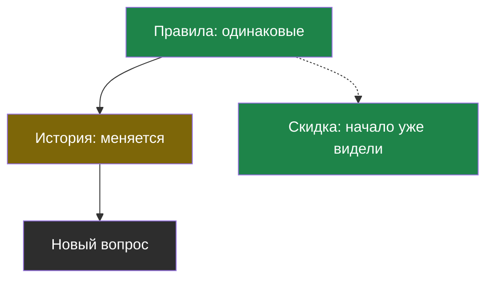
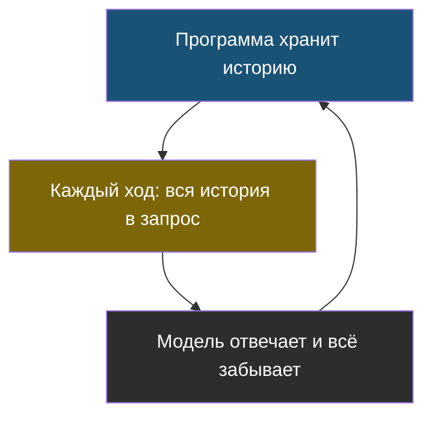
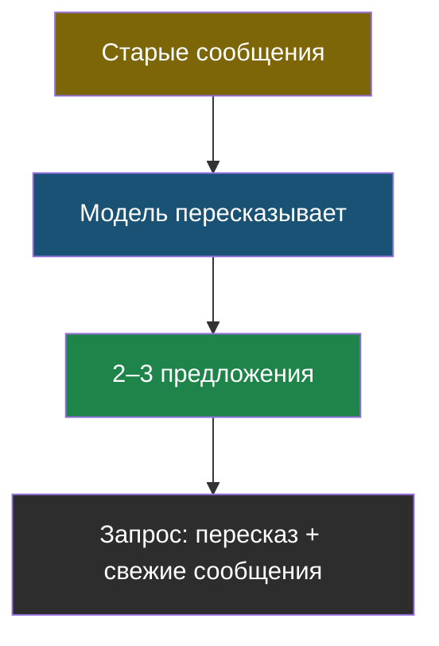
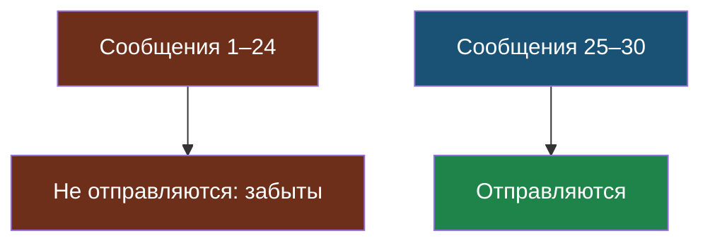
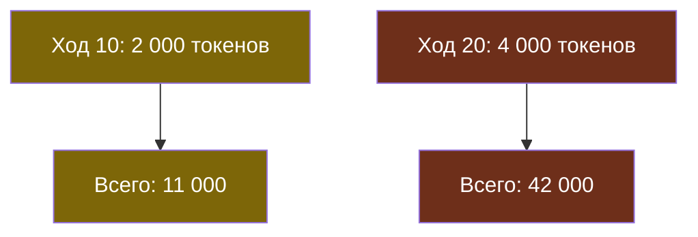

# Словарик темы 9

Термины по алфавиту; названия латиницей — в конце.

## Кэш начала запроса (prompt caching)

> **Кэш начала запроса** (по-английски *prompt caching*) — скидка на ту часть запроса, которая побуквенно совпадает с началом недавнего запроса; поставщик не обрабатывает её заново.

Из [урока 2](chapter-02.md). Правило: неизменное — в начало, меняющееся — в конец.

## Модель без состояния

> **Модель без состояния** — модель, которая не хранит ничего между запросами: каждый запрос для неё первый, и всё, что она должна «помнить», нужно положить в сам запрос.

Из [урока 1](chapter-01.md). «Память» чата — это история, которую пересылает программа.

## Пересказ истории

> **Пересказ истории** — приём, при котором старая часть диалога заменяется коротким изложением, которое пишет сама модель; свежие сообщения отправляются как есть.

Из [урока 2](chapter-02.md). Стоит отдельного запроса и может упустить детали.

## Скользящее окно

> **Скользящее окно** — приём, при котором модели отправляются только несколько последних сообщений диалога; более старые не отправляются вовсе.

Из [урока 2](chapter-02.md). Цена запроса не растёт, но всё старше окна забыто.

## Стоимость истории

> **Стоимость истории** — сколько токенов уходит на повторную пересылку прошлых сообщений. В длинном диалоге она быстро становится основной частью цены, хотя новой информации в ней нет.

Из [урока 1](chapter-01.md). Каждый ход заново оплачивает все предыдущие.

