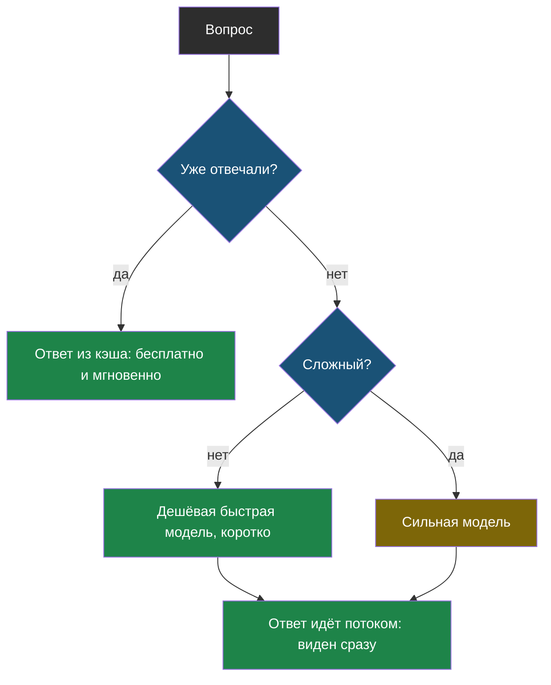

# Тема 10. Цена и скорость

> Вторая тема продолжения. В теме 9 мы экономили на истории. Здесь — на всём остальном: какую модель звать, сколько ей давать писать, что не спрашивать дважды и как сделать, чтобы ответ не заставлял ждать.

## Задача, с которой начинается тема

Представь, что бот из твоего проекта понравился всей школе. Было 20 вопросов в день, стало 2000. Счёт вырос в сто раз, а ученики жалуются, что бот «думает» по десять секунд.

Первая мысль — взять модель подешевле. Но дешёвая плохо решает задачи по алгебре. Вторая — взять модель побыстрее. Но быстрая хуже объясняет. Кажется, что цена, скорость и качество тянут в разные стороны.

На самом деле почти всегда можно выиграть и в цене, и в скорости, **не потеряв качества** — если понимать, откуда берутся деньги и секунды.

## Главная мысль темы

Не все вопросы одинаковые. Большинство — простые и повторяются, меньшинство — сложные. Платить по цене сложного за каждый простой вопрос и ждать каждого ответа по очереди — главные источники лишних денег и секунд.

## Уроки темы

- [Урок 1. Куда уходят деньги](chapter-01.md) — вход и выход, длина ответа, выбор модели под вопрос, кэш ответов · лабораторная: [открыть в Colab](https://colab.research.google.com/github/iRoboTron/ai-engineering-school/blob/main/docs/books/labs/tema10-cena/01_cena_i_skorost.ipynb)
- [Урок 2. Почему ответ идёт долго](chapter-02.md) — время до первого токена, потоковый ответ, параллельные запросы
- [Словарик темы](glossary.md)

## Что понадобится

Тема 1 (токены, `max_tokens`), тема 9 (стоимость истории) и, если есть, витрина моделей — там видно, насколько разные цены у моделей.
