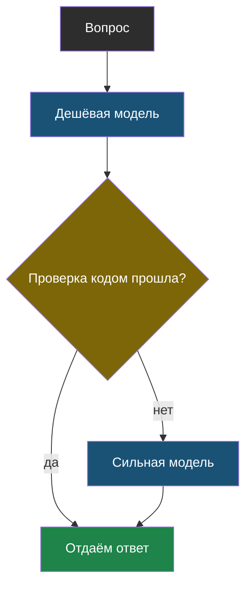

# Урок 1. Куда уходят деньги

> **Лабораторная этого урока:** месяц работы школьного бота — шесть способов распорядиться двумя моделями.
> - без интернета: [01_marshrutizator.py](labs/tema10-cena/01_marshrutizator.py) — запуск `python3 01_marshrutizator.py`, разобрана в разделе [«Практика: месяц работы школьного бота»](#практика-месяц-работы-школьного-бота)
> - на настоящей модели: [открыть в Google Colab](https://colab.research.google.com/github/iRoboTron/ai-engineering-school/blob/main/docs/books/labs/tema10-cena/01_cena_i_skorost.ipynb) · [скачать .ipynb](labs/tema10-cena/01_cena_i_skorost.ipynb)

## С чего начнём

В такси ты платишь за посадку и за километры. Если ехать два квартала на бизнес-классе — выйдет дорого не потому, что далеко, а потому что машина не та. А если водитель повезёт кругом — дорого, потому что лишние километры.

С моделями то же самое. Есть «машина» — какая модель, и «километры» — сколько токенов она прочитала и написала.

## Два счётчика: вход и выход

В теме 1 мы считали цену запроса. Напомним и уточним одну важную вещь: у модели **два разных тарифа**.

> **Цена входа и цена выхода** — модель берёт отдельную плату за прочитанные токены (всё, что ты отправил) и за написанные (её ответ); написанный токен обычно в 3–5 раз дороже прочитанного.

Почему выход дороже: прочитать весь запрос модель может за один проход, а писать приходится по одному токену, и каждый новый токен — это снова работа над всем текстом (тема 1).

| Что | За что платишь | Как влиять |
|---|---|---|
| **Вход** | правила, история, документы, вопрос | тема 9: окно, пересказ, обрезка; тема 2: только нужные куски |
| **Выход** | длина ответа | просить коротко и ставить `max_tokens` |

Отсюда неочевидное: болтливая модель, которая на «Где столовая?» пишет три абзаца с приветствием, стоит дороже, чем кажется. Три абзаца выхода могут стоить больше, чем весь запрос с правилами.

## Длина ответа — это решение программиста

Модель пишет столько, сколько сочтёт правдоподобным. Если не сказать иначе — часто много. Помогают две вещи, и нужны **обе**:

1. **Попросить в правилах:** «отвечай одним-двумя предложениями». Это снижает длину в большинстве ответов.
2. **Поставить `max_tokens`:** жёсткий потолок. Это граница в коде (тема 4), и модель её не обойдёт.

Почему не только `max_tokens`? Потому что он просто **обрывает** ответ на полуслове, а в ответе появится `finish_reason: length` (тема 1). Правило в запросе заставляет модель уложиться, а потолок страхует, если не уложилась.

## Не каждый вопрос заслуживает сильной модели

Посмотри на цены в витрине моделей: сильные модели бывают в **сто раз** дороже дешёвых. При этом на «Во сколько начало уроков?» обе ответят одинаково правильно.

> **Маршрутизация моделей** — выбор модели под каждый запрос: простые вопросы отправляются дешёвой модели, сложные — сильной.

Как решить, какой вопрос сложный? От простого к сложному:

| Способ | Как | Плюсы | Минусы |
|---|---|---|---|
| **Правило по словам** | «почему», «объясни», «реши» → сильная | бесплатно, мгновенно | ошибается на необычных формулировках |
| **Дешёвая модель-сортировщик** | дешёвая модель отвечает одним словом: «простой/сложный» | понимает смысл | лишний запрос, хоть и копеечный |
| **Сначала дешёвая, потом сильная** | дешёвая отвечает, код проверяет; не прошло — сильная | платишь за сильную только при провале | нужна проверка ответа кодом (тема 6) |



Третий способ хорош тем, что сильная модель вызывается **только когда действительно нужна**. Но он работает только там, где ответ можно проверить: JSON правильного вида, число из документа, код, который запускается.

## Не отвечай дважды на один вопрос

В школе половина вопросов — одни и те же: «когда каникулы», «где столовая», «нужна ли сменная обувь». Звать модель каждый раз — платить за одно и то же сто раз.

> **Кэш ответов** — хранилище готовых ответов на уже заданные вопросы; повторный вопрос получает ответ из хранилища без обращения к модели.

Это не то же самое, что кэш начала запроса из темы 9: там поставщик даёт скидку на повторённое **начало**, а здесь **твоя программа** вообще не зовёт модель.

Простейший кэш — обычный словарь:

```python
kesh = {}

def otvetit(vopros):
    klyuch = vopros.lower().strip(" ?!.")
    if klyuch in kesh:
        return kesh[klyuch]                 # бесплатно и мгновенно
    otvet = sprosit_model(vopros)
    kesh[klyuch] = otvet
    return otvet
```

Кэш ответов опасен в трёх случаях, и про них нужно помнить:

| Опасность | Пример | Что делать |
|---|---|---|
| **Ответ устарел** | расписание поменялось, а кэш отдаёт старое | хранить ответ ограниченное время |
| **Ответ личный** | «какие у меня оценки?» — один вопрос, разные ученики | не кэшировать то, что зависит от человека |
| **Нужен разный ответ** | «придумай загадку» — все получат одну и ту же | не кэшировать творческое |

## Практика: месяц работы школьного бота

40 вопросов, в которых есть повторы и несколько сложных, умножаем на 1000 — примерно месяц работы школы. Две модели с ценами и скоростью, похожими на настоящие: дешёвая быстрая и дорогая сильная. Шесть способов ими распорядиться.

Файл: [labs/tema10-cena/01_marshrutizator.py](labs/tema10-cena/01_marshrutizator.py) — запуск: `python3 01_marshrutizator.py`.

```python
# labs/tema10-cena/01_marshrutizator.py
# Школьный бот за месяц: 40 вопросов, две модели, шесть способов их использовать.
# Считаем деньги, долю хороших ответов и время. Модели — заглушки с ценой и скоростью,
# похожими на настоящие: дешёвая быстрая и дорогая сильная.

import re

# --- НАСТРОЙКИ ---
DESHEVAYA = {"imya": "дешёвая", "vhod": 0.03, "vyhod": 0.13, "tokenov_v_sekundu": 150, "do_pervogo": 0.3}
SILNAYA = {"imya": "сильная", "vhod": 3.00, "vyhod": 15.00, "tokenov_v_sekundu": 50, "do_pervogo": 1.2}
PRAVILA_TOKENOV = 300            # правила бота в каждом запросе
KOROTKO_TOKENOV = 60             # длина ответа, если попросить коротко и поставить max_tokens
PARALLELNO = 5                   # сколько запросов отправлять одновременно
POVTOROV_MESYATSEV = 1000        # во сколько раз умножить, чтобы получить «месяц работы школы»

SLOZHNYE_PRIZNAKI = ["почему", "объясни", "сравни", "докажи", "реши"]

VOPROSY = [
    "Во сколько начало уроков?", "Где кабинет 204?", "Почему небо голубое?",
    "Во сколько начало уроков?", "Когда каникулы?", "Объясни теорему Пифагора",
    "Где столовая?", "Во сколько начало уроков?", "Сравни Пушкина и Лермонтова",
    "Когда каникулы?", "Где кабинет 204?", "Реши уравнение 2x + 3 = 11",
    "Нужна ли сменная обувь?", "Во сколько начало уроков?", "Почему идёт дождь?",
    "Где столовая?", "Когда каникулы?", "Докажи, что корень из двух иррационален",
    "Нужна ли сменная обувь?", "Во сколько начало уроков?",
] * 2


def slozhnyy(vopros):
    return any(p in vopros.lower() for p in SLOZHNYE_PRIZNAKI)


def zaglushka(model, vopros, korotko):
    """Возвращает (токенов на выходе, хороший ли ответ). Дешёвая модель не справляется со сложным."""
    if slozhnyy(vopros):
        tokenov = 300
        horosho = model is SILNAYA
    else:
        tokenov = KOROTKO_TOKENOV if korotko else 250     # без ограничения модель «болтает»
        horosho = True
    return tokenov, horosho


def tokeny(tekst):
    return len(tekst) // 2 + PRAVILA_TOKENOV


def normalizovat(vopros):
    """Ключ кэша: регистр и знаки препинания не должны мешать узнать тот же вопрос."""
    return re.sub(r"[^\w\s]", "", vopros.lower()).strip()


def progon(nazvanie, vybrat_model, kesh=False, korotko=False):
    dengi, horoshih, kesh_popadaniy, vremena = 0.0, 0, 0, []
    zapomneno = {}
    for vopros in VOPROSY:
        klyuch = normalizovat(vopros)
        if kesh and klyuch in zapomneno:
            kesh_popadaniy += 1
            horoshih += zapomneno[klyuch]
            vremena.append(0.01)                          # ответ из словаря — мгновенно
            continue
        model = vybrat_model(vopros)
        vyhod, horosho = zaglushka(model, vopros, korotko)
        dengi += (tokeny(vopros) * model["vhod"] + vyhod * model["vyhod"]) / 1e6
        horoshih += horosho
        vremena.append(model["do_pervogo"] + vyhod / model["tokenov_v_sekundu"])
        if kesh:
            zapomneno[klyuch] = horosho
    podryad = sum(vremena)
    # Параллельно: запросы идут пачками, пачка ждёт самый долгий из своих.
    parallelno = sum(max(vremena[i:i + PARALLELNO]) for i in range(0, len(vremena), PARALLELNO))
    print(f"{nazvanie:<32} ${dengi * POVTOROV_MESYATSEV:>8.2f}  {horoshih / len(VOPROSY):>5.0%}"
          f"  {kesh_popadaniy:>4}  {podryad:>7.1f} с  {parallelno:>6.1f} с")
    return dengi


print(f"{len(VOPROSY)} вопросов × {POVTOROV_MESYATSEV} (месяц работы школы)\n")
print(f"{'Способ':<32} {'деньги':>9}  {'хорошо':>6}  {'кэш':>4}  {'подряд':>9}  {'пачками':>8}")
print("-" * 80)
vse_silnaya = progon("всё на сильной", lambda v: SILNAYA)
progon("всё на сильной + коротко", lambda v: SILNAYA, korotko=True)
progon("всё на дешёвой", lambda v: DESHEVAYA)
progon("маршрутизатор", lambda v: SILNAYA if slozhnyy(v) else DESHEVAYA)
progon("маршрутизатор + кэш", lambda v: SILNAYA if slozhnyy(v) else DESHEVAYA, kesh=True)
luchshiy = progon("маршрутизатор + кэш + коротко", lambda v: SILNAYA if slozhnyy(v) else DESHEVAYA, kesh=True, korotko=True)

print(f"\nПоследний способ дешевле «всё на сильной» в {vse_silnaya / luchshiy:.0f} раз.")

print("\nИз чего складывается цена одного сложного вопроса на сильной модели:")
vhod = tokeny("Объясни теорему Пифагора") * SILNAYA["vhod"] / 1e6
vyhod = 300 * SILNAYA["vyhod"] / 1e6
print(f"  вход  {tokeny('Объясни теорему Пифагора'):>4} токенов × ${SILNAYA['vhod']}/1М = ${vhod:.5f}")
print(f"  выход  300 токенов × ${SILNAYA['vyhod']}/1М = ${vyhod:.5f}  ← выход дороже, хотя токенов меньше")
```

**Что посмотреть в выводе:**

1. **Всё на сильной** — $196 в месяц. Качество 100%, но большая часть денег ушла на вопросы вроде «где столовая».
2. **Всё на сильной + коротко** — $116. Та же модель, то же качество, только ответы на простые вопросы короче. Выход стоит дорого, и это видно.
3. **Всё на дешёвой** — $1.75, но хороших ответов 70%: сложные вопросы дешёвая модель проваливает. Экономия, которая портит продукт.
4. **Маршрутизатор** — $66 и снова 100%: сильная модель работает только на сложных вопросах.
5. **Маршрутизатор + кэш** — $33: 29 вопросов из 40 уже задавали, модель не звали вовсе.
6. Последняя строчка: разница в 6 раз при том же качестве. А внизу — разбор одного сложного вопроса: выход в 300 токенов стоит почти впятеро дороже входа в 312 токенов.

Колонки «подряд» и «пачками» — про время, их разберём в [уроке 2](chapter-02.md).

**Попробуй сам:**

- Добавь в `SLOZHNYE_PRIZNAKI` слово «где». Что стало с ценой маршрутизатора и почему?
- Убери `* 2` в конце списка `VOPROSY`. Как изменилась доля попаданий в кэш? Почему кэш тем выгоднее, чем дольше работает бот?
- Поставь `SILNAYA["vyhod"] = 60.0` — так стоят самые дорогие модели. Во сколько раз теперь выгоднее маршрутизатор?

### А теперь — на настоящей модели

В ноутбуке ты возьмёшь настоящие цены моделей из каталога, замеришь `completion_tokens` у болтливого и короткого ответа, соберёшь кэш и маршрутизатор на живых запросах — и увидишь, сколько стоит каждый.

Лаборатория (ноутбук): [скачать .ipynb](labs/tema10-cena/01_cena_i_skorost.ipynb) · [открыть в Google Colab](https://colab.research.google.com/github/iRoboTron/ai-engineering-school/blob/main/docs/books/labs/tema10-cena/01_cena_i_skorost.ipynb)

## Найди ошибку

Ученик сделал кэш ответов для школьного бота:

```python
kesh = {}

def otvetit(uchenik, vopros):
    if vopros in kesh:
        return kesh[vopros]
    kontekst = f"Ученик: {uchenik['imya']}, оценки: {uchenik['ocenki']}"
    otvet = sprosit_model(kontekst, vopros)
    kesh[vopros] = otvet
    return otvet
```

Через день к нему пришла учительница: бот сказал Пете, что у него пятёрка по алгебре, хотя у Пети тройка. Что случилось?

<details>
<summary>Ответ</summary>

Ключ кэша — только текст вопроса. Первой спросила Маша «какая у меня оценка по алгебре?» — ответ с **её** оценкой лёг в кэш. Петя задал тот же вопрос — и получил ответ Маши из кэша, модель даже не звали.

Это опасность «ответ личный» из таблицы выше, и она хуже, чем просто ошибка: бот раскрыл чужие оценки (тема 6 — чужие личные данные).

Исправления, от простого к правильному:

1. Не кэшировать вопросы, ответ на которые зависит от ученика.
2. Если кэшировать всё же нужно — в ключ добавить того, о ком ответ: `klyuch = (uchenik["id"], vopros)`.
</details>

## Что мы узнали

- У модели две цены: за **вход** и за **выход**, написанный токен обычно в 3–5 раз дороже прочитанного.
- Длину ответа ограничивают двумя способами сразу: просьбой в правилах и потолком `max_tokens`.
- **Маршрутизация моделей** отправляет сильной модели только сложные вопросы; качество при этом не падает.
- **Кэш ответов** убирает повторные запросы, но опасен для устаревающих, личных и творческих ответов.

## Проверь себя

1. Почему болтливый ответ на простой вопрос может стоить больше, чем все правила бота в запросе?
2. Чем способ «сначала дешёвая, потом сильная» лучше правила по словам и где он не сработает?
3. Какие три вопроса школьного бота нельзя класть в кэш ответов и почему?
