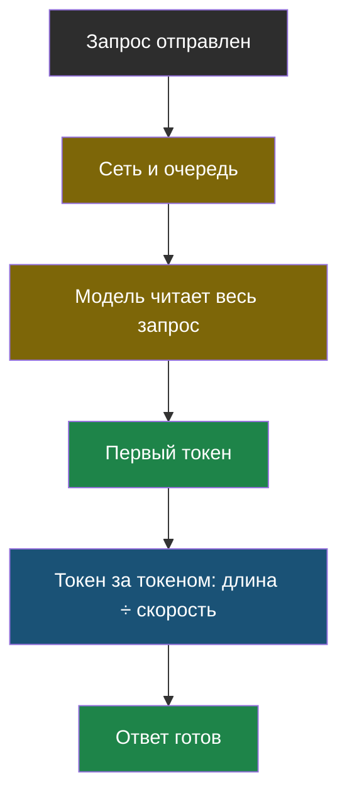
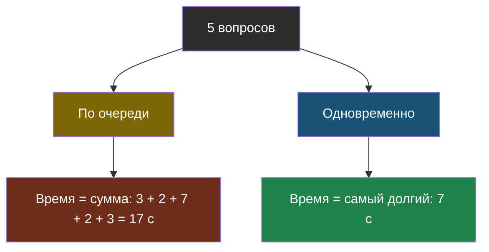

# Урок 2. Почему ответ идёт долго

> **Лабораторная этого урока** — общая для темы: колонки «подряд» и «пачками» в лабораторной [урока 1](chapter-01.md), а потоковый ответ и параллельные запросы на живой модели — в [ноутбуке](https://colab.research.google.com/github/iRoboTron/ai-engineering-school/blob/main/docs/books/labs/tema10-cena/01_cena_i_skorost.ipynb) (шаги 5 и 6).

## Напомним, где мы остановились

В уроке 1 мы разобрались, куда уходят деньги: вход и выход, длина ответа, выбор модели, кэш. Теперь про второе, на что жалуются пользователи, — время. И окажется, что многие приёмы экономят и деньги, и секунды одновременно.

## С чего начнём

Ты заказал пиццу. Вариант первый: 40 минут тишины, потом звонок в дверь. Вариант второй: через минуту приходит сообщение «заказ принят», потом «пицца в печи», потом «курьер выехал». Пицца приезжает в то же время — но во втором случае ждать гораздо спокойнее.

Скорость ответа ИИ состоит из тех же двух частей: сколько ждать **первого признака жизни** и сколько ждать **всего**.

## Из чего складывается время ответа

Модель пишет ответ по одному токену (тема 1). Поэтому время ответа — это:

> **Время до первого токена** — сколько проходит от отправки запроса до появления первого кусочка ответа; сюда входит дорога по сети, очередь у поставщика и чтение всего запроса моделью.

> **Скорость генерации** — сколько токенов в секунду модель пишет после того, как начала; у маленьких моделей она выше, у больших — ниже.

Полное время = время до первого токена + длина ответа ÷ скорость генерации.



Смотри на два жёлтых узла: длинный запрос (вся история, все документы) замедляет даже **начало** ответа, потому что модель сначала всё это читает. Экономия из темы 9 ускоряет бота, а не только удешевляет.

Посчитаем на числах из лабораторной урока 1:

| | До первого токена | Скорость | Ответ 300 токенов | Ответ 60 токенов |
|---|---|---|---|---|
| **Дешёвая** | 0,3 с | 150 токенов/с | 2,3 с | 0,7 с |
| **Сильная** | 1,2 с | 50 токенов/с | 7,2 с | 2,4 с |

Короткий ответ на сильной модели идёт втрое быстрее длинного. Просьба «отвечай коротко» из урока 1 — это одновременно экономия и ускорение.

## Потоковый ответ: не быстрее, но ощущается быстрее

Обычно программа ждёт, пока модель допишет ответ целиком, и только потом показывает его. Семь секунд пользователь смотрит на пустой экран.

> **Потоковый ответ** (по-английски *streaming*) — режим, в котором модель отдаёт ответ кусочками по мере написания, а программа сразу их показывает; полное время то же, но первый текст виден через доли секунды.

Именно так печатают ответы все чат-боты: текст появляется слово за словом. В коде это один параметр:

```python
potok = client.chat.completions.create(model=MODEL, messages=soobshcheniya, stream=True)
for kusok in potok:
    if kusok.choices and kusok.choices[0].delta.content:
        print(kusok.choices[0].delta.content, end="", flush=True)
```

| Когда поток нужен | Когда не нужен |
|---|---|
| Человек читает ответ с экрана | Ответ читает программа (JSON, число) |
| Ответ длинный | Ответ из пары слов |
| Важно, чтобы бот казался живым | Результат всё равно проверяется целиком перед показом |

Последняя строка важна: если ответ перед показом проверяется кодом (тема 6), поток теряет смысл — показать непроверенный текст нельзя, а проверить можно только весь.

## Параллельные запросы: не стой в очереди

Представь, что боту нужно ответить на 5 независимых вопросов — например, проверить пять сочинений. Если отправлять их по очереди, общее время — сумма всех пяти. Но они ведь **не зависят** друг от друга.

> **Параллельные запросы** — отправка нескольких независимых запросов одновременно; общее время становится примерно равно времени самого долгого из них, а не сумме.

```python
from concurrent.futures import ThreadPoolExecutor

with ThreadPoolExecutor(max_workers=5) as ispolniteli:
    otvety = list(ispolniteli.map(sprosit_model, voprosy))
```



Вернись к лабораторной урока 1: колонка «пачками» — это как раз параллельные запросы по 5 штук. «Всё на сильной» подряд — 260 секунд, пачками — 58.

Две оговорки:

- **Лимиты.** У поставщиков и у нашего школьного сервера есть ограничение числа запросов (тема 11). Сто запросов одновременно быстро упрутся в отказ «слишком много запросов». Поэтому пачки небольшие.
- **Зависимость.** Если второй запрос использует ответ первого (агент из темы 4), параллелить нельзя: второму нечего отправлять, пока нет первого.

## Какой приём что даёт

| Приём | Деньги | Время | Урок |
|---|---|---|---|
| Короткая история (тема 9) | меньше | быстрее начало | 9 |
| Просьба коротко + `max_tokens` | меньше | быстрее целиком | 10.1 |
| Маршрутизация на дешёвую | меньше | быстрее: маленькие модели шустрее | 10.1 |
| Кэш ответов | ноль | мгновенно | 10.1 |
| Потоковый ответ | так же | ощущается быстрее | 10.2 |
| Параллельные запросы | так же | быстрее пачки | 10.2 |

Почти каждый приём помогает сразу в двух колонках — и ни один не требует жертвовать качеством.

## Найди ошибку

Ученик сделал бота, который проверяет ответы на тест: модель должна вернуть JSON `{"verno": true/false}`. Чтобы бот «ощущался быстрее», он включил потоковый ответ:

```python
potok = client.chat.completions.create(model=MODEL, messages=zapros, stream=True,
                                       response_format={"type": "json_object"})
for kusok in potok:
    tekst = kusok.choices[0].delta.content or ""
    rezultat = json.loads(tekst)
    pokazat_ucheniku(rezultat["verno"])
```

Программа падает на первом же вопросе. Найди две ошибки.

<details>
<summary>Ответ</summary>

1. **Кусок потока — не весь JSON.** Модель отдаёт ответ по кусочкам: `{"ver`, `no": tr`, `ue}`. `json.loads` от первого кусочка падает. В потоке текст нужно сначала **собрать целиком**, и только потом разбирать.
2. **Поток здесь вообще не нужен.** Ответ читает программа, а не человек, и он из пары слов. Показывать ученику нечего, пока JSON не собран и не проверен. Это случай из правой колонки таблицы «когда поток не нужен» — без `stream=True` код и проще, и надёжнее.

Бонус: в потоке первый кусок может прийти вовсе без текста (`choices` пустые или `content` равен `None`), поэтому даже сборку нужно писать аккуратно — как в примере в разделе про потоковый ответ.
</details>

## Что мы узнали

- Время ответа = **время до первого токена** + длина ответа ÷ **скорость генерации**.
- Длинный запрос замедляет начало ответа, длинный ответ — конец; короткое помогает и деньгам, и времени.
- **Потоковый ответ** не ускоряет модель, но показывает текст сразу; для ответов, которые читает программа, он не нужен.
- **Параллельные запросы** превращают сумму времён в максимум, но упираются в лимиты и не годятся для зависимых шагов.

## Проверь себя

1. Почему бот с историей в 20 000 токенов медленнее начинает отвечать, чем бот с окном в 6 сообщений?
2. Бот возвращает оценку сочинения в JSON, а учитель видит её в таблице. Нужен ли здесь потоковый ответ?
3. Нужно проверить 30 сочинений. Почему не стоит отправлять все 30 запросов одновременно?

## Что добавить к чек-листу

- Ответы на простые вопросы короткие: есть просьба в правилах и `max_tokens`.
- Сильная модель вызывается только там, где без неё хуже.
- Повторяющиеся вопросы отвечаются из кэша, личные и творческие — нет.
- Человек видит ответ потоком; независимые запросы идут небольшими пачками.

## Итог темы 10

Теперь ты знаешь, из чего складываются цена и время ответа, и умеешь уменьшать оба, не жертвуя качеством. Проверь термины по [словарику](glossary.md).

Дальше — тема 11: что делать, когда модель отвечает ошибкой, молчит или обрывается на полуслове.
