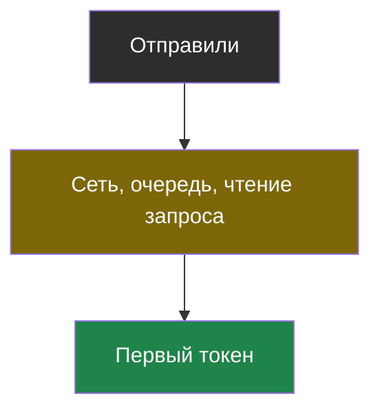
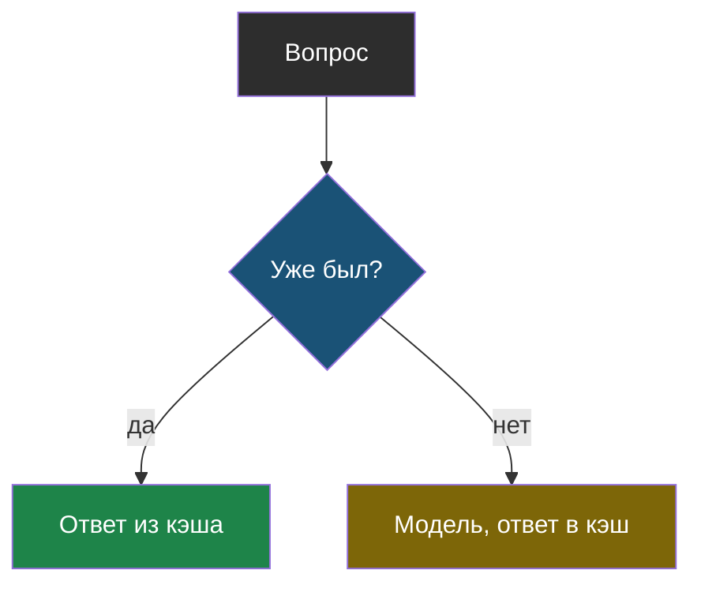
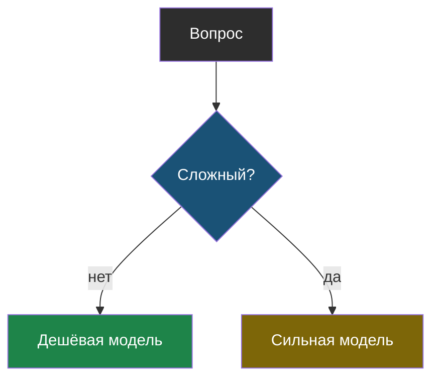
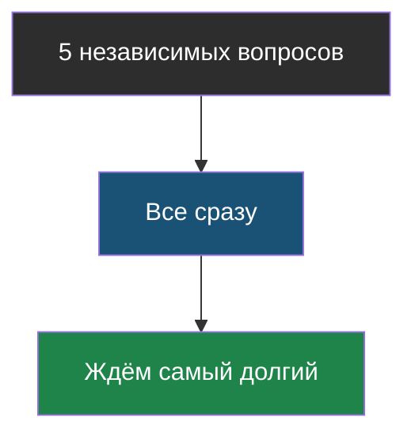
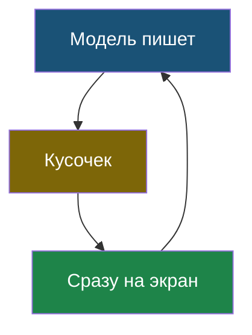
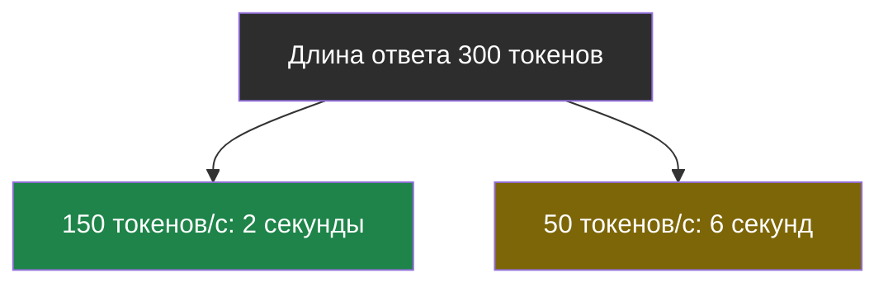
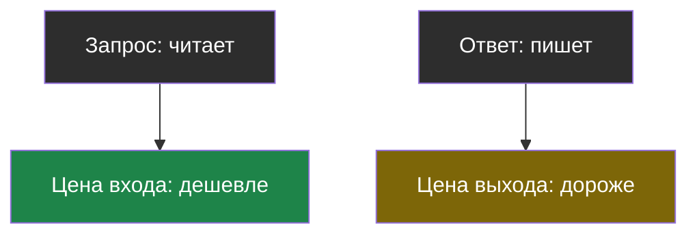

# Словарик темы 10

Термины по алфавиту; названия латиницей — в конце.

## Время до первого токена

> **Время до первого токена** — сколько проходит от отправки запроса до появления первого кусочка ответа; сюда входит дорога по сети, очередь у поставщика и чтение всего запроса моделью.

Из [урока 2](chapter-02.md). Длинный запрос делает его больше.

## Кэш ответов

> **Кэш ответов** — хранилище готовых ответов на уже заданные вопросы; повторный вопрос получает ответ из хранилища без обращения к модели.

Из [урока 1](chapter-01.md). Не для личных, творческих и устаревающих ответов.

## Маршрутизация моделей

> **Маршрутизация моделей** — выбор модели под каждый запрос: простые вопросы отправляются дешёвой модели, сложные — сильной.

Из [урока 1](chapter-01.md).

## Параллельные запросы

> **Параллельные запросы** — отправка нескольких независимых запросов одновременно; общее время становится примерно равно времени самого долгого из них, а не сумме.

Из [урока 2](chapter-02.md). Упираются в лимиты, не годятся для зависимых шагов.

## Потоковый ответ (streaming)

> **Потоковый ответ** (по-английски *streaming*) — режим, в котором модель отдаёт ответ кусочками по мере написания, а программа сразу их показывает; полное время то же, но первый текст виден через доли секунды.

Из [урока 2](chapter-02.md). Для ответов, которые читает программа, не нужен.

## Скорость генерации

> **Скорость генерации** — сколько токенов в секунду модель пишет после того, как начала; у маленьких моделей она выше, у больших — ниже.

Из [урока 2](chapter-02.md).

## Цена входа и цена выхода

> **Цена входа и цена выхода** — модель берёт отдельную плату за прочитанные токены (всё, что ты отправил) и за написанные (её ответ); написанный токен обычно в 3–5 раз дороже прочитанного.

Из [урока 1](chapter-01.md).

