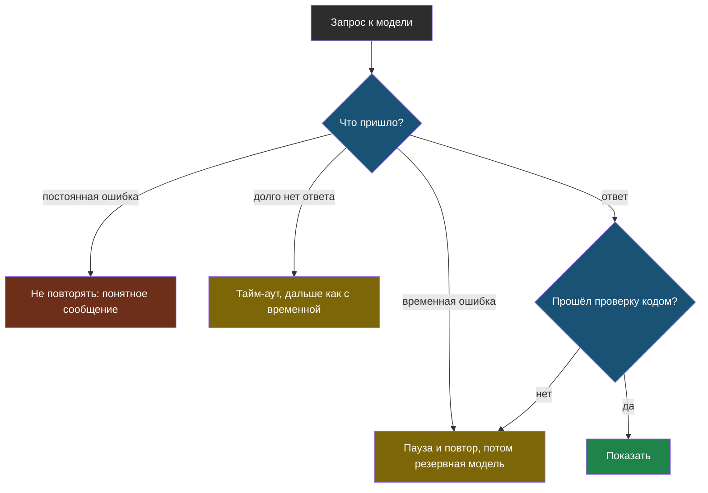

# Тема 11. Надёжность: когда модель подводит

> Третья тема продолжения. Всё, что мы делали раньше, молчаливо предполагало, что модель отвечает. В жизни она иногда не отвечает, отвечает ошибкой, думает минуту или обрывается на полуслове. Эта тема — о том, чтобы бот от этого не падал.

## Задача, с которой начинается тема

В лабораторных ты, скорее всего, уже видел это: запрос вдруг падает с красным текстом `RateLimitError` или `502`, а перезапуск ячейки через минуту всё чинит. В ноутбуке это мелкая неприятность. В боте, которым пользуется вся школа, это ученик, который увидел непонятную ошибку вместо ответа — и больше бота не открыл.

Сервис модели — это чужой компьютер далеко по сети. Он **будет** иногда подводить. Вопрос не в том, как этого избежать, а в том, как сделать, чтобы пользователь этого почти не замечал.

## Главная мысль темы

Ошибки бывают двух родов: те, что пройдут сами, и те, что не пройдут никогда. Первые **пережидают и повторяют**, вторые **сразу честно сообщают**. А всё, что пришло «успешно», всё равно проверяют кодом.

## Уроки темы

- [Урок 1. Что может сломаться](chapter-01.md) — коды ошибок, временные и постоянные, тайм-аут, обрезанный и испорченный ответ
- [Урок 2. Как не упасть](chapter-02.md) — повтор с растущей паузой, резервная модель, проверка ответа, понятный отказ · лабораторная: [открыть в Colab](https://colab.research.google.com/github/iRoboTron/ai-engineering-school/blob/main/docs/books/labs/tema11-nadezhnost/01_kogda_model_podvodit.ipynb)
- [Словарик темы](glossary.md)

## Что понадобится

Тема 1 (`finish_reason`, структурированный ответ), тема 4 (граница «при сомнении — закрыто»), тема 6 (проверка ответа кодом) и тема 10 (лимиты при параллельных запросах).
