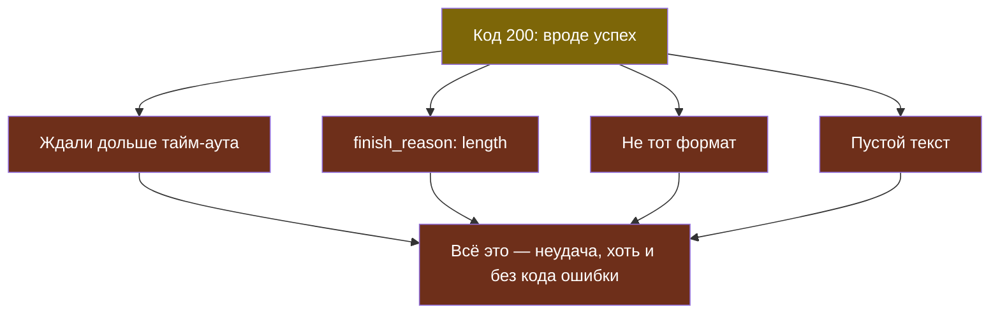

# Урок 1. Что может сломаться

> **Лабораторной в этом уроке нет.** Практика темы — в [уроке 2](chapter-02.md).

## Знакомая ситуация

Ты звонишь другу, а там: «Абонент временно недоступен». Ты не решаешь, что друга больше нет, — перезваниваешь через пять минут. А если там: «Номер набран неверно» — перезванивать бессмысленно хоть сто раз, нужно проверить номер.

С ошибками сервиса модели ровно так же. Главное умение — отличить «временно недоступен» от «номер неверный».

## Сервис отвечает кодом

Когда программа обращается к модели через интернет, сервер вместе с ответом присылает **код ответа** — трёхзначное число. `200` — всё хорошо. Остальные — что-то пошло не так, и число говорит, что именно.

| Код | Что значит | Пример у нас | Пройдёт само? |
|---|---|---|---|
| **400** | Запрос составлен неправильно | неразрешённая модель, неверный параметр | нет |
| **401** | Не узнали, кто ты | неверный код класса | нет |
| **413** | Запрос слишком большой | история длиннее 40 000 символов | нет |
| **429** | Слишком много запросов | упёрлись в лимит класса или поставщика | да, если подождать |
| **500, 502, 503** | Сломалось на той стороне | модель перегружена или упала | обычно да |

Правило для запоминания: коды на **4** — чаще всего ошибка в **твоём** запросе, коды на **5** — беда **на той стороне**. И отдельно 429: запрос правильный, но пришёл не вовремя.

> **Временная ошибка** — отказ, который может пройти сам, если подождать и повторить: перегрузка сервиса (500, 502, 503), превышение частоты запросов (429), обрыв сети.

> **Постоянная ошибка** — отказ из-за самого запроса: неверный параметр (400), неверный ключ (401), слишком длинный запрос (413); повтор того же запроса даст ту же ошибку.

Почему это различие так важно: повторять постоянную ошибку — **вредно**. Бот тратит время ученика, лимит запросов и иногда деньги, а результат не изменится.

## Про 429 отдельно

Ошибка «слишком много запросов» хитрее остальных временных. Бывает два случая:

- **Короткий всплеск.** Ты отправил 30 запросов за секунду (параллельно, как в теме 10). Через пару секунд всё снова работает.
- **Исчерпан лимит.** У нашего школьного сервера 120 запросов в час на класс. Если они кончились, повтор через две секунды не поможет — нужно ждать до часа.

Часто сервер сам подсказывает, сколько ждать, — в тексте ошибки или в заголовке `Retry-After`. Хорошая программа это читает, а не долбит сервер вслепую.

## Когда ошибки нет, а ответа тоже нет

Самые неприятные сбои приходят с кодом `200` — формально всё хорошо.

**Модель думает слишком долго.** Сервис перегружен, и ответ идёт минуту. Программа честно ждёт, ученик смотрит на пустой экран.

> **Тайм-аут** — предельное время ожидания ответа, после которого программа перестаёт ждать и считает запрос неудачным.

Без тайм-аута программа может ждать очень долго: у многих библиотек предел по умолчанию — минуты. Для бота, которому ученик задал вопрос на перемене, 60 секунд — это то же самое, что никогда.

**Ответ обрезан.** Модель упёрлась в `max_tokens` (тема 10), и в ответе стоит `finish_reason: length`. Текст обрывается на полуслове, а JSON без закрывающей скобки не разбирается вовсе.

**Ответ не того вида.** Просили JSON — пришёл JSON с лишним текстом до и после. Просили одно слово — пришло три предложения. Схема ответа (тема 1) делает это реже, но не всегда.

**Ответ пустой.** Некоторые модели иногда возвращают пустой текст — например, «размышляющие» модели, потратившие всё на размышления. Наш прокси такой ответ считает отказом.



Все четыре стрелки ведут в один узел: для пользователя неважно, пришла ошибка с кодом или «успешный» мусор. Поэтому проверять нужно не только код, но и сам ответ — ровно как в теме 6.

## Почему нельзя просто «поймать всё»

Первое желание новичка — обернуть запрос в `try/except` и на любую ошибку повторять:

```python
while True:
    try:
        return sprosit_model(vopros)
    except Exception:
        pass                         # попробуем ещё раз
```

В этих четырёх строках три беды:

| Беда | Что случится |
|---|---|
| Бесконечный цикл | Неверный код класса (401) — программа повторяет вечно |
| Нет паузы | Упёрлись в 429 — сотни запросов в секунду, лимит кончается ещё быстрее |
| Ловит всё подряд | Опечатка в своём коде (`NameError`) тоже «повторяется», и её не видно |

Это та же ошибка, что с агентом без границ в теме 4: цикл без лимита и без понимания, когда остановиться.

## Найди ошибку

Ученик сделал бота и добавил обработку ошибок:

```python
def otvetit(vopros):
    for popytka in range(5):
        try:
            otvet = client.chat.completions.create(model=MODEL, messages=[...], max_tokens=50)
            return json.loads(otvet.choices[0].message.content)
        except Exception:
            time.sleep(1)
    return {"otvet": "Ошибка"}
```

Бот часто отвечает «Ошибка», хотя сервис работает нормально, а в журнале прокси видно, что на каждый вопрос уходит по пять запросов. В чём дело?

<details>
<summary>Ответ</summary>

Главная причина — `max_tokens=50`. Ответ в JSON не помещается в 50 токенов, обрезается (`finish_reason: length`), и `json.loads` падает. Программа считает это ошибкой сервиса и повторяет — но запрос тот же, значит, и обрезка та же. **Это постоянная ошибка**, а повторяется она как временная: пять одинаковых запросов, пять оплаченных ответов и в итоге «Ошибка».

Что поправить:

1. Поднять `max_tokens` или попросить ответ короче — чинить причину, а не повторять.
2. Отличать ошибки: `finish_reason == "length"` — не повод повторять тот же запрос.
3. Не ловить `Exception` целиком: временные ошибки сети и сервиса — одно, ошибка разбора JSON — другое.
4. Вместо «Ошибка» — понятное сообщение ученику (урок 2).
</details>

## Что мы узнали

- Сервис отвечает кодом: на **4** — обычно ошибка в запросе, на **5** — на той стороне, **429** — слишком часто.
- **Временная ошибка** может пройти сама, **постоянная** — нет; повторять постоянную вредно.
- 429 бывает коротким всплеском и исчерпанным лимитом — ждать нужно по-разному.
- **Тайм-аут** нужен всегда: без него бот может ждать минуту.
- Код 200 не гарантирует годный ответ: он бывает обрезанным, пустым или не того вида.

## Проверь себя

1. Какие из ошибок 400, 429, 503 имеет смысл повторять и почему?
2. Бот получил ответ с кодом 200, но `finish_reason` равен `length`. Что это значит и поможет ли повтор того же запроса?
3. Чем опасен `except Exception: pass` внутри цикла повторов?
