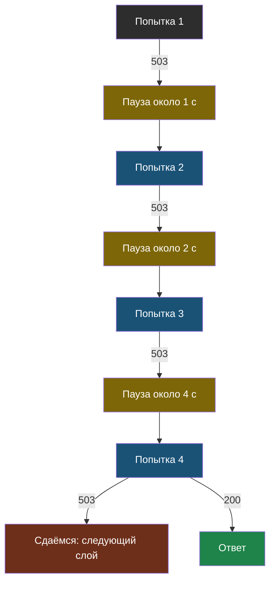
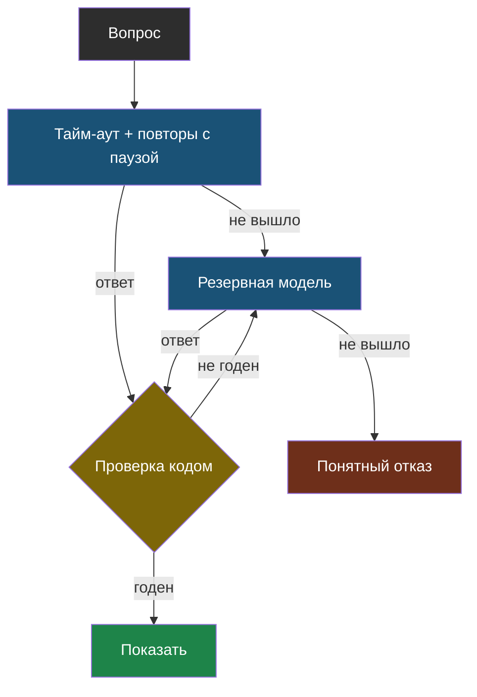

# Урок 2. Как не упасть

> **Лабораторная этого урока:** ненадёжный сервис и четыре способа с ним работать — сколько ответов дошло до ученика.
> - без интернета: [01_povtory.py](labs/tema11-nadezhnost/01_povtory.py) — запуск `python3 01_povtory.py`, разобрана в разделе [«Практика: неудачная неделя сервиса»](#практика-неудачная-неделя-сервиса)
> - на настоящей модели: [открыть в Google Colab](https://colab.research.google.com/github/iRoboTron/ai-engineering-school/blob/main/docs/books/labs/tema11-nadezhnost/01_kogda_model_podvodit.ipynb) · [скачать .ipynb](labs/tema11-nadezhnost/01_kogda_model_podvodit.ipynb)

## Напомним, где мы остановились

Ошибки бывают временные (подождать и повторить) и постоянные (повтор бесполезен), а ответ с кодом 200 может оказаться обрезанным, пустым или не того вида. Теперь соберём из этого защиту — слой за слоем.

## С чего начнём

Курьер приехал, а в подъезде домофон не работает. Хороший курьер не уезжает сразу и не звонит в домофон двести раз подряд. Он ждёт минуту и пробует снова, потом звонит тебе на телефон (другой путь), а если никак — пишет «не смог доставить, заберите в пункте выдачи». Три слоя: повтор, запасной путь, понятный отказ.

## Слой 1. Тайм-аут

Первым делом — не ждать вечно. В клиенте `openai` это один параметр:

```python
client = OpenAI(base_url=ADRES, api_key=KOD, timeout=15, max_retries=0)
```

`max_retries=0` здесь не случайно: библиотека умеет сама повторять запросы, но делает это молча. Пока ты учишься, лучше повторять самому и видеть каждую попытку.

Какой выбрать тайм-аут? Посмотри, сколько обычно отвечает модель (тема 10), и возьми с запасом в 3–5 раз. Если ответ обычно идёт 2 секунды — тайм-аут 10–15 секунд.

## Слой 2. Повтор с растущей паузой

Если ошибка временная, повторяем. Но не сразу и не бесконечно.

> **Повтор с растущей паузой** (по-английски *exponential backoff*) — повтор неудачного запроса, при котором пауза перед каждой следующей попыткой вдвое длиннее предыдущей, а число попыток ограничено.

```python
VREMENNYE = {429, 500, 502, 503, 504}

def s_povtorami(vopros, popytok=4, pauza=1.0):
    for popytka in range(1, popytok + 1):
        try:
            return sprosit_model(vopros)
        except APIStatusError as e:
            if e.status_code not in VREMENNYE or popytka == popytok:
                raise                                   # постоянная или попытки кончились
        except (APITimeoutError, APIConnectionError):
            if popytka == popytok:
                raise
        time.sleep(pauza * random.uniform(0.5, 1.5))    # пауза с разбросом
        pauza *= 2
```

Три детали, каждая важна:

| Деталь | Зачем |
|---|---|
| **Лимит попыток** | Граница из темы 4: цикл обязан закончиться |
| **Пауза растёт** | Сервис перегружен — частые повторы перегружают его ещё сильнее |
| **Разброс паузы** | Если сто учеников получили ошибку одновременно и повторят через ровно секунду — снова одновременно. Разброс их расталкивает |



Смотри на жёлтые узлы: паузы 1, 2, 4 секунды. Четыре попытки занимают около 7 секунд ожидания — для бота это предел, дальше нужно что-то другое.

## Слой 3. Резервная модель

Бывает, что основная модель легла надолго: у поставщика авария на час. Повторы тут не спасут — все попытки упрутся в ту же ошибку.

> **Резервная модель** (по-английски *fallback*) — другая модель, а лучше у другого поставщика, которой программа отправляет запрос, когда основная модель не ответила после всех повторов.

Наш школьный прокси делает ровно это — с самого первого урока, ты просто этого не замечал. Вот упрощённый кусок его кода из `proxy/app.py`:

```python
poryadok = [model] + [m for m in sorted(ALLOWED_MODELS) if m != model]
VREMENNYE_OTKAZY = {429, 500, 502, 503, 504}

for popytka, kandidat in enumerate(poryadok):
    payload["model"] = kandidat
    response = await client.post(f"{UPSTREAM}/chat/completions", json=payload, ...)
    if response.status_code not in VREMENNYE_OTKAZY and _est_otvet(response):
        break                                  # нормальный ответ — выходим
    if popytka == 0:
        await asyncio.sleep(1.5)               # первой модели даём второй шанс после паузы
```

Именно поэтому в ноутбуке темы 1 в поле `model` иногда приходила не та модель, что ты заказал.

У резервной модели есть цена, про которую нужно помнить:

| Подвох | Что делать |
|---|---|
| Резервная хуже или отвечает иначе | Прогнать эталонный набор (тема 5) и на резервной тоже |
| Резервная не умеет того, что нужно | Выбирать резервную с теми же возможностями: инструменты, JSON, картинки |
| Незаметно, что работает резервная | Писать в журнал, какая модель ответила на самом деле (тема 8) |

## Слой 4. Проверка ответа

Ответ пришёл — это ещё не значит, что его можно показать. Проверяем кодом то, что проверяется:

- `finish_reason` не `length`;
- текст не пустой;
- JSON разбирается и в нём есть нужные поля;
- числа из ответа есть в документе (тема 6).

Если проверка не прошла, **один** повтор с подсказкой часто помогает: к запросу добавляется сообщение «Твой прошлый ответ не разобрался как JSON. Ответь строго JSON без текста вокруг». Бесконечно так повторять нельзя — если и второй ответ негодный, это уже повод идти к резервной модели или честно отказать.

## Слой 5. Понятный отказ

Когда не помогло ничего, пользователь должен получить **понятное** сообщение, а не `Traceback` и не «Ошибка».

| Плохо | Хорошо |
|---|---|
| `openai.APIStatusError: Error code: 503` | «Сервис сейчас перегружен. Попробуй через минуту.» |
| «Ошибка» | «Не получилось ответить на этот вопрос. Уточни у учителя.» |
| Пустой экран | «Лимит вопросов на этот час исчерпан, снова можно в 15:00.» |
| Выдуманный ответ, лишь бы что-то сказать | Честное «не знаю» |

Последняя строка — продолжение правила «при сомнении — закрыто» из темы 4: лучше честно не ответить, чем показать непроверенное.



Каждая стрелка «не вышло» ведёт в следующий слой, и у каждого пути есть конец: либо показать проверенный ответ, либо честно отказать.

## Практика: неудачная неделя сервиса

Смоделируем сервис, который подводит так, как подводят настоящие: 429 и 500 время от времени, иногда «зависает» на минуту, иногда обрывает JSON. Несколько вопросов сломаны сами (400). А под конец основная модель ложится совсем. Прогоним 200 вопросов четырьмя способами.

Файл: [labs/tema11-nadezhnost/01_povtory.py](labs/tema11-nadezhnost/01_povtory.py) — запуск: `python3 01_povtory.py`.

```python
# labs/tema11-nadezhnost/01_povtory.py
# Ненадёжный сервис модели и четыре способа с ним работать.
# Заглушка иногда отвечает ошибкой, иногда думает слишком долго, иногда присылает
# испорченный JSON. Считаем, сколько запросов ученика в итоге получили нормальный ответ
# и сколько времени это заняло. Паузы не настоящие — время только считается.

import json
import random

# --- НАСТРОЙКИ ---
ZAPROSOV = 200           # сколько вопросов задают ученики
SEED = 7                 # поменяй — получишь другую «неудачную неделю»
TAYMAUT = 10.0           # секунд ждём ответа, дальше считаем, что не дождались
POPYTOK = 4              # сколько раз всего пробуем одну модель
PERVAYA_PAUZA = 1.0      # пауза перед первым повтором, дальше растёт вдвое

# Поведение моделей: вероятности разных бед на один запрос.
OSNOVNAYA = {"imya": "основная", "429": 0.15, "500": 0.05, "dolgo": 0.05, "bityy_json": 0.05, "vremya": 1.5}
REZERVNAYA = {"imya": "резервная", "429": 0.02, "500": 0.02, "dolgo": 0.01, "bityy_json": 0.10, "vremya": 2.5}
DOLYA_PLOHIH_VOPROSOV = 0.03     # вопрос сломан сам (400): повторять бесполезно
LEZHIT_S = 0.8                   # с этой доли потока основная модель «ложится» совсем (503)

VREMENNYE = {429, 500, 502, 503, 504}     # подождать и повторить — может помочь
POSTOYANNYE = {400, 401, 413}             # повтор ничего не изменит


class Oshibka(Exception):
    def __init__(self, kod, potracheno):
        super().__init__(kod)
        self.kod, self.potracheno = kod, potracheno


def zaglushka_api(model, vopros_plohoy, sluchay):
    """Один запрос. Возвращает (текст, секунд) или бросает Oshibka."""
    if vopros_plohoy:
        raise Oshibka(400, 0.2)
    if model.get("lezhit"):
        raise Oshibka(503, 0.3)
    r = sluchay.random()
    porog = 0.0
    for kod, klyuch in ((429, "429"), (500, "500")):
        porog += model[klyuch]
        if r < porog:
            raise Oshibka(kod, 0.3)
    porog += model["dolgo"]
    if r < porog:
        return '{"otvet": "..."}', 60.0                    # модель «зависла» на минуту
    porog += model["bityy_json"]
    if r < porog:
        return '{"otvet": "Каникулы с 28 окт', model["vremya"]  # оборван на полуслове
    return '{"otvet": "Каникулы с 28 октября"}', model["vremya"]


def proverit_json(tekst):
    try:
        return "otvet" in json.loads(tekst)
    except json.JSONDecodeError:
        return False


# ---------- Способы ----------

def bez_zashchity(vopros_plohoy, sluchay, zhurnal):
    tekst, sekund = zaglushka_api(OSNOVNAYA, vopros_plohoy, sluchay)   # ошибка — упадёт
    return tekst, sekund


def odna_model(model, vopros_plohoy, sluchay, zhurnal, proveryat_json):
    """Тайм-аут + повторы с растущей паузой, только для временных ошибок."""
    vremya, pauza = 0.0, PERVAYA_PAUZA
    for popytka in range(1, POPYTOK + 1):
        try:
            tekst, sekund = zaglushka_api(model, vopros_plohoy, sluchay)
            if sekund > TAYMAUT:
                vremya += TAYMAUT
                raise Oshibka("тайм-аут", 0)
            vremya += sekund
            if proveryat_json and not proverit_json(tekst):
                raise Oshibka("битый JSON", 0)
            return tekst, vremya
        except Oshibka as e:
            vremya += e.potracheno
            zhurnal[e.kod] = zhurnal.get(e.kod, 0) + 1
            if e.kod in POSTOYANNYE:
                raise Oshibka(e.kod, vremya)                  # не повторяем: бесполезно
            if popytka < POPYTOK:
                vremya += pauza * (0.5 + sluchay.random())     # пауза с разбросом
                pauza *= 2
    raise Oshibka("попытки кончились", vremya)


def povtory(vopros_plohoy, sluchay, zhurnal):
    return odna_model(OSNOVNAYA, vopros_plohoy, sluchay, zhurnal, proveryat_json=False)


def povtory_i_rezerv(vopros_plohoy, sluchay, zhurnal):
    try:
        return odna_model(OSNOVNAYA, vopros_plohoy, sluchay, zhurnal, proveryat_json=False)
    except Oshibka as e:
        if e.kod in POSTOYANNYE:
            raise
        tekst, vremya = odna_model(REZERVNAYA, vopros_plohoy, sluchay, zhurnal, proveryat_json=False)
        return tekst, vremya + e.potracheno


def vse_zashchity(vopros_plohoy, sluchay, zhurnal):
    try:
        return odna_model(OSNOVNAYA, vopros_plohoy, sluchay, zhurnal, proveryat_json=True)
    except Oshibka as e:
        if e.kod in POSTOYANNYE:
            raise
        tekst, vremya = odna_model(REZERVNAYA, vopros_plohoy, sluchay, zhurnal, proveryat_json=True)
        return tekst, vremya + e.potracheno


SPOSOBY = [
    ("без защиты", bez_zashchity),
    ("тайм-аут + повторы", povtory),
    ("+ резервная модель", povtory_i_rezerv),
    ("+ проверка JSON", vse_zashchity),
]

print(f"{ZAPROSOV} вопросов; примерно {DOLYA_PLOHIH_VOPROSOV:.0%} сломаны сами; "
      f"последние {1 - LEZHIT_S:.0%} основная модель не отвечает совсем\n")
print(f"{'Способ':<22} {'годных':>7} {'упало':>6} {'битых':>6} {'ср. время':>10} {'макс':>7}")
print("-" * 64)
for nazvanie, sposob in SPOSOBY:
    godnyh = upalo = bityh = 0
    vremena, zhurnal = [], {}
    for nomer in range(ZAPROSOV):
        # У каждого вопроса своя «судьба», одинаковая для всех способов — сравнение честное.
        sluchay = random.Random(SEED * 100_000 + nomer)
        plohoy = sluchay.random() < DOLYA_PLOHIH_VOPROSOV
        OSNOVNAYA["lezhit"] = nomer >= ZAPROSOV * LEZHIT_S
        try:
            tekst, vremya = sposob(plohoy, sluchay, zhurnal)
            if proverit_json(tekst):
                godnyh += 1
            else:
                bityh += 1                             # «ответил», но показать нельзя
            vremena.append(vremya)
        except Oshibka as e:
            upalo += 1
            vremena.append(e.potracheno)
    print(f"{nazvanie:<22} {godnyh:>7} {upalo:>6} {bityh:>6} {sum(vremena) / len(vremena):>8.1f} с {max(vremena):>5.1f} с")
    if zhurnal:
        print(f"{'':<22} неудачные попытки: " + ", ".join(f"{k}: {v}" for k, v in zhurnal.items()))
```

**Что посмотреть в выводе:**

1. **Без защиты** — 129 годных из 200. 64 ученика увидели ошибку, семеро получили оборванный ответ, а кто-то ждал 60 секунд.
2. **Тайм-аут + повторы** — годных уже 149, и никто не ждал больше 18 секунд. Но 43 упали: почти все — когда основная модель легла совсем. Посмотри в журнал: **156 попыток с кодом 503** — программа честно повторяла по четыре раза то, что не могло пройти.
3. **+ резервная модель** — 181 годный, упали только 4. Эти четыре — вопросы с ошибкой 400: их не спасает ничто, и правильно, что их не повторяли.
4. **+ проверка JSON** — 196 годных и **ноль битых**. Без проверки 15 оборванных ответов ушли бы ученикам как «успешные».
5. Среднее время растёт с каждым слоем — защита стоит секунд. Но максимум упал с 60 до 20 секунд: худший случай стал терпимым.

**Попробуй сам:**

- Поставь `POPYTOK = 10`. Стало ли годных больше? А что с максимальным временем?
- Поставь `LEZHIT_S = 0.0` — основная модель не работает с самого начала. Какой способ это переживает?
- Сделай «выключатель»: если основная модель отказала 503 три запроса подряд, следующие вопросы сразу отправляй резервной. Сколько попыток 503 удалось сэкономить?

### А теперь — на настоящей модели

В ноутбуке ты вызовешь настоящие ошибки через школьный сервер — 400, 401, 413, тайм-аут, обрезанный ответ — и посмотришь, как каждая выглядит в Python. Потом соберёшь обёртку со всеми слоями и проверишь её на «обезьяне», которая нарочно ломает запросы.

Лаборатория (ноутбук): [скачать .ipynb](labs/tema11-nadezhnost/01_kogda_model_podvodit.ipynb) · [открыть в Google Colab](https://colab.research.google.com/github/iRoboTron/ai-engineering-school/blob/main/docs/books/labs/tema11-nadezhnost/01_kogda_model_podvodit.ipynb)

## Найди ошибку

Ученик написал обёртку с повторами:

```python
def nadezhno(vopros):
    pauza = 1
    for popytka in range(3):
        try:
            return sprosit_model(vopros, model="osnovnaya")
        except Exception:
            time.sleep(pauza)
            pauza *= 2
    for popytka in range(3):
        try:
            return sprosit_model(vopros, model="rezervnaya")
        except Exception:
            time.sleep(pauza)
            pauza *= 2
    return None
```

Найди как минимум три проблемы.

<details>
<summary>Ответ</summary>

1. **Повторяет всё подряд**, включая постоянные ошибки. Неверный код класса (401) даст шесть попыток и почти минуту ожидания вместо мгновенного честного сообщения.
2. **Пауза не сбрасывается** для резервной модели: к ней переходят с паузой 8 секунд, а последняя попытка ждёт 32. Худший случай — больше минуты. Для резервной модели паузу нужно начинать заново.
3. **Пауза без разброса**: если сервис упал у всех учеников сразу, все повторят в одни и те же секунды.
4. **Нет тайм-аута**: одна «зависшая» попытка может длиться минуту, и все расчёты пауз теряют смысл.
5. **`return None`** — вместо понятного отказа программа вернёт пустоту, и где-то дальше упадёт уже непонятно на чём.
6. **Ответ не проверяется**: обрезанный или пустой ответ «успешно» вернётся из первой же попытки.
</details>

## Что мы узнали

- Защита строится слоями: тайм-аут → повторы → резервная модель → проверка ответа → понятный отказ.
- **Повтор с растущей паузой** — только для временных ошибок, с лимитом попыток и разбросом паузы.
- **Резервная модель** спасает, когда основная легла надолго, но её тоже нужно проверять эталонным набором и отмечать в журнале.
- Ответ с кодом 200 проверяют кодом; при неудаче — один повтор с подсказкой, не больше.
- Лучше честный понятный отказ, чем ошибка на экране или выдуманный ответ.

## Проверь себя

1. Почему пауза перед повтором должна расти и почему у неё должен быть разброс?
2. Основная модель отвечает ошибкой 503 уже десять минут. Какой слой защиты здесь главный и почему повторы не помогут?
3. Что показать ученику, если исчерпан лимит запросов класса на час?

## Что добавить к чек-листу

- У каждого запроса к модели есть тайм-аут.
- Повторяются только временные ошибки, с растущей паузой и лимитом попыток.
- Есть резервная модель с теми же возможностями, и в журнале видно, какая модель ответила.
- Ответ проверяется кодом даже при коде 200; при полном провале пользователь видит понятное сообщение.

## Итог темы 11

Теперь твой бот переживает перегрузки, аварии и испорченные ответы, а пользователь почти ничего не замечает. Проверь термины по [словарику](glossary.md).

Дальше — [тема 12](../12-dokumenty/book.md): что меняется, когда модели показывают картинки и длинные документы.
