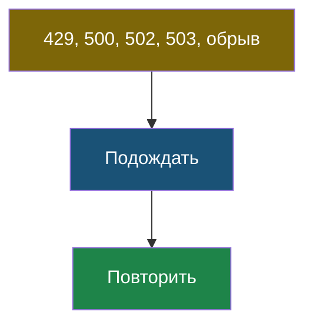
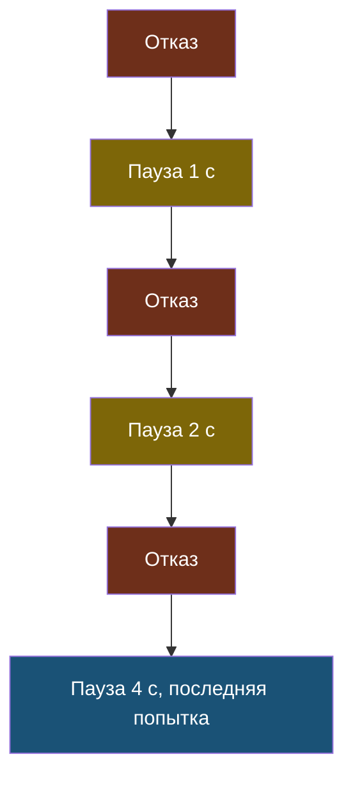
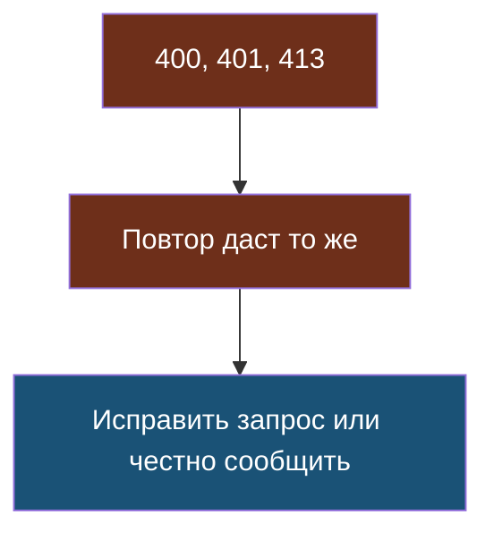
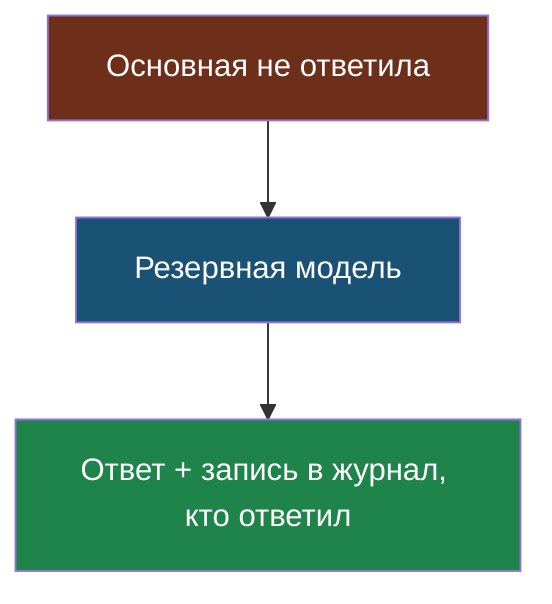
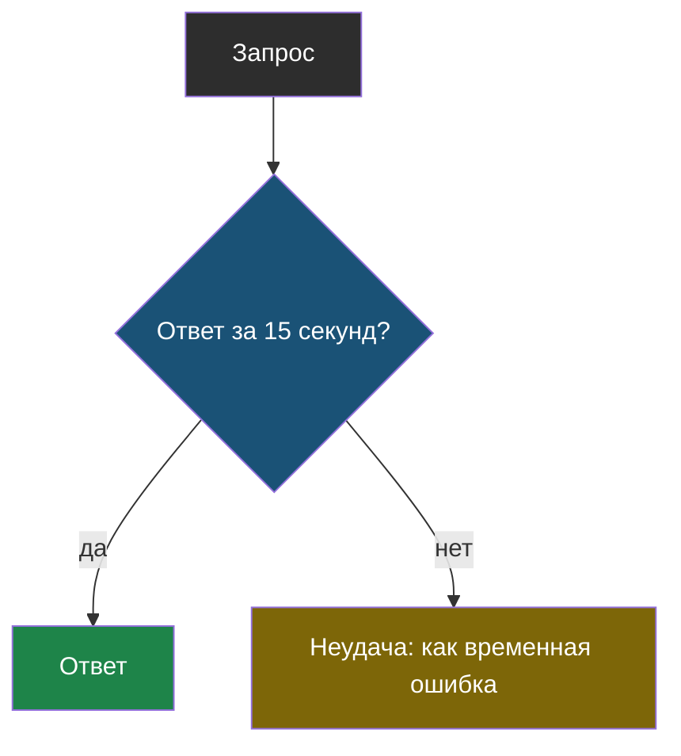

# Словарик темы 11

Термины по алфавиту; названия латиницей — в конце.

## Временная ошибка

> **Временная ошибка** — отказ, который может пройти сам, если подождать и повторить: перегрузка сервиса (500, 502, 503), превышение частоты запросов (429), обрыв сети.

Из [урока 1](chapter-01.md).

## Повтор с растущей паузой (exponential backoff)

> **Повтор с растущей паузой** (по-английски *exponential backoff*) — повтор неудачного запроса, при котором пауза перед каждой следующей попыткой вдвое длиннее предыдущей, а число попыток ограничено.

Из [урока 2](chapter-02.md). Паузе нужен разброс, попыткам — лимит.

## Постоянная ошибка

> **Постоянная ошибка** — отказ из-за самого запроса: неверный параметр (400), неверный ключ (401), слишком длинный запрос (413); повтор того же запроса даст ту же ошибку.

Из [урока 1](chapter-01.md). Не повторять — сразу понятное сообщение.

## Резервная модель (fallback)

> **Резервная модель** (по-английски *fallback*) — другая модель, а лучше у другого поставщика, которой программа отправляет запрос, когда основная модель не ответила после всех повторов.

Из [урока 2](chapter-02.md). Наш школьный прокси так и работает.

## Тайм-аут

> **Тайм-аут** — предельное время ожидания ответа, после которого программа перестаёт ждать и считает запрос неудачным.

Из [урока 1](chapter-01.md). Выбирают с запасом в 3–5 раз от обычного времени ответа.

