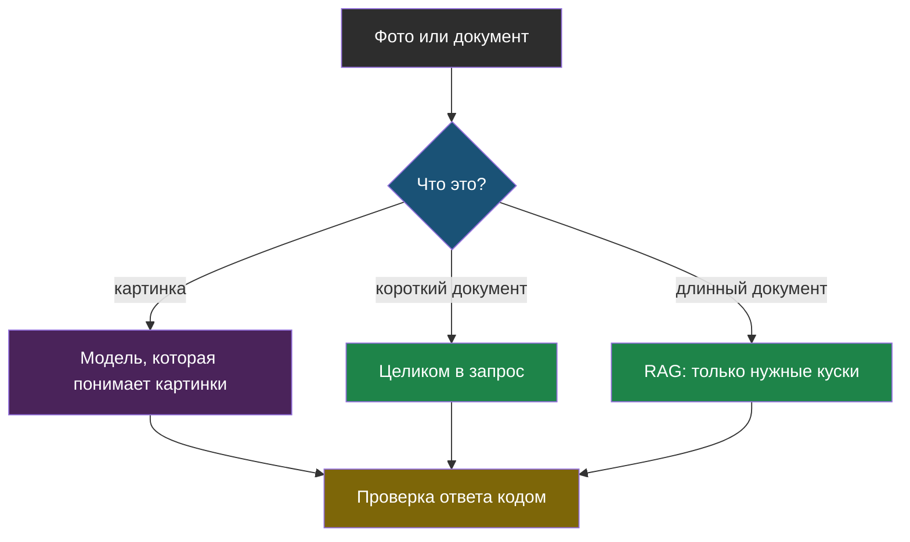

# Тема 12. Картинки и длинные документы

> Последняя тема продолжения. До сих пор модель получала короткий текст. Здесь — две вещи, которые в жизни встречаются постоянно: фотографии и документы на сотни страниц.

## Задача, с которой начинается тема

Ученик фотографирует расписание на стенде и спрашивает бота: «Во сколько у нас физика?». Учитель загружает положение о школе на 80 страниц и спрашивает: «Что там про пропуски без справки?».

Современные модели умеют и то и другое: смотреть на картинки и читать огромные тексты. Кажется, что вопрос решён — просто отправь всё модели. Но у картинок и длинных документов свои ловушки: они дорого стоят в токенах, модель на них ошибается иначе, чем на тексте, а в очень длинном тексте она может просто не заметить нужное.

## Главная мысль темы

Картинка и длинный документ — это **очень много токенов** и **новые способы ошибиться**. Правила остаются прежними: отправляй модели только нужное (тема 2) и проверяй ответ кодом (тема 6). Меняется только то, как именно это делать.

## Уроки темы

- [Урок 1. Модель смотрит на картинку](chapter-01.md) — как картинка попадает в запрос, сколько она стоит, где модель ошибается · лабораторная: [открыть в Colab](https://colab.research.google.com/github/iRoboTron/ai-engineering-school/blob/main/docs/books/labs/tema12-dokumenty/01_kartinki_i_dokumenty.ipynb)
- [Урок 2. Большое окно или RAG](chapter-02.md) — длинный документ целиком или по кускам, потерянная середина, PDF и сканы
- [Словарик темы](glossary.md)

## Что понадобится

Тема 1 (токены, окно), тема 2 (RAG), тема 6 (проверка ответа кодом, чужие личные данные) и тема 10 (цена входа).
