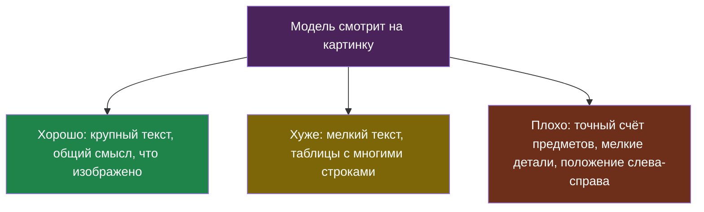

# Урок 1. Модель смотрит на картинку

> **Лабораторная этого урока** — в ноутбуке (шаги 1–4): модель читает расписание с картинки, считает фигуры, а код проверяет её ответы.
> - на настоящей модели: [открыть в Google Colab](https://colab.research.google.com/github/iRoboTron/ai-engineering-school/blob/main/docs/books/labs/tema12-dokumenty/01_kartinki_i_dokumenty.ipynb) · [скачать .ipynb](labs/tema12-dokumenty/01_kartinki_i_dokumenty.ipynb)

## Знакомая ситуация

Ты отправляешь другу фото доски с домашним заданием. Друг прекрасно читает крупные слова, но мелкую приписку в углу разбирает с трудом, а если спросить «сколько там всего задач» — может ошибиться на одну, если они написаны вразнобой.

Модели, которые понимают картинки, ошибаются очень похоже.

## Как картинка попадает к модели

Модель по-прежнему работает с токенами (тема 1). Картинку перед отправкой режут на небольшие квадратики, и каждый превращается в набор чисел — примерно так же, как слово превращается в токены.

> **Мультимодальная модель** — модель, которая принимает на вход не только текст, но и другие виды данных, чаще всего картинки; всё это она переводит в токены и обрабатывает вместе.

Не каждая модель такая. В нашем школьном сервере картинки понимают `qwen/qwen3.7-flash` и `google/gemma-3-12b-it`, а `mistral-nemo` и `mercury-2.5` — нет. На витрине моделей это видно по значку «картинки».

В запросе картинка — это ещё одна часть сообщения рядом с текстом:

```python
soobshchenie = {
    "role": "user",
    "content": [
        {"type": "text", "text": "Во сколько урок физики?"},
        {"type": "image_url", "image_url": {"url": "data:image/png;base64,iVBORw0KG..."}},
    ],
}
```

Картинку можно передать двумя способами: ссылкой на неё в интернете или самим файлом, закодированным в текст (`base64`). Второй способ надёжнее: модели не нужно ничего скачивать.

## Сколько стоит картинка

> **Токены картинки** — число токенов, в которое превращается изображение; оно растёт вместе с размером картинки и обычно составляет от нескольких сотен до нескольких тысяч токенов.

Точная формула у каждой модели своя, но правило общее: **больше точек — больше токенов — дороже и медленнее**. Фото с телефона в полном размере может стоить как несколько страниц текста.

| Что делать | Почему |
|---|---|
| Уменьшать картинку до 1000–1500 точек по длинной стороне | Большинству задач хватает, токенов в разы меньше |
| Обрезать до нужного места | Расписание — это не весь стенд с коридором |
| Не отправлять картинку повторно в истории (тема 9) | Одна фотография в истории оплачивается на каждом ходе |

Последняя строка особенно коварна. Ученик прислал фото и задал ещё десять вопросов текстом — если фото осталось в истории, его токены пересылаются все десять раз.

## Где модель ошибается на картинках



Смотри на нижний узел: **считать** модель умеет плохо. «Сколько человек на фото класса?» — очень правдоподобный, но часто неверный ответ. Это та же галлюцинация из темы 1: модель выдаёт правдоподобное продолжение, а не пересчитывает.

И ещё одна ловушка — **модель уверенно описывает то, чего нет**. Если на размытом фото не видно номер кабинета, модель может его «прочитать». Поэтому правило «разреши сказать "не знаю"» и проверка кодом здесь ещё важнее, чем с текстом.

## Проверка ответа по картинке

Как проверить кодом ответ про картинку, если код картинку не видит? Есть несколько приёмов:

| Приём | Пример |
|---|---|
| **Просить JSON и проверять формат** | время урока должно подходить под `ЧЧ:ММ`, кабинет — быть числом |
| **Сверять с известным** | номера кабинетов в школе известны — ответ «кабинет 912» отклоняется |
| **Спросить дважды** | два разных ответа на одну картинку — повод не доверять (тема 1) |
| **Показать человеку** | для важного — «на фото написано 15:40, всё верно?» |

В ноутбуке ты сделаешь картинку сам, в Python. Значит, правильный ответ будет известен заранее, и код сможет честно посчитать, сколько раз модель ошиблась.

## Картинки и чужие личные данные

Фотография почти всегда содержит больше, чем нужно. На фото расписания может оказаться лицо одноклассника, на фото дневника — фамилия и оценки. Всё это уходит поставщику модели (тема 6).

Правило простое: **обрезай до нужного перед отправкой** — это и дешевле, и безопаснее.

## Найди ошибку

Ученик сделал бота для дневника: фотографируешь страницу, бот говорит, сколько двоек за неделю.

```python
foto = open("dnevnik.jpg", "rb").read()                 # 4000×3000 точек
kartinka = "data:image/jpeg;base64," + base64.b64encode(foto).decode()
istoriya.append({"role": "user", "content": [
    {"type": "text", "text": "Сколько двоек за неделю?"},
    {"type": "image_url", "image_url": {"url": kartinka}},
]})
otvet = sprosit_model(istoriya, model="mistralai/mistral-nemo")
print("Двоек:", otvet)
```

Найди как минимум четыре проблемы.

<details>
<summary>Ответ</summary>

1. **Модель не понимает картинки.** `mistral-nemo` картинку просто не увидит, а наш прокси и вовсе вернёт ошибку 400. Нужна мультимодальная модель.
2. **Картинка огромная.** 4000×3000 точек — тысячи токенов и больше мегабайта в запросе. Для страницы дневника хватит 1500 точек по длинной стороне.
3. **Картинка кладётся в историю.** На каждый следующий вопрос она будет отправляться снова (тема 9).
4. **Счёт — слабое место модели.** «Сколько двоек» — ровно та задача, где модель уверенно ошибается. Лучше попросить JSON со списком оценок по дням и **посчитать двойки кодом**.
5. **Ответ не проверяется.** Если модель прочитала «2» там, где «3», программа это покажет как факт. Хотя бы проверь, что все оценки из ответа — числа от 1 до 5.
6. Бонус: на фото дневника — фамилия и оценки. Это чужие личные данные, если дневник не твой (тема 6).
</details>

## Что мы узнали

- **Мультимодальная модель** переводит картинку в токены и обрабатывает её вместе с текстом; не каждая модель это умеет.
- **Токены картинки** растут с её размером: уменьшай и обрезай перед отправкой, не держи картинку в истории.
- Модели хорошо понимают общий смысл и крупный текст, но плохо считают и путают мелкие детали.
- Ответы по картинке проверяют кодом: формат, сверка с известным, повторный вопрос, человек.
- Лишнее на фото — лишние деньги и чужие личные данные.

## Проверь себя

1. Почему фото, оставленное в истории диалога, дорожает с каждым вопросом?
2. Бот должен сказать, сколько учеников на фото класса. Почему это плохая задача для модели и как её переделать?
3. Какими способами можно проверить кодом ответ «урок физики в 15:40, кабинет 204», если код картинку не видит?
