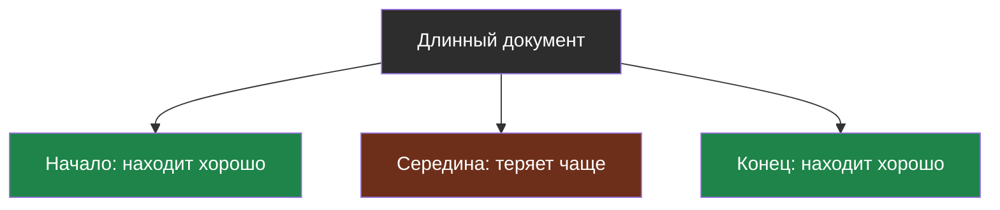
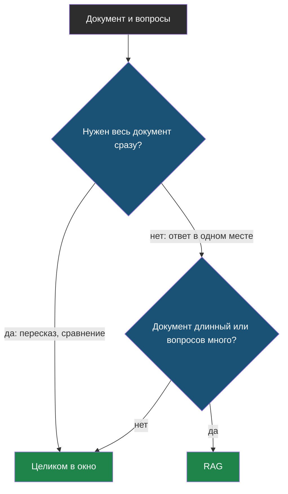

# Урок 2. Большое окно или RAG

> **Лабораторная этого урока:** один вопрос к документам разной длины — всё в окно или поиск кусков.
> - без интернета: [01_okno_ili_rag.py](labs/tema12-dokumenty/01_okno_ili_rag.py) — запуск `python3 01_okno_ili_rag.py`, разобрана в разделе [«Практика: окно против RAG»](#практика-окно-против-rag)
> - на настоящей модели: [открыть в Google Colab](https://colab.research.google.com/github/iRoboTron/ai-engineering-school/blob/main/docs/books/labs/tema12-dokumenty/01_kartinki_i_dokumenty.ipynb) (шаги 5–7) · [скачать .ipynb](labs/tema12-dokumenty/01_kartinki_i_dokumenty.ipynb)

## Напомним, где мы остановились

Картинка — это много токенов и свои способы ошибиться, а ответы по ней нужно проверять кодом. Теперь про вторую тяжёлую вещь — длинные документы. И про вопрос, который возникает у всех, кто видит модель с окном в миллион токенов: зачем вообще RAG?

## С чего начнём

Тебе дали учебник на 400 страниц и спросили, в каком году был основан Петербург. Можно прочитать учебник целиком — ответ точно встретится. А можно открыть предметный указатель, найти «Петербург» и прочитать одну страницу. Второй способ быстрее, и ты не устанешь к двухсотой странице так, что пропустишь нужную строчку.

Большое окно — это «прочитать всё». RAG — это «предметный указатель».

## Почему не отправить всё

В теме 1 окна были маленькими, и RAG был необходимостью: документ просто не влезал. Сейчас у многих моделей окно на сотни тысяч и даже миллион токенов — это несколько толстых книг. Кажется, что RAG больше не нужен. Но у «всё в окно» остались три проблемы:

| Проблема | Почему | Тема |
|---|---|---|
| **Цена** | Каждый вопрос оплачивает весь документ заново | 9, 10 |
| **Скорость** | Модель сначала читает всё — время до первого токена растёт | 10 |
| **Точность** | В очень длинном тексте модель хуже замечает нужное | ниже |

Первые две ты уже умеешь считать. Третья — новая.

## Потерянная середина

Исследователи проверили: прячем один нужный факт в длинный текст — в начало, в середину или в конец — и спрашиваем о нём модель. Оказалось, что факт из начала и из конца модели находят хорошо, а из **середины** длинного текста — заметно хуже.

> **Потерянная середина** (по-английски *lost in the middle*) — склонность модели хуже использовать сведения из середины очень длинного контекста, чем из его начала и конца.



Новые модели справляются с этим лучше старых, и насколько сильно теряется середина, зависит от модели и длины текста. Поэтому не стоит ни слепо верить «у модели окно миллион, значит, всё найдёт», ни бояться длинного текста — это **проверяют эталонным набором** (тема 5): вопросы с ответами в разных местах документа.

## Когда что выбрать

| Ситуация | Лучше |
|---|---|
| Документ короткий (несколько страниц), вопросов немного | **Целиком в окно** — проще и надёжнее |
| Нужно понять документ целиком: пересказать, найти противоречия | **Целиком в окно** — RAG видит только куски |
| Документ длинный, вопросов много | **RAG** — в сотни раз дешевле на каждом вопросе |
| Документов много (вся школьная документация) | **RAG** — в окно не влезет |
| Вопросы задают другими словами, чем в документе | **RAG по смыслу** (тема 3) или **окно** |



Первый ромб отделяет задачи, где RAG вообще не подходит: «перескажи положение о школе» не решить тремя найденными кусками.

## PDF: текст бывает не текстом

Длинные документы чаще всего приходят в PDF. И тут первая ловушка: из PDF нужно сначала **достать текст**, а это не всегда просто.

> **Извлечение текста из PDF** — получение обычного текста из файла PDF программой; работает, только если в файле есть сам текст, а не его изображение.

Бывают два совсем разных PDF:

| Вид | Как понять | Что делать |
|---|---|---|
| **Текстовый** — сохранён из Word или с сайта | текст в просмотрщике выделяется мышкой | достать текст библиотекой (`pypdf`) и дальше как с обычным текстом |
| **Скан** — сфотографированные страницы | выделить текст нельзя, это картинки | распознать текст: мультимодальная модель (урок 1) или программа распознавания |

Даже из текстового PDF текст выходит с сюрпризами: колонтитулы и номера страниц посреди абзацев, переносы слов («учени-\nки»), таблицы, превращённые в кашу. Поэтому после извлечения текст **смотрят глазами** хотя бы на одной-двух страницах, а колонтитулы вычищают кодом — ещё до нарезки на куски (тема 2).

## Практика: окно против RAG

Один факт — «пропуск в спортзал выдаёт завуч» — спрячем в документы из 10, 300, 1000 и 3000 абзацев: в начало, середину и конец. Спросим двумя способами. Заглушка модели ведёт себя так, как описывают исследования: в очень длинном тексте теряет середину.

Файл: [labs/tema12-dokumenty/01_okno_ili_rag.py](labs/tema12-dokumenty/01_okno_ili_rag.py) — запуск: `python3 01_okno_ili_rag.py`.

```python
# labs/tema12-dokumenty/01_okno_ili_rag.py
# Большое окно или RAG? Один вопрос к документам разной длины, факт спрятан
# в начале, середине или конце. Считаем цену и проверяем, найден ли ответ.
# Заглушка модели ведёт себя, как описывают исследования длинного контекста:
# в очень длинном тексте факт из середины теряется чаще, чем из начала или конца.

import re

# --- НАСТРОЙКИ ---
OKNO = 128_000                 # контекстное окно модели, токенов
PORG_SEREDINY = 20_000         # с какой длины документа модель начинает терять середину
CENA_VHODA = 0.30              # $ за 1 млн входных токенов
KUSKOV_V_RAG = 3               # сколько кусков кладёт в запрос RAG
VOPROSOV_V_DEN = 500           # сколько раз в день задают вопросы по этому документу

FAKT = "Пропуск в спортзал выдаёт завуч Ольга Петровна в кабинете 115."
VOPROS = "Кто выдаёт пропуск в спортзал?"
VOPROS_INACHE = "У кого получить разрешение ходить на тренировки?"   # те же смысл, другие слова

ZAPOLNITEL = "Пункт {n}. Ученики соблюдают порядок в коридорах и бережно относятся к имуществу школы."


def tokeny(tekst):
    return len(tekst) // 2


def sdelat_dokument(abzacev, gde):
    abzacy = [ZAPOLNITEL.format(n=i + 1) for i in range(abzacev)]
    mesto = {"начало": 0, "середина": abzacev // 2, "конец": abzacev - 1}[gde]
    abzacy[mesto] = FAKT
    return abzacy, mesto / max(1, abzacev - 1)


def zaglushka_modeli(kontekst, polozhenie_fakta):
    """Находит факт, если он есть в контексте и не потерялся в середине длинного текста."""
    if FAKT not in kontekst:
        return "Не знаю."
    if tokeny(kontekst) > PORG_SEREDINY and 0.2 < polozhenie_fakta < 0.8:
        return "Не знаю."                                   # «потерянная середина»
    return "Ольга Петровна, кабинет 115."


def slova(tekst):
    return {s[:5] for s in re.findall(r"[а-яё]+", tekst.lower()) if len(s) > 3}


def rag(abzacy, vopros):
    """Поиск по словам (тема 2): KUSKOV_V_RAG абзацев с наибольшим совпадением слов."""
    ocenki = sorted(abzacy, key=lambda a: len(slova(a) & slova(vopros)), reverse=True)
    naydeno = [a for a in ocenki[:KUSKOV_V_RAG] if slova(a) & slova(vopros)]
    return "\n".join(naydeno)


print(f"{'документ':>18} {'где факт':>9} | {'всё в окно':^30} | {'RAG':^30}")
print(f"{'':>18} {'':>9} | {'токенов':>8} {'$ в день':>9} {'ответ':>11} | {'токенов':>8} {'$ в день':>9} {'ответ':>11}")
print("-" * 86)
for abzacev in (10, 300, 1000, 3000):
    for gde in ("начало", "середина", "конец"):
        abzacy, polozhenie = sdelat_dokument(abzacev, gde)
        ves = "\n".join(abzacy)

        t_okno = tokeny(ves)
        if t_okno > OKNO:
            okno = f"{t_okno:>8} {'—':>9} {'не влезает':>11}"
        else:
            otvet = zaglushka_modeli(ves, polozhenie)
            okno = f"{t_okno:>8} {t_okno * CENA_VHODA / 1e6 * VOPROSOV_V_DEN:>9.2f} {'✅' if 'Ольга' in otvet else '❌ не нашла':>11}"

        kuski = rag(abzacy, VOPROS)
        t_rag = tokeny(kuski)
        otvet = zaglushka_modeli(kuski, 0.0)
        rag_stroka = f"{t_rag:>8} {t_rag * CENA_VHODA / 1e6 * VOPROSOV_V_DEN:>9.4f} {'✅' if 'Ольга' in otvet else '❌ не нашла':>11}"
        print(f"{str(abzacev) + ' абзацев':>18} {gde:>9} | {okno} | {rag_stroka}")
    print()

print("Слабое место RAG — вопрос другими словами:")
abzacy, polozhenie = sdelat_dokument(300, "середина")
for vopros in (VOPROS, VOPROS_INACHE):
    kuski = rag(abzacy, vopros)
    print(f"  «{vopros}»")
    print(f"      RAG: найдено кусков {len(kuski.splitlines())}, ответ: {zaglushka_modeli(kuski, 0.0)}")
    # Модели всё равно, какими словами спросили: весь документ у неё перед глазами.
    print(f"      всё в окно: ответ: {zaglushka_modeli(chr(10).join(abzacy), polozhenie)}")
```

**Что посмотреть в выводе:**

1. **10 и 300 абзацев** — оба способа находят ответ. Но «всё в окно» на 300 абзацах стоит $1.97 в день против $0.005 у RAG — в 400 раз дороже.
2. **1000 абзацев** — окно ещё вмещает документ, но факт из **середины** потерян, а из начала и конца найден. Это и есть потерянная середина. RAG находит везде: в запрос попадает один нужный абзац, середины у него нет.
3. **3000 абзацев** — документ в окно уже не влезает. RAG работает так же дёшево, как на десяти абзацах.
4. Последний блок — **слабое место RAG**: вопрос другими словами («разрешение ходить на тренировки») поиск по словам не находит, и бот честно говорит «не знаю». А модели с полным документом всё равно, какими словами спросили. Лечится поиском по смыслу (тема 3) — или сочетанием обоих поисков.

**Попробуй сам:**

- Поставь `PORG_SEREDINY = 200_000` — представь модель, которая не теряет середину. Когда теперь окно выигрывает у RAG, а когда нет?
- Поставь `VOPROSOV_V_DEN = 5`. Сколько теперь стоит «всё в окно» для 300 абзацев? Не проще ли в таком случае обойтись без RAG?
- Добавь в `ZAPOLNITEL` слова «пропуск» и «зал». Сколько кусков теперь находит RAG и какие?

### А теперь — на настоящей модели

В ноутбуке ты спрячешь факт в длинный документ и спросишь настоящую модель, где он: в начале, в середине и в конце. Потом сравнишь с RAG по `prompt_tokens` и цене. Заранее честно предупредим: у современной модели на документе, который пропускает школьный сервер, середина может и не потеряться. Тогда в ноутбуке останется главная разница — цена.

Лаборатория (ноутбук): [скачать .ipynb](labs/tema12-dokumenty/01_kartinki_i_dokumenty.ipynb) · [открыть в Google Colab](https://colab.research.google.com/github/iRoboTron/ai-engineering-school/blob/main/docs/books/labs/tema12-dokumenty/01_kartinki_i_dokumenty.ipynb)

## Найди ошибку

Школа сделала бота по «Положению об успеваемости» — PDF на 80 страниц. Разработчик рассуждал так: «У модели окно миллион токенов, положение туда влезет целиком, RAG не нужен»:

```python
tekst = izvlech_tekst("polozhenie.pdf")          # 80 страниц
def otvetit(vopros):
    return sprosit_model([
        {"role": "system", "content": "Отвечай по положению.\n\n" + tekst},
        {"role": "user", "content": vopros},
    ])
```

Бот работает, но месячный счёт оказался огромным, а на вопрос про пересдачу он иногда отвечает «в положении об этом ничего нет», хотя пункт есть. Что не так?

<details>
<summary>Ответ</summary>

1. **Цена.** 80 страниц — это десятки тысяч токенов. Каждый вопрос каждого ученика оплачивает всё положение заново. Если вопросов сотни в день, это в сотни раз дороже RAG (тема 10).
2. **Потерянная середина.** Пункт про пересдачу может стоять на 40-й странице, и в таком длинном контексте модель его пропускает. Поэтому «ничего нет», хотя пункт есть.
3. **Текст из PDF не проверен.** Если положение — скан, `izvlech_tekst` вернёт пустоту или мусор, и модель честно не найдёт ничего. Если текстовый, в середине пунктов могут стоять колонтитулы и номера страниц.
4. Бонус из темы 9: неизменное положение стоит в начале запроса, поэтому здесь хотя бы сработает кэш начала запроса — это единственное, что автор сделал правильно, и то случайно.

Как лучше: извлечь текст и проверить его глазами, нарезать положение на пункты, искать 3–5 нужных (тема 2) и отвечать по ним. А для вопросов вида «перескажи всё положение» — отдельный режим с документом целиком.
</details>

## Что мы узнали

- Большое окно не отменяет RAG: целый документ в каждом запросе дорог, медленен и не всегда точен.
- **Потерянная середина** — модель хуже использует сведения из середины очень длинного текста; насколько, проверяют эталонным набором.
- Целиком в окно — для коротких документов и задач «понять всё сразу»; RAG — для длинных документов и частых вопросов.
- **Извлечение текста из PDF** работает только для текстовых файлов; сканы — это картинки, а извлечённый текст нужно смотреть и чистить.

## Проверь себя

1. У модели окно в миллион токенов. Назови три причины всё равно использовать RAG.
2. Какую задачу по документу нельзя решить RAG и почему?
3. Из PDF извлёкся пустой текст. Что это, скорее всего, за PDF и что с ним делать?

## Что добавить к чек-листу

- Картинки уменьшены и обрезаны до нужного, в истории не хранятся, ответы по ним проверяются кодом.
- Модель для картинок и её резервная модель понимают картинки.
- Выбор «целиком в окно или RAG» сделан по длине документа, числу вопросов и задаче, а не по размеру окна.
- Текст из PDF просмотрен глазами и очищен до нарезки; для сканов есть распознавание.

## Итог продолжения курса

Четыре темы назад твой проект «просто работал». Теперь ты знаешь, что происходит, когда им пользуются по-настоящему: как не переплачивать за историю диалога, куда уходят деньги и секунды, как пережить сбои сервиса и что делать с фотографиями и толстыми документами.

Везде работали одни и те же две идеи из основного курса: **отправляй модели только нужное** и **проверяй ответ кодом**. Если они стали привычкой — продолжение ты прошёл. Загляни в [словарик](glossary.md) и в словарики тем 9–11.
