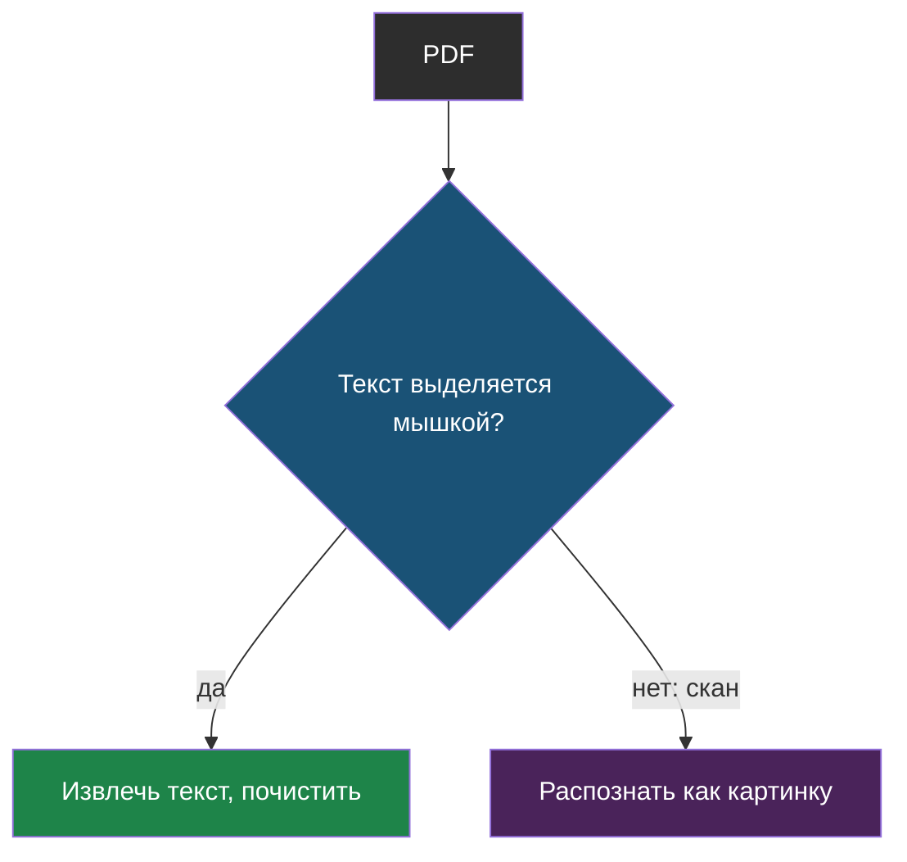
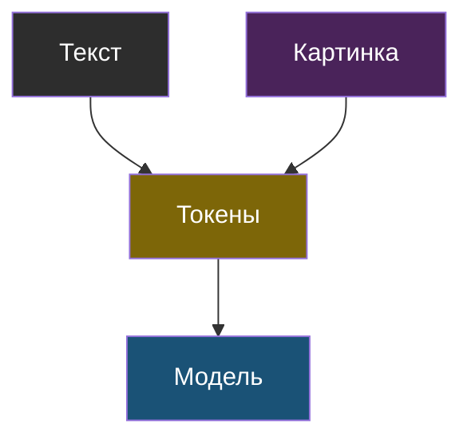
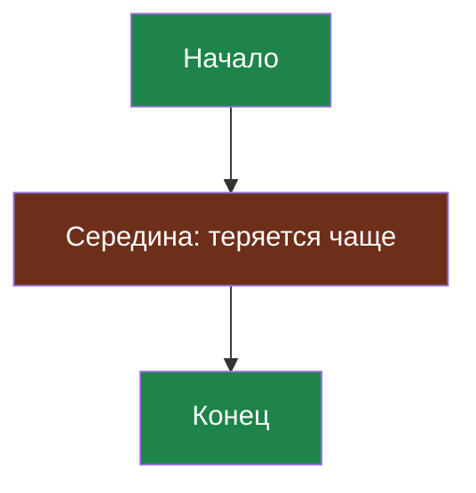
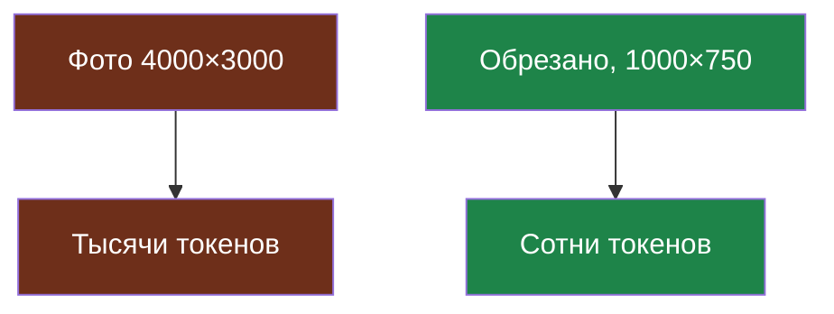

# Словарик темы 12

Термины по алфавиту; названия латиницей — в конце.

## Извлечение текста из PDF

> **Извлечение текста из PDF** — получение обычного текста из файла PDF программой; работает, только если в файле есть сам текст, а не его изображение.

Из [урока 2](chapter-02.md). Сканы — это картинки; извлечённый текст смотрят глазами и чистят.

## Мультимодальная модель

> **Мультимодальная модель** — модель, которая принимает на вход не только текст, но и другие виды данных, чаще всего картинки; всё это она переводит в токены и обрабатывает вместе.

Из [урока 1](chapter-01.md). Не каждая модель такая.

## Потерянная середина (lost in the middle)

> **Потерянная середина** (по-английски *lost in the middle*) — склонность модели хуже использовать сведения из середины очень длинного контекста, чем из его начала и конца.

Из [урока 2](chapter-02.md). Насколько сильно — проверяют эталонным набором.

## Токены картинки

> **Токены картинки** — число токенов, в которое превращается изображение; оно растёт вместе с размером картинки и обычно составляет от нескольких сотен до нескольких тысяч токенов.

Из [урока 1](chapter-01.md). Уменьшай и обрезай перед отправкой.

